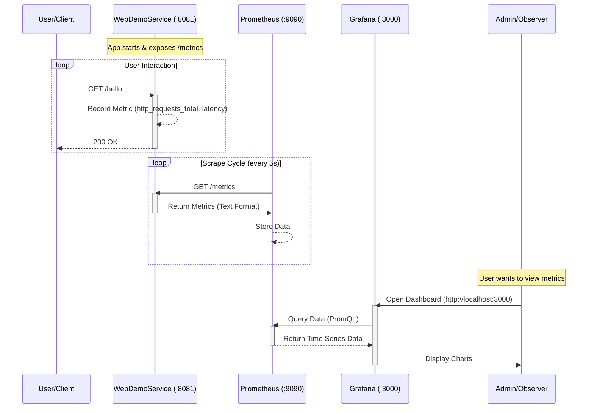

# Monitoring Architecture

This directory contains the Docker Compose stack for monitoring the `gRouter` services using Prometheus and Grafana.

## Architecture Overview

The monitoring stack consists of three main components:

1.  **gRouter Service (e.g., `webdemosvc`)**:
    *   Runs the application logic.
    *   Instrumented with `prometheus/client_golang` and `otelgin`.
    *   Exposes metrics at the `/metrics` endpoint.

2.  **Prometheus**:
    *   Time-series database.
    *   Scrapes metrics from configured targets (like `webdemosvc`) at regular intervals.
    *   Stores data locally.

3.  **Grafana**:
    *   Visualization platform.
    *   Connects to Prometheus as a Data Source.
    *   Provides dashboards to visualize the metrics.

## Metrics Flow Sequence Diagram

The following diagram illustrates how metrics are generated, collected, and visualized.



## Directory Structure

*   `docker-compose.yml`: Defines the Prometheus and Grafana services.
*   `config/prometheus/prometheus.yml`: Configuration file for Prometheus, defining scrape targets.
*   `config/grafana/provisioning/`: Configuration to automatically setup Data Sources and Dashboards.

## Usage

1.  **Start the Stack**:
    ```bash
    docker-compose up -d
    ```

2.  **Access Grafana**:
    *   URL: [http://localhost:3000](http://localhost:3000)
    *   Credentials: `admin` / `admin`

3.  **Access Prometheus**:
    *   URL: [http://localhost:9090](http://localhost:9090)

4.  **Access Jaeger UI**:
    *   URL: [http://localhost:16686](http://localhost:16686)

## How to Integrate a New Application

To monitor a new application with this stack, you need to perform two steps:

### 1. Instrument Your Application

#### Prometheus Metrics
Ensure your application exposes metrics in the Prometheus format.

**For Go applications:**
Use the `prometheus/client_golang` library.

```go
import (
    "net/http"
    "github.com/prometheus/client_golang/prometheus/promhttp"
)

func main() {
    // Expose the registered metrics via HTTP.
    http.Handle("/metrics", promhttp.Handler())
    http.ListenAndServe(":8080", nil)
}
```

#### Jaeger Tracing
Ensure your application sends traces to the Jaeger collector (running on OTLP ports 4317/4318).

**For Go applications:**
Use OpenTelemetry (`go.opentelemetry.io/otel`).

```go
import (
    "go.opentelemetry.io/otel"
    "go.opentelemetry.io/otel/exporters/otlp/otlptrace/otlptracegrpc"
    "go.opentelemetry.io/otel/sdk/resource"
    "go.opentelemetry.io/otel/sdk/trace"
    semconv "go.opentelemetry.io/otel/semconv/v1.17.0"
)

func initTracer() {
    ctx := context.Background()
    // Connect to Jaeger via OTLP gRPC
    exporter, _ := otlptracegrpc.New(ctx,
        otlptracegrpc.WithEndpoint("localhost:4317"),
        otlptracegrpc.WithInsecure(),
    )
    
    tp := trace.NewTracerProvider(
        trace.WithBatcher(exporter),
        trace.WithResource(resource.NewWithAttributes(
            semconv.SchemaURL,
            semconv.ServiceNameKey.String("my-service"),
        )),
    )
    otel.SetTracerProvider(tp)
}
```

### 2. Configure Prometheus

Update `config/prometheus/prometheus.yml` (relative to `deployments/docker-compose`) to include your new application as a scrape target.

Add a new `job_name` under `scrape_configs`:

```yaml
scrape_configs:
  # ... existing jobs ...

  - job_name: 'my-new-app'
    scrape_interval: 5s
    static_configs:
      - targets: ['host.docker.internal:YOUR_APP_PORT']
```

*   Replace `my-new-app` with a descriptive name for your service.
*   Replace `YOUR_APP_PORT` with the port where your application exposes `/metrics`.
*   Note: `host.docker.internal` is used to reach services running on the host machine from within the Docker container. If your app is running in another Docker container on the same network, use its container name.

### 3. Restart Services

For metrics config changes:
```bash
docker compose restart prometheus
```

For tracing, no configuration restart is needed on the infrastructure side; just point your app to the correct OTLP endpoint (port 4317 for gRPC).

## Verification Steps (Step-by-Step)

Here is how you can verify that your metrics are flowing correctly in Grafana:

1.  **Generate Traffic**:
    Ensure your services are running and receiving requests.
    ```bash
    # For webdemosvc (Port 8081)
    curl http://localhost:8081/hello
    
    # For natsdemosvc (Port 8082)
    curl http://localhost:8082/metrics
    ```

2.  **Open Grafana**:
    Navigate to [http://localhost:3000](http://localhost:3000) in your browser.
    Log in with `admin` / `admin`.

3.  **View Dashboard**:
    *   Go to **Dashboards** (icon on the left) -> **Go Service Metrics**.
    *   You should see a **Service** dropdown at the top left.
    *   Select `webdemosvc` or `natsdemosvc`.
    *   Verify that the charts (HTTP Requests, Goroutines, Memory) are populating with data.

4.  **Explore Manually**:
    *   Click the **Explore** icon (compass) on the left sidebar.
    *   Ensure the data source is set to **Prometheus**.
    *   In the **Metric** field, type `http_requests_total`.
    *   Click **Run query** (top right).
    *   You should see a graph. Click **Table** to see the raw values and labels (like `job="webdemosvc"` and `job="natsdemosvc"`).
