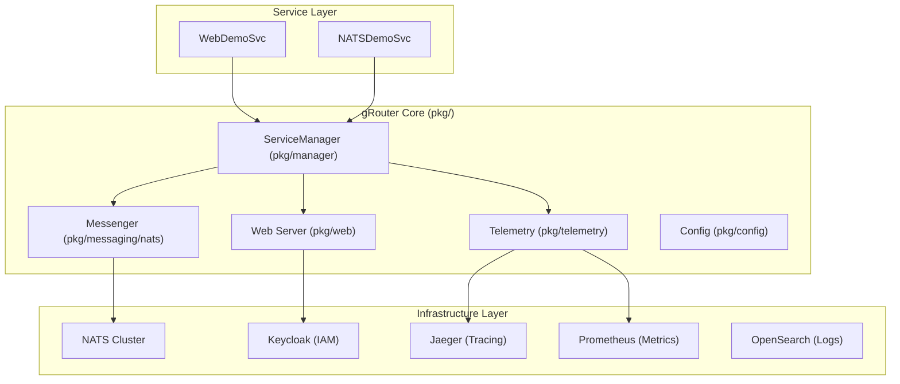
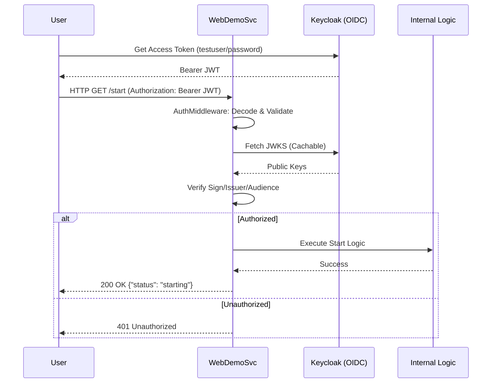
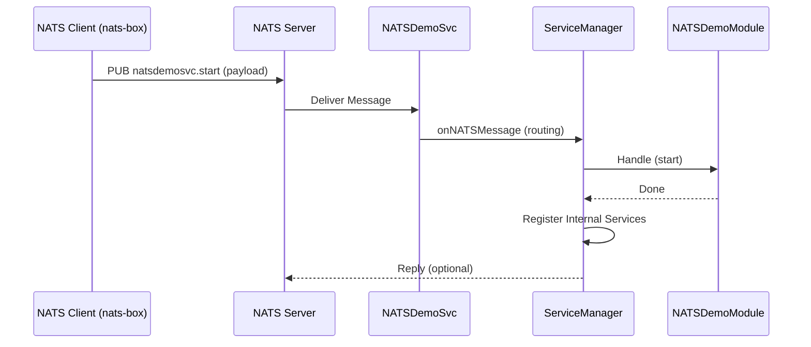
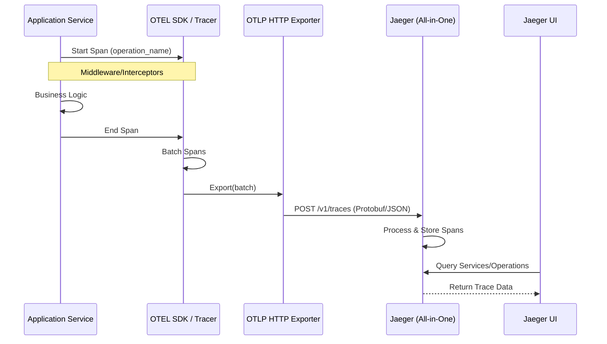
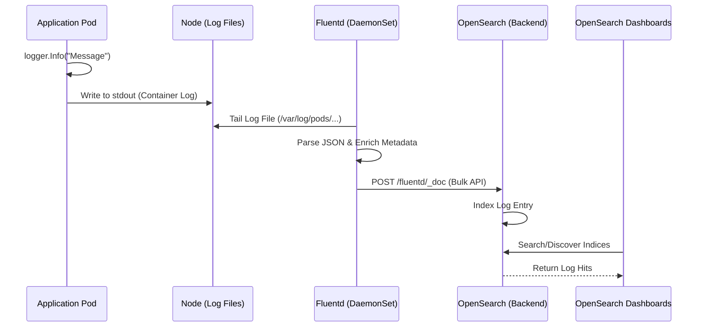
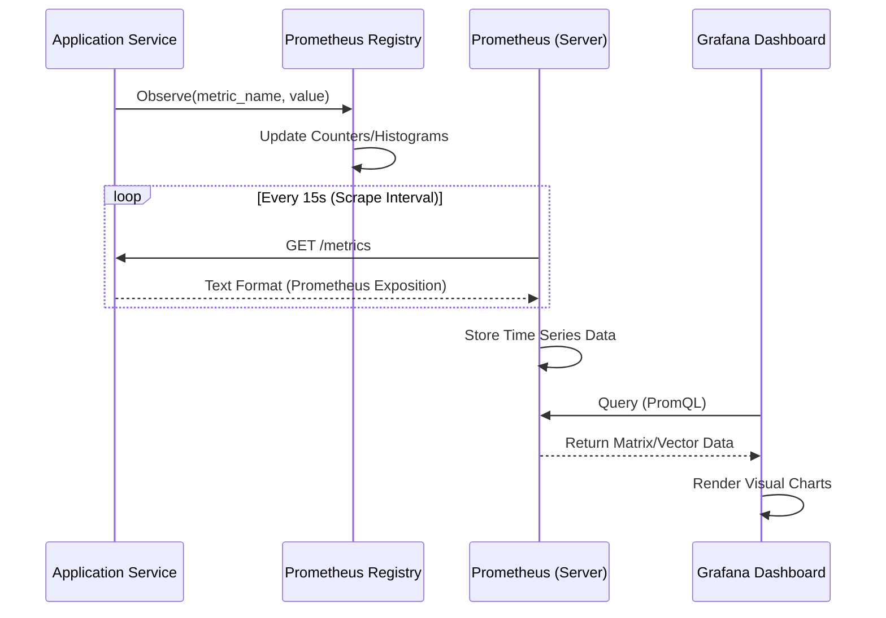
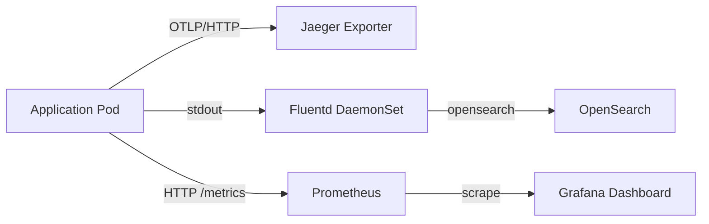

# gRouter Architecture Documentation

This document provides a high-level overview of the gRouter architectural design, component interactions, and message flows.

## 1. System Architecture Overview

gRouter is a generic microservices framework designed for high-performance messaging, web services, and observability. It follows a modular design where a central `ServiceManager` orchestrates various subsystems.

## 2. Interface Sequence Diagrams

### 2.1 Authentication & Request Flow (OIDC)

The following diagram illustrates how an authenticated HTTP request is processed by `webdemosvc` using Keycloak.

### 2.2 NATS Messaging Flow (Request-Reply)

The `natsdemosvc` uses a request-reply pattern for service activation and communication.

### 2.3 Tracing & Observability Flow (OTLP)

Trace spans are generated within the application and exported via OTLP to Jaeger.

### 2.4 Logging & Log Aggregation Flow (Fluentd)

Logs are captured from application output, processed by Fluentd, and indexed in OpenSearch.

### 2.5 Metrics & Monitoring Flow (Prometheus)

Metrics are exposed by the application and periodically scraped by Prometheus for storage and visualization.

## 3. Component Message Flows

### 3.1 Observability Pipeline

Logging and Tracing flows ensure full visibility across the distributed system.

### 3.2 Service Lifecycle

All gRouter services follow a stateful transition pattern:

1.  **Bootstrap State**:
    - Only `start`, `stop`, and `health` endpoints/topics are active.
    - The application waits for a "Start Signal".
2.  **Running State**:
    - Upon receiving a signal, the `ServiceManager` registers all dynamic modules.
    - The `WebServer` or `Messenger` reloads to apply new routes/subscriptions.
3.  **Graceful Stop**:
    - Services are unregistered.
    - Internal state is cleaned up.
    - Application returns to Bootstrap or exits.

## 4. Component Summary

| Component | Responsibility |
| :--- | :--- |
| **ServiceManager** | Core orchestrator. Handles Init, Start, Stop, and Service Registration. |
| **Messenger** | Wrapper around NATS. Provides Middleware support (Logging, Tracing) and Request-Reply abstractions. |
| **Web Server** | Gin-based HTTP server. Implements OIDC Auth, CORS, Security Headers, and Prometheus metrics. |
| **Telemetry** | Centralized OpenTelemetry initialization for distributed tracing (Jaeger) and metrics. |
| **Config** | Viper-based configuration loader with validation and environment variable overrides. |
