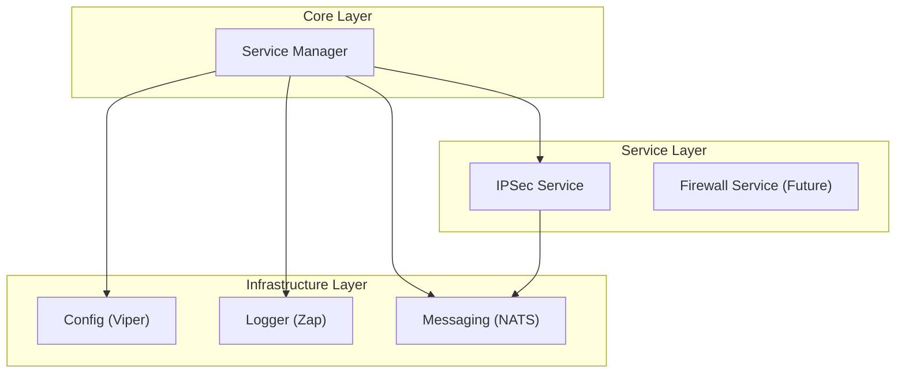
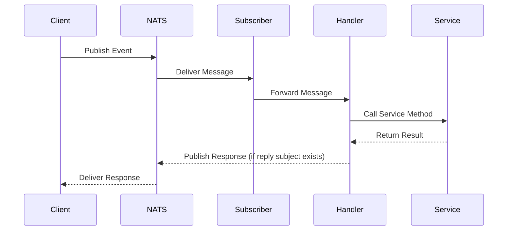

# gRouter Technical Documentation

gRouter is a high-performance, event-driven microservice framework built in Go. It leverages NATS for asynchronous communication and provides a modular architecture for building scalable network services.

## Features

- **Event-Driven Architecture**: Built on NATS for scalable, asynchronous messaging.
- **Modular Services**: Independent service packages that can be enabled/disabled via configuration.
- **Configuration Management**: Viper + pflag for flexible config from files, env vars, and CLI flags.
- **Structured Logging**: Zap logger with JSON and console output formats.
- **Bazel Build System**: Hermetic, incremental builds for reproducible environments.
- **Docker Support**: Multi-stage Dockerfile for minimal production images.

## Project Structure

```text
gRouter/
├── cmd/service/          # Main application entry point
├── pkg/
│   ├── config/          # Configuration management (Viper + pflag)
│   ├── logger/          # Logging framework (Zap)
│   ├── messaging/       # NATS event handling
│   └── services/
│       └── ipsec/       # IPSec service implementation
├── configs/             # Configuration files
├── deployments/         # Dockerfile
└── BUILD.bazel files    # Bazel build configuration
```

## Architecture Overview

gRouter follows a modular design where the core framework provides infrastructure (logging, config, messaging) and independent services implement business logic.



## Event Flow

The following diagram illustrates the lifecycle of an event in gRouter:



## Prerequisites

- **Go**: 1.22 or higher
- **NATS Server**: Required for runtime messaging
- **Bazel**: 6.0+ or Bazelisk (Optional, for hermetic builds)

## Quick Start

### 1. Install Dependencies
```bash
go mod download
```

### 2. Start NATS Server
Using Docker:
```bash
docker run -d --name nats -p 4222:4222 nats:latest
```

### 3. Build and Run

#### 1. Using Go
```bash
# Build
go build -o bin/service ./cmd/service

# Run
./bin/service --config configs/config.yaml
```

#### 2. Using Bazel
```bash
# Build
bazel build //cmd/service:service

# Run
bazel run //cmd/service:service -- --config configs/config.yaml
```

#### 3. Using Docker
```bash
# Build image
docker build -f deployments/Dockerfile -t grouter-service:latest .

# Run container
docker run -d \
  --name grouter \
  -v $(pwd)/configs:/app/configs \
  grouter-service:latest
```

## Configuration

Configuration can be provided via:
1. **YAML file**: Default `configs/config.yaml`.
2. **Environment variables**: Prefix `GROUTER_`.
3. **Command-line flags**: Override other sources.

### Example Configuration (YAML)
```yaml
app:
  name: "gRouter"
  version: "1.0.0"
  environment: "development"

nats:
  url: "nats://localhost:4222"
  max_reconnects: 10
  reconnect_wait: 2s
  connection_timeout: 5s

log:
  level: "info"
  format: "console"
  output_path: "stdout"

services:
  ipsec:
    enabled: true
    subject: "ipsec"
```

### Command-Line Flags
```bash
./bin/service \
  --config configs/config.yaml \
  --log-level debug \
  --nats-url nats://localhost:4222
```

### Environment Variables
```bash
export GROUTER_LOG_LEVEL=debug
export GROUTER_NATS_URL=nats://localhost:4222
./bin/service
```

## Core Components

gRouter is built around several core components that provide the necessary infrastructure for microservices.

### 1. Config: Centralized Configuration Management (`pkg/config`)
Uses **Viper** and **pflag** to manage configuration from multiple sources (YAML, Env, Flags). It handles the merging of defaults and provides a type-safe way to access configuration throughout the application.

### 2. Logger: Structured Logging with Context Propagation (`pkg/logger`)
Built on **Uber-Zap**, this component provides high-performance, structured logging. It supports multiple output formats and levels, and is designed to propagate context (like request IDs) across service boundaries.

### 3. Messaging: NATS Client, Publisher, and Subscriber Abstractions (`pkg/messaging`)
A robust abstraction layer over **NATS**:
- **Client**: Manages the lifecycle of the NATS connection.
- **Publisher**: Provides a clean interface for publishing messages, supporting both synchronous and asynchronous modes.
- **Subscriber**: Simplifies the process of subscribing to subjects and handling incoming messages, including support for queue groups.
- **JetStream**: Integrated support for NATS JetStream for persistent messaging and guaranteed delivery.

### 4. Services: Independent Service Implementations (`pkg/services`)
The framework is designed to host multiple independent services. Each service is encapsulated in its own package and follows a consistent pattern for handling events and implementing business logic. The **IPSec** service is the primary example currently implemented.

### 5. Service Manager (`pkg/manager`)
The orchestrator that ties everything together. It initializes the infrastructure, registers enabled services, and routes incoming NATS messages to the appropriate handlers.

## Service Implementation: IPSec (`pkg/services/ipsec`)

The IPSec service listens for events on NATS subjects and manages IPSec tunnels.

### Usage Examples (via NATS CLI)

#### Create Tunnel
```bash
nats pub ipsec.tunnel.create '{
  "name": "tunnel-1",
  "source": "10.0.0.1",
  "destination": "10.0.0.2",
  "local_subnet": "192.168.1.0/24",
  "remote_subnet": "192.168.2.0/24",
  "pre_shared_key": "secret",
  "encryption_algo": "aes256",
  "auth_algo": "sha256",
  "dpd_interval": 30
}'
```

#### Delete Tunnel
```bash
nats pub ipsec.tunnel.delete '{"id": "tunnel-id"}'
```

#### Get Status
```bash
nats pub ipsec.tunnel.status '{"id": "tunnel-id"}'
```

## Production Deployment

### Docker Compose

```yaml
version: '3.8'
services:
  nats:
    image: nats:latest
    ports:
      - "4222:4222"
  
  grouter:
    image: grouter-service:latest
    depends_on:
      - nats
    environment:
      - GROUTER_NATS_URL=nats://nats:4222
      - GROUTER_LOG_LEVEL=info
    volumes:
      - ./configs:/app/configs
```

### Kubernetes

See `deployments/k8s/` (to be added) for Kubernetes manifests.

## License

MIT

## Contributing

Contributions are welcome! Please open an issue or submit a pull request.

## Development

### Running Tests

```bash
# Using Go
go test ./pkg/... -v

# Using Bazel
bazel test //pkg/...

# With coverage
bazel coverage //pkg/...
```

### Adding a New Service

1. **Create service package**: `pkg/services/myservice/`
2. **Implement logic**: Create `models.go`, `events.go`, `service.go`, and `handler.go`.
3. **Add configuration**: Update `pkg/config/types.go` with service settings.
4. **Wire up**: Register the service in `cmd/service/main.go`.
5. **Update config file**: Add service-specific configuration to `configs/config.yaml`.
6. **Create build file**: Add a `BUILD.bazel` file for the new package.

---
*Last Updated: 2025-12-20*
