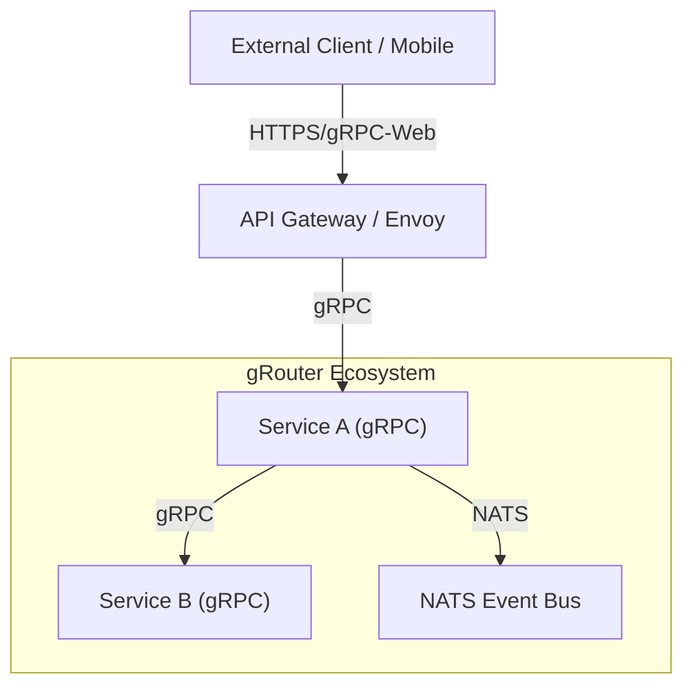
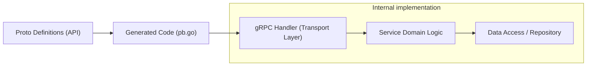
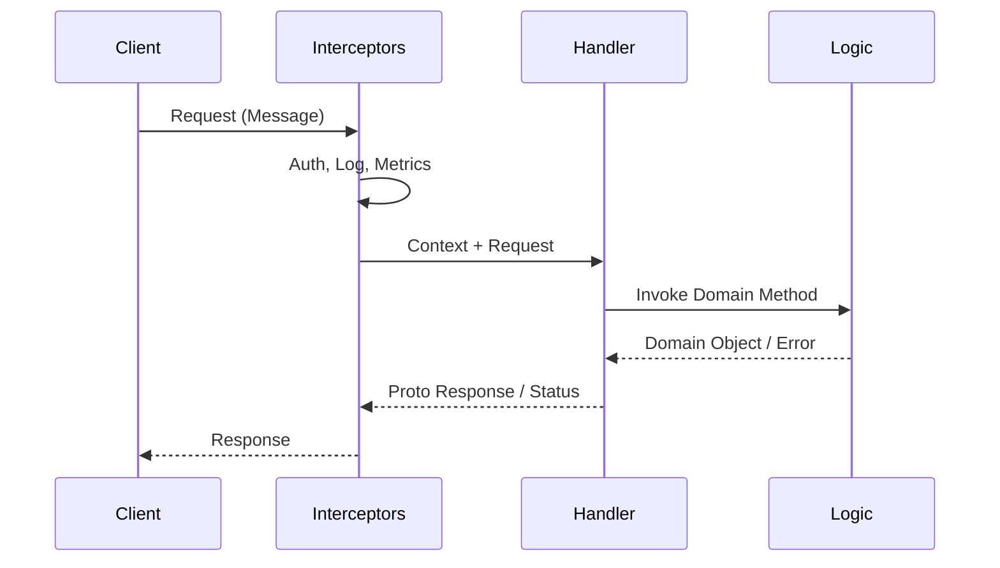

# gRPC Production Service Architecture

This document outlines the architecture and standards for implementing gRPC services within the gRouter system.

## Table of Contents

1. [System Architecture Overview](#1-system-architecture-overview)
2. [Detailed gRPC Service Architecture](#2-detailed-grpc-service-architecture)
3. [Service Communication Flow](#3-service-communication-flow)
4. [Interceptor Chain Architecture](#4-interceptor-chain-architecture)
5. [Deployment Architecture](#5-deployment-architecture)
6. [Protocol Buffers Communication](#6-protocol-buffers-communication)
7. [Load Balancing & Service Discovery](#7-load-balancing--service-discovery)
8. [Monitoring & Observability](#8-monitoring--observability)
9. [Security Architecture](#9-security-architecture)
10. [Development Workflow](#10-development-workflow)
11. [Architecture Patterns](#11-architecture-patterns)

---

## 1. System Architecture Overview

gRPC services in gRouter are designed to provide high-performance, strongly-typed internal communication between microservices, as well as efficient external APIs where suitable.



- **Transport**: HTTP/2 generic transport.
- **Serialization**: Protocol Buffers (Probobuf) v3.
- **Service Mesh**: Optional integration with Istio/Envoy for advanced traffic management.

## 2. Detailed gRPC Service Architecture

Each gRPC service follows a Clean Architecture approach to separate concerns.



- **API Layer (`api/proto`)**: Contains `.proto` definitions. Source of truth.
- **Transport Layer (`internal/grpc`)**: Implements `Unimplemented<ServiceName>Server`. Handles request decoding, validation, and calling the business logic.
- **Domain Layer (`internal/service`)**: Pure business logic, agnostic of gRPC or HTTP.
- **Data Layer (`internal/repository`)**: Database access or external client calls.

## 3. Service Communication Flow

Typical flow for a Unary RPC call:



## 4. Interceptor Chain Architecture

Middleware is implemented via **Interceptors**. We use generic chaining (e.g., `grpc-middleware`).

**Order of Execution (Inbound):**
1.  **Panic Recovery**: Safely handle panics.
2.  **Context Propagation**: Extract TraceIDs/SpanIDs.
3.  **Logging**: Log start of request (using `pkg/logger`).
4.  **Metrics**: Telemetry (Prometheus).
5.  **Authentication**: Verify JWT/mTLS.
6.  **Validation**: Validate request payload (protoc-gen-validate).
7.  **Deadline/Cancel**: Respect context cancellation.

```go
// Example logical chain
func Chain(interceptor ...grpc.UnaryServerInterceptor) grpc.UnaryServerInterceptor {
    return func(ctx, req, info, handler) (resp, err) {
        // ... build chain
    }
}
```

## 5. Deployment Architecture

Services are deployed as containerized applications (Docker) managed by Kubernetes.

- **Container Port**: Expose gRPC port (default `50051`).
- **Health Checks**: Implement `grpc.health.v1.Health` standard service.
  - **Liveness**: Connection open?
  - **Readiness**: Database/Dependencies connected?
- **Resources**: CPU/Memory limits tuned for highly concurrent goroutines.

## 6. Protocol Buffers Communication

- **Syntax**: `syntax = "proto3";`
- **Style**: Google AIP style guidelines (snake_case fields, CamelCase messages).
- **Versioning**: `package company.service.v1;` helps in non-breaking evolution.
- **Buf**: Recommended tool for management (`buf.yaml`, `buf.gen.yaml`).

Example `buf.yaml`:
```yaml
version: v1
breaking:
  use:
    - FILE
lint:
  use:
    - DEFAULT
```

## 7. Load Balancing & Service Discovery

Direct service-to-service gRPC requires special handling because connections are sticky (HTTP/2).

- **Client-Side LB**:
  - Client connects to all backend instances (Headless Service in K8s).
  - Uses `kuberesolver` or generic gRPC DNS resolver.
  - Policy: `round_robin`.

- **Proxy LB (Service Mesh)**:
  - Envoy/Linkerd sidecar handles distribution.
  - Transparent to the application code.

## 8. Monitoring & Observability

Standardized observability stack integrated with `pkg/logger`.

- **Metrics**: `grpc_server_handled_total`, `grpc_server_handling_seconds`.
- **Tracing**: OpenTelemetry (OTEL) interceptors.
  - Propagate `traceparent` headers.
- **Logs**: Structured logs (Zap) with `trace_id` and `request_id`.

## 9. Security Architecture

- **Transport Security**:
  - **TLS/mTLS**: Required for all production traffic.
  - Certificates managed by Cert Manager or Mesh.
- **Authentication**:
  - **JWT**: Passed in `authorization: Bearer <token>` metadata.
  - Verified by Auth Interceptor.
- **Authorization**:
  - Role-Based Access Control (RBAC) checked within Service layer or dedicated AuthZ interceptor.

## 10. Development Workflow

1.  **Define API**: Create/Modify `api/proto/v1/service.proto`.
2.  **Lint/Review**: Run `buf lint`. Peer review the schematic change.
3.  **Generate**: Run `buf generate` or `protoc` to create Go stubs.
4.  **Implement**:
    - Update `internal/grpc` handler.
    - Update `internal/service` logic.
5.  **Test**:
    - Unit tests for Logic.
    - `bufcon` (in-memory listener) tests for Interceptors/Handlers.
    - `grpcurl` for manual verification.

## 11. Architecture Patterns

- **Error Handling**:
  - Map internal Go errors to `google.golang.org/grpc/status`.
  - Use `codes.NotFound`, `codes.InvalidArgument`, `codes.Internal`.
  - Return detailed `status.Details` (e.g., `BadRequest` details) where safe.

- **Streaming**:
  - **Server-Side Streaming**: For long-lived updates (e.g., logs, notifications).
  - **Bi-Directional**: For real-time chat or synchronization.
  - *Note*: Keep streams short-lived or handle reconnection gracefully.

- **Deadlines/Timeouts**:
  - Clients **MUST** set a deadline (`context.WithTimeout`).
  - Servers **MUST** propagate context to downstream calls.
