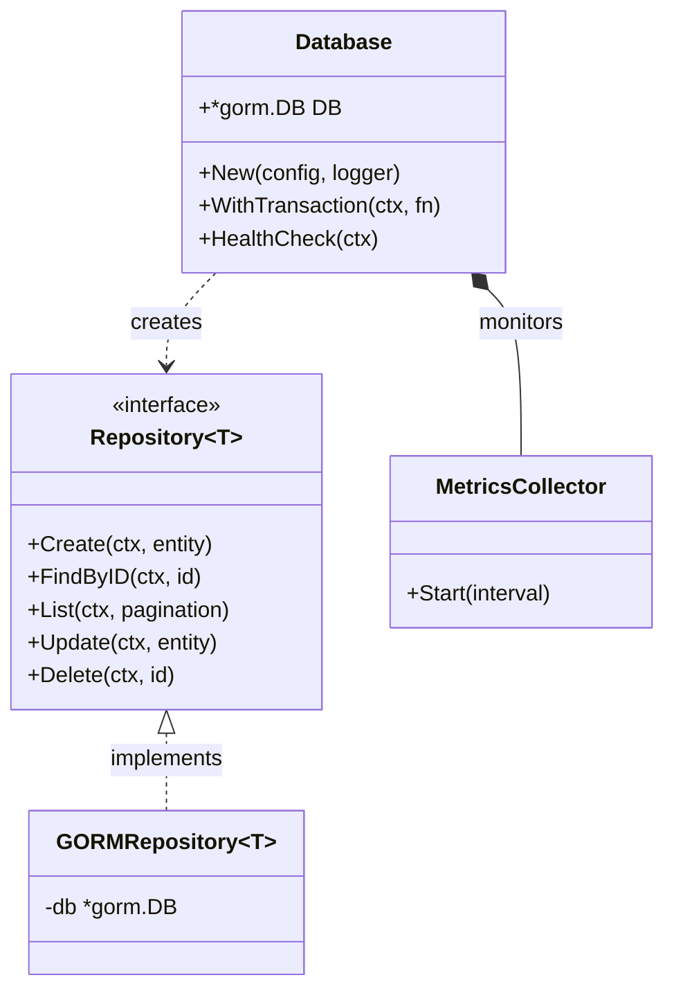
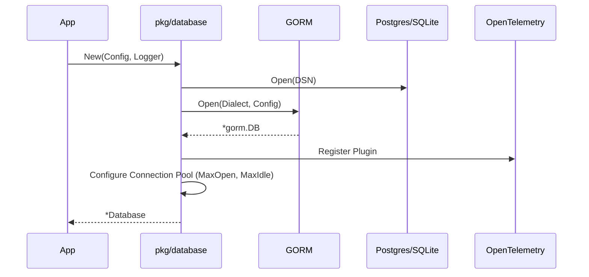
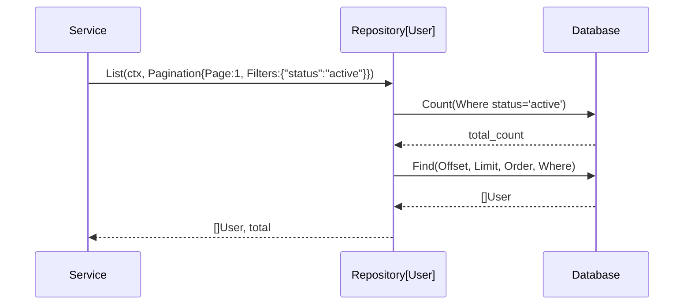
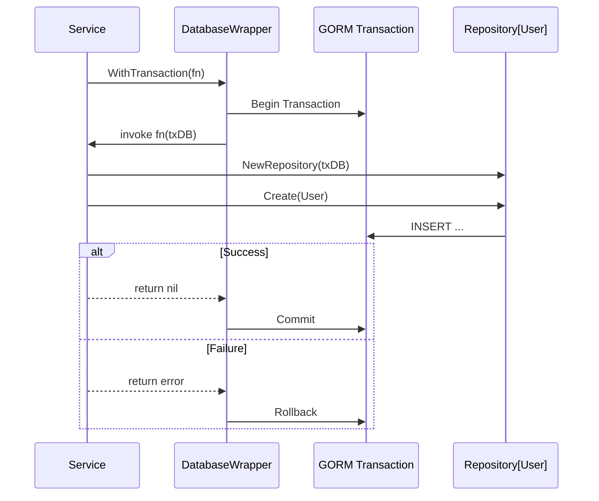
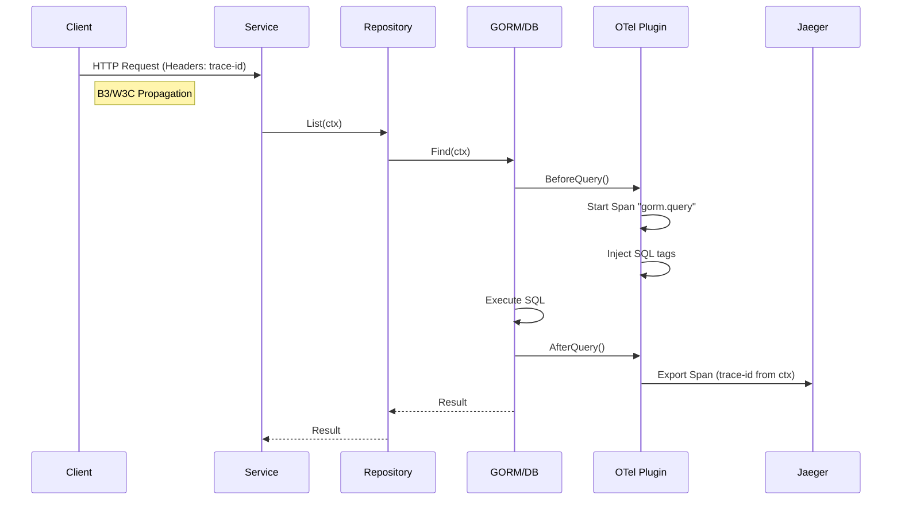

# Database Package Learning Guide

This document explains the architecture, design, and usage of the generic `pkg/database` package in `gRouter`.

## Overview
The `pkg/database` package provides a standardized, production-ready interface for interacting with databases. It abstracts the underlying driver (Postgres, SQLite) and ORM (GORM) complexities, offering a clean API for microservices.

## Architecture

The package is built on top of **GORM** and follows the **Repository Pattern**.



## Features & Sequence Diagrams

### 1. Initialization
The `New` factory function initializes the database connection, configures the connection pool, sets up the Zap logger adapter, and registers OpenTelemetry tracing.



### 2. Generic CRUD Operations
The `Repository[T]` interface allows standard CRUD operations on any entity without writing boilerplate code. Supports **Pagination** and **Dynamic Filtering**.



### 3. Transaction Management
Atomic operations are supported via `WithTransaction`.



### 4. Observability: Tracing Flow
The package uses `gorm.io/plugin/opentelemetry` to automatically trace queries.



## Build and Verification

### Unit Tests
Run the comprehensive test suite (includes SQLite in-memory tests).

**Using Go:**
```bash
go test -v ./pkg/database/...
```

**Using Bazel:**
```bash
bazel test //pkg/database/...
```

### Build
To build the library:

**Using Go:**
```bash
go build ./pkg/database/...
```

**Using Bazel:**
```bash
bazel build //pkg/database
```

## Usage Examples

### Basic Setup
```go
cfg := config.DatabaseConfig{
    Driver: "postgres",
    Host: "localhost",
    // ...
}
db, err := database.New(cfg, zapLogger)
```

### Using Generic Repository
```go
type User struct {
    ID   uint `gorm:"primarykey"`
    Name string
}

// Create Repo
repo := database.NewRepository[User](db.DB)

// CRUD
repo.Create(ctx, &User{Name: "Ganesh"})

// List with Filters
repo.List(ctx, database.Pagination{
    Page: 1,
    Filters: map[string]interface{}{"name": "Ganesh"},
})
```
