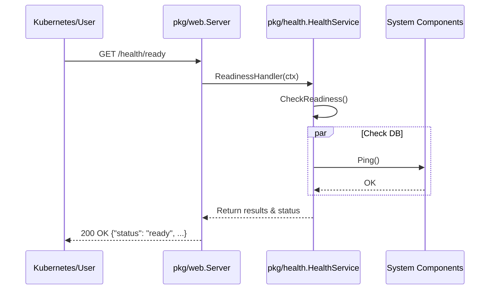
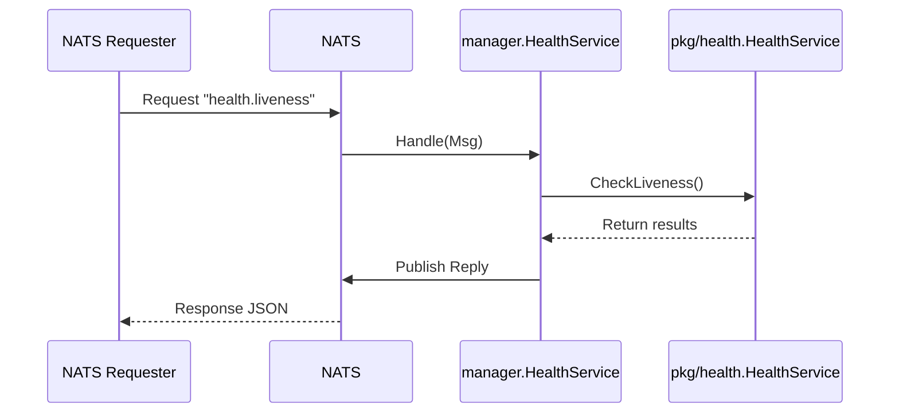

# Health Service

The `pkg/health` package provides a centralized, thread-safe mechanism for managing the health state of the application. It is designed to be used by both the HTTP server (`pkg/web`) and the NATS manager (`pkg/manager`).

## Features

-   **Centralized Logic**: A single `HealthService` instance manages checks, ensuring consistency across all transports.
-   **Dual Probes**: Distinct `liveness` (is the process running?) and `readiness` (can it handle traffic?) checks.
-   **Concurrency Safe**: Thread-safe registration and execution of checks.
-   **Transport Agnostic**: Check logic is decoupled from transport (HTTP/NATS).
-   **Standardized Response**: Uniform JSON output for all probes.

## Design

The architecture follows the **Shared Package** pattern to avoid circular dependencies:

1.  **`pkg/health`**: Defines `HealthService` and `HealthChecker`. Independent of `web` or `manager`.
2.  **`pkg/web`**: Imports `pkg/health` to expose HTTP endpoints (`/health/live`, `/health/ready`).
3.  **`pkg/manager`**: Imports `pkg/health` to expose NATS endpoints (`health.liveness`, `health.readiness`).

### Interfaces

```go
// HealthChecker returns an error if the check fails
type HealthChecker func() error

// HealthService methods
func (s *HealthService) AddLivenessCheck(name string, check HealthChecker)
func (s *HealthService) AddReadinessCheck(name string, check HealthChecker)
func (s *HealthService) CheckLiveness() (map[string]string, error)
func (s *HealthService) CheckReadiness() (map[string]string, error)
```

## Sequential Flows

### 1. HTTP Health Check Flow

Users (e.g., Kubernetes) query the HTTP endpoint directly.



### 2. NATS Health Check Flow

Services query health via NATS Request-Reply.



## Usage

### Where to call these APIs?

You should register health checks during your service initialization, typically in `RegisterServices` or `Init` method of your application loop.

**Example in `services/natsdemosvc/internal/app/app.go`:**

```go
func (a *App) RegisterServices() error {
    // ... setup service ...

    // Access the HealthService via the Manager
    healthSvc := a.manager.Health()

    // Add a check for this service
    healthSvc.AddReadinessCheck("natsdemo-db", func() error {
        // Implement your actual check logic here
        return db.Ping() 
    })
    
    // ...
}
```

### Response Format

```json
{
  "status": "ready",
  "checks": {
    "database": "OK",
    "cache": "OK"
  }
}
```
