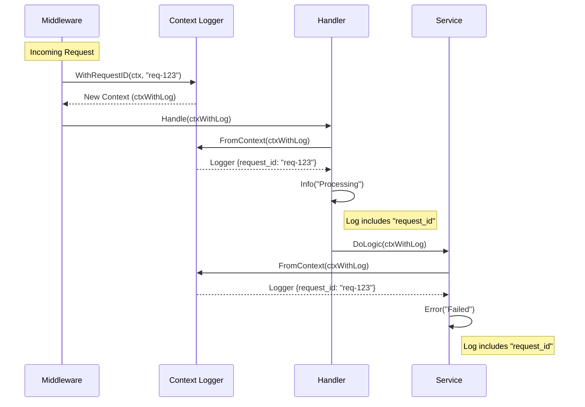

# Logger Module

The `pkg/logger` module provides a structured logging wrapper around [zap](https://github.com/uber-go/zap). It supports JSON and Console formatting, file output, and context propagation.

## Components

*   **Config**: Configuration struct for setting log level, format, and output.
*   **Global Logger**: A singleton instance for application-wide logging.
*   **Context Helpers**: Middleware support for injecting loggers with request-scoped fields (e.g., RequestID).

## Configuration

```go
type Config struct {
    Level      string // "debug", "info", "warn", "error"
    Format     string // "json" (production) or "console" (development)
    OutputPath string // "stdout" or file path
}
```

## Initialization & Usage

### 1. Basic Initialization

Initialize the logger at the start of your application.

```go
package main

import "github.com/ganesh/grouter/pkg/logger"

func main() {
    cfg := logger.Config{
        Level:  "info",
        Format: "json",
    }
    
    // Initialize global logger
    log, _ := logger.New(cfg)
    defer logger.Sync()
    
    // Use directly
    log.Info("Application started")
    
    // Or via global helpers
    logger.Info("Global helper usage")
}
```

### 2. Contextual Logging

The module shines when used with `context.Context` to propagate metadata like Request IDs or Trace IDs throughout the call stack.

#### Flow Diagram



#### Go Code Example (Context)

```go
func Middleware(next http.Handler) http.Handler {
    return http.HandlerFunc(func(w http.ResponseWriter, r *http.Request) {
        // 1. Create context with Request ID
        ctx := logger.WithRequestID(r.Context(), "req-123")
        
        // 2. Pass context down
        next.ServeHTTP(w, r.WithContext(ctx))
    })
}

func Handler(w http.ResponseWriter, r *http.Request) {
    // 3. Retrieve logger from context
    // This logger automatically has "request_id": "req-123" attached
    log := logger.FromContext(r.Context())
    
    log.Info("Handling request")
}
```
