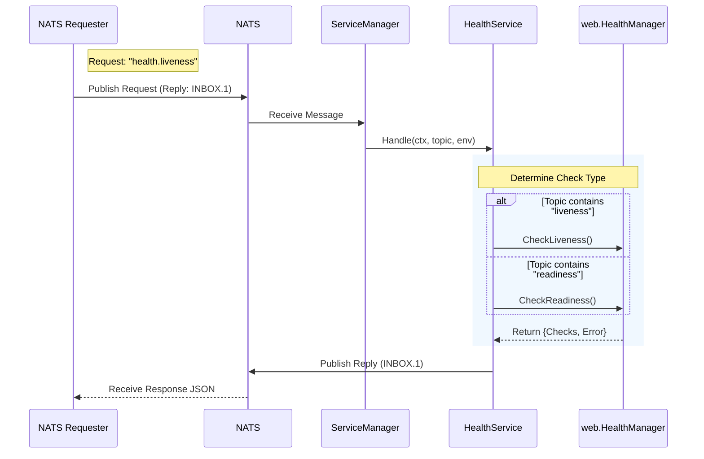

# Health Service

The `HealthService` in `pkg/manager` bridges the NATS messaging layer with the application's internal health state (managed by `pkg/web`). It enables external entities to query the liveness and readiness of the service via NATS Request-Reply.

## features

-   **NATS Integration**: Implements the `manager.Service` interface to handle NATS messages.
-   **Dual Probes**: Supports both `liveness` (is the process up?) and `readiness` (can it traffic?) checks.
-   **Granular Checks**: Aggregates results from individual health checkers registered in `web.HealthManager`.
-   **Unified Response**: Returns a standardized JSON response for both HTTP and NATS probes.

## Design

The system is designed to be **transport-agnostic** regarding the actual health check logic. The `web.HealthManager` holds the source of truth, while `HealthService` acts as a NATS adapter.

### Components
1.  **ServiceManager**: Initializes and registers the `HealthService`.
2.  **HealthService**: Listens for NATS messages, queries `HealthManager`, and sends replies.
3.  **HealthManager** (`pkg/web`): Registry for individual `HealthChecker` functions.

## Sequential Flow



## Models

### Request
-   **Subject**: `health.liveness`, `health.readiness`, or `<app>.health.<type>`
-   **Payload**: Empty (ignored)
-   **Reply**: Required

### Response
The response payload is a JSON object matching the schema used by the HTTP endpoints.

```json
{
  "status": "up",           // "up" | "down" | "ready" | "not ready"
  "checks": {               // Map of individual check names to their status
    "database": "OK",
    "redis": "connection refused"
  },
  "error": "liveness check failed" // Present only if status is down/not ready
}
```
