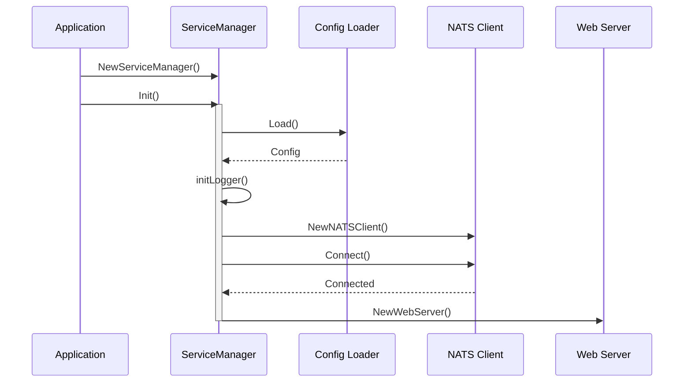
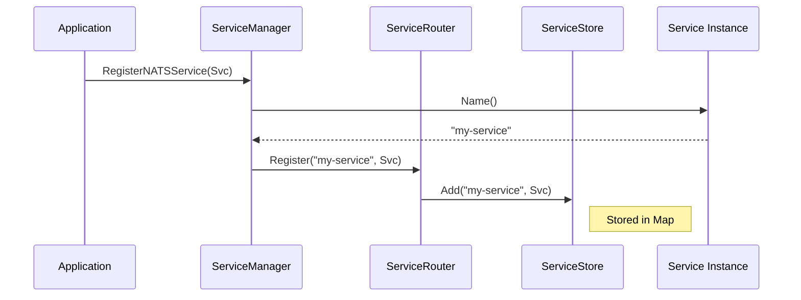
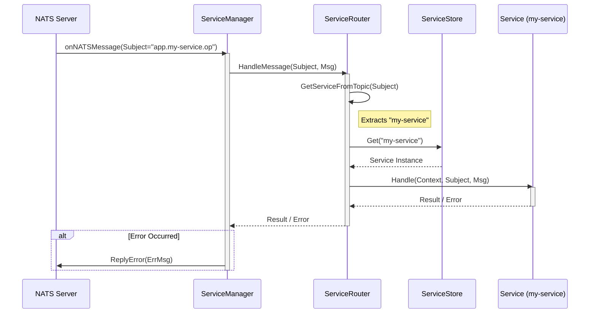
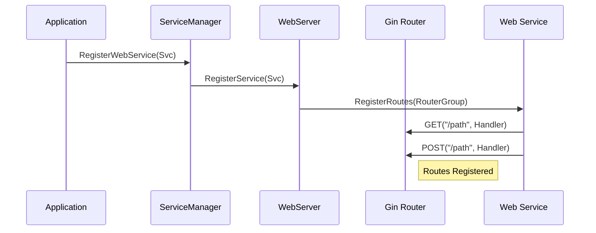
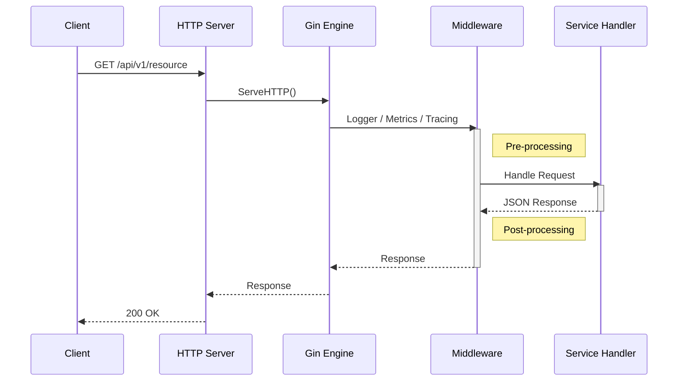

# Manager Module Architecture

The `pkg/manager` module is responsible for orchestrating the application lifecycle, managing internal services, and routing NATS messages.

## Components

*   **ServiceManager**: The main entry point. Initializes config, logger, NATS, and Web Server.
*   **ServiceRouter**: Routes incoming NATS messages to the correct registered service.
*   **ServiceStore**: A thread-safe registry of services.
*   **Service Interface**: The contract that all managed services must implement.

## Sequence Diagrams

### 1. Service Manager Initialization

### 2. Service Registration

Services are registered with the manager so they can receive NATS messages routed by topic.

### 3. Message Routing Flow

When a NATS message arrives (e.g., subject `app.my-service.do-work`), the manager routes it to the correct service.

### 4. WebService Registration

Services that expose HTTP endpoints register with the Web Server.

### 5. Web Request Flow

How an incoming HTTP request is processed by the managed web server.

