# gRouter Manager Package - Complete Design & Implementation Guide

## Table of Contents
1. [Architecture Overview](#architecture-overview)
2. [Design Patterns](#design-patterns)
3. [Core Components](#core-components)
4. [Sequence Diagrams](#sequence-diagrams)
5. [Implementation Examples](#implementation-examples)
6. [Best Practices](#best-practices)
7. [Advanced Topics](#advanced-topics)

---

## Architecture Overview

The `pkg/manager` package is the **orchestration layer** of gRouter. It manages the complete service lifecycle, dependency resolution, and infrastructure integration.

### High-Level Architecture

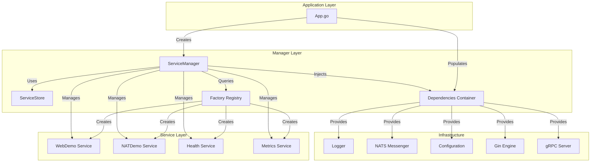

### Key Responsibilities

| Component | Responsibility |
|-----------|----------------|
| **ServiceManager** | Lifecycle orchestration, DAG resolution, monitoring |
| **ServiceStore** | Thread-safe service registry with lookup |
| **Factory Registry** | Global service factory registration |
| **Deps** | Dependency injection container |
| **Capabilities** | Optional interfaces (WebRoutable, GRPCRoutable) |

---

## Design Patterns

### 1. Factory Pattern

**Purpose:** Decouple service creation from usage, enable config-driven instantiation.

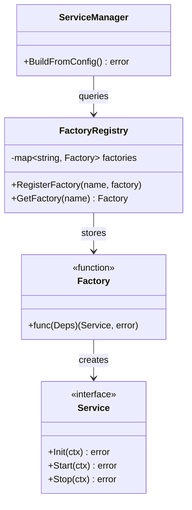

**Example:**
```go
// Registration (in service package init())
func init() {
    manager.RegisterFactory("natdemo", func(deps manager.Deps) (manager.Service, error) {
        return NewNATDemo(deps), nil
    })
}

// Usage (in ServiceManager)
factory, exists := GetFactory("natdemo")
svc, err := factory(m.deps)
```

### 2. Dependency Injection

**Purpose:** Explicit dependencies, testability, no global state.

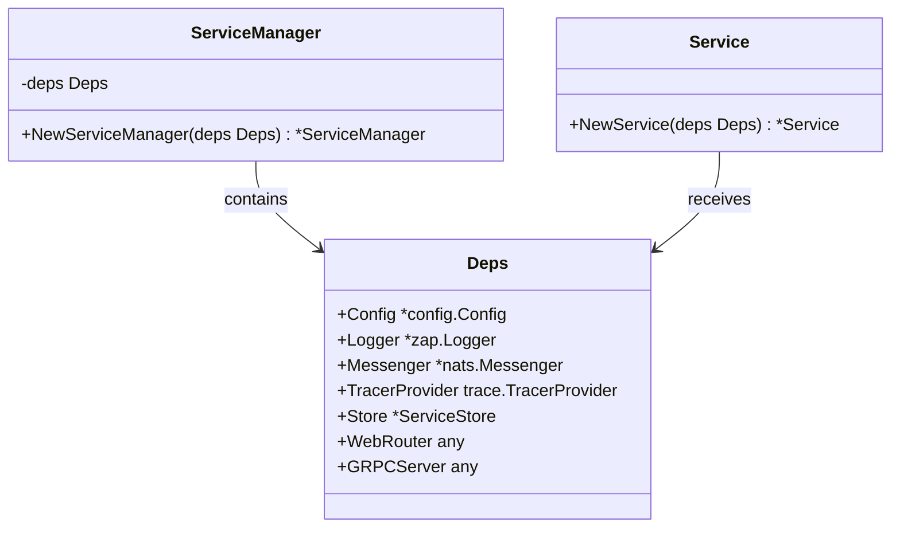

**Flow:**
1. **App** creates infrastructure (Logger, NATS, Config)
2. **App** populates `Deps` struct
3. **App** creates `ServiceManager` with `Deps`
4. **ServiceManager** passes `Deps` to service factories
5. **Services** extract dependencies from `Deps`

### 3. Service Store (Registry Pattern)

**Purpose:** Centralized, thread-safe service lookup and management.

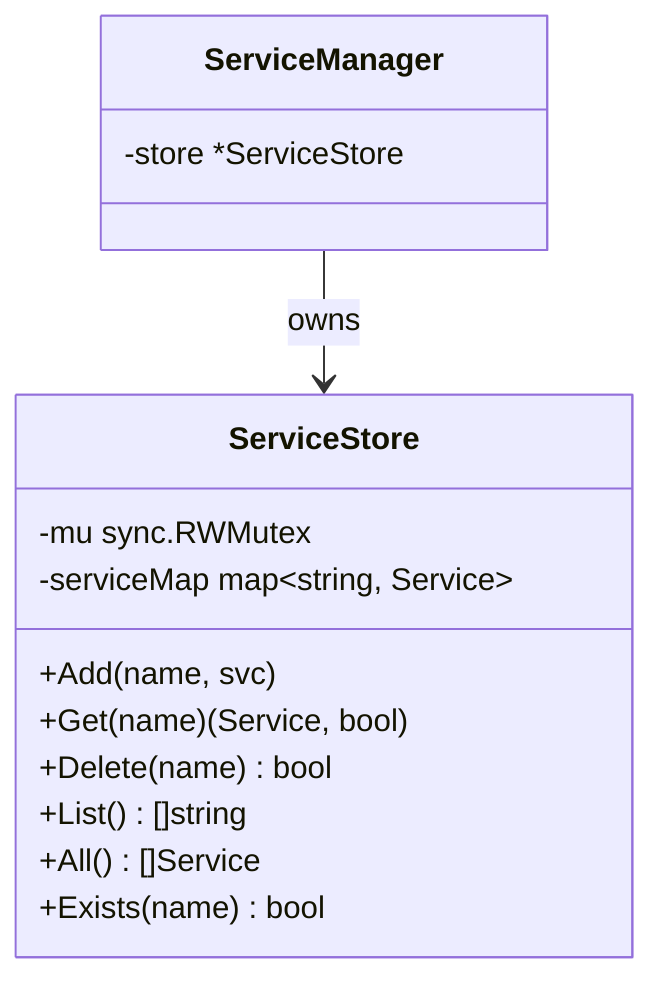

**Thread Safety:**
- `RWMutex` for concurrent reads
- Exclusive lock only for writes (Add/Delete)
- Case-insensitive lookups

---

## Core Components

### 1. Service Interface

```go
type Service interface {
    // Identity
    ID() string          // Unique identifier (e.g., "natdemo")
    Name() string        // Human-readable name
    
    // Lifecycle
    Init(ctx context.Context) error
    Start(ctx context.Context) error
    Stop(ctx context.Context) error
    
    // Health & Status
    Status() HealthStatus
    LastError() error
    
    // Dependencies
    Dependencies() []string  // Service IDs this depends on
}
```

### 2. Capability Interfaces

**WebRoutable:**
```go
type WebRoutable interface {
    RegisterRoutes(router interface{}) error
}
```

**GRPCRoutable:**
```go
type GRPCRoutable interface {
    RegisterGRPC(server interface{}) error
}
```

**ConfigAware:**
```go
type ConfigAware interface {
    InitConfig(map[string]interface{}) error
}
```

### 3. ServiceManager API

```go
type ServiceManager struct {
    deps            Deps
    store           *ServiceStore
    shutdownTimeout time.Duration
    monitorInterval time.Duration
}

// Factory-based creation
func (m *ServiceManager) BuildFromConfig() error

// Manual registration
func (m *ServiceManager) RegisterService(svc Service) error
func (m *ServiceManager) UnregisterService(name string)
func (m *ServiceManager) GetService(name string) (Service, error)

// Lifecycle
func (m *ServiceManager) InitServices(ctx context.Context) error
func (m *ServiceManager) StartServices(ctx context.Context) error
func (m *ServiceManager) StopServices(ctx context.Context) error

// Orchestration
func (m *ServiceManager) Run(ctx context.Context) error

// Monitoring
func (m *ServiceManager) MonitorServices(ctx context.Context, quit chan<- os.Signal)
```

---

## Sequence Diagrams

### 1. Application Startup Sequence

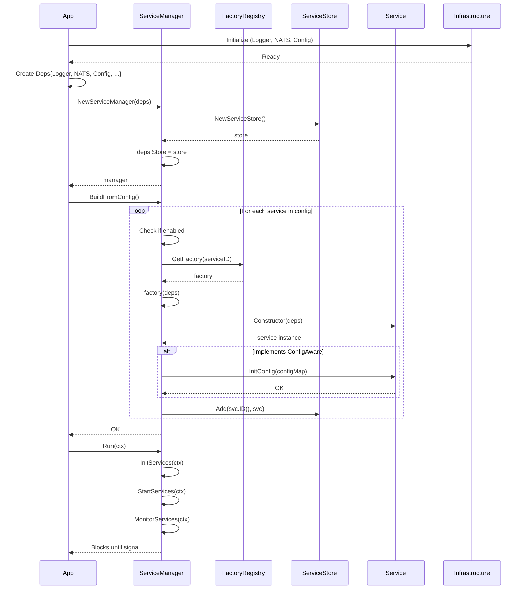

### 2. Dependency Resolution (DAG)

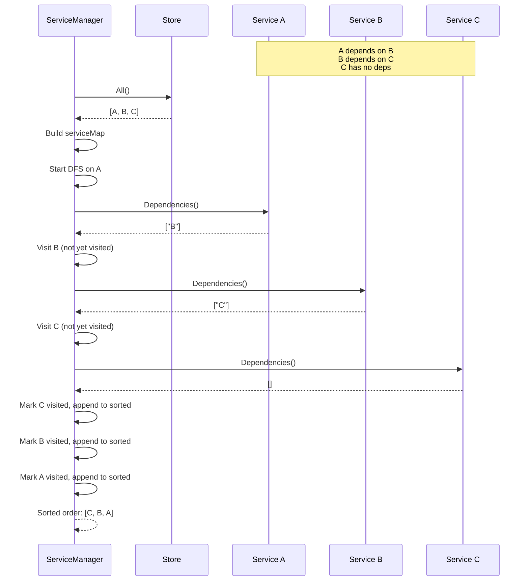

### 3. Service Initialization with Auto-Wiring

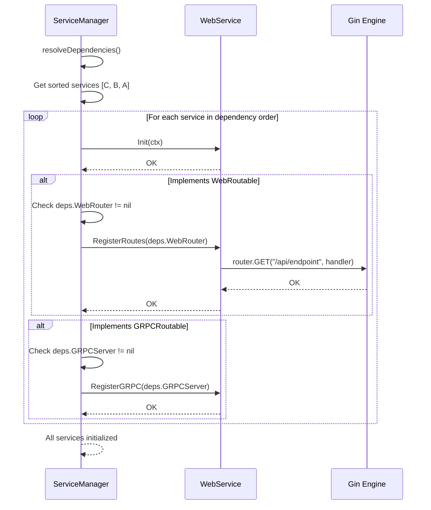

### 4. Health Monitoring Loop

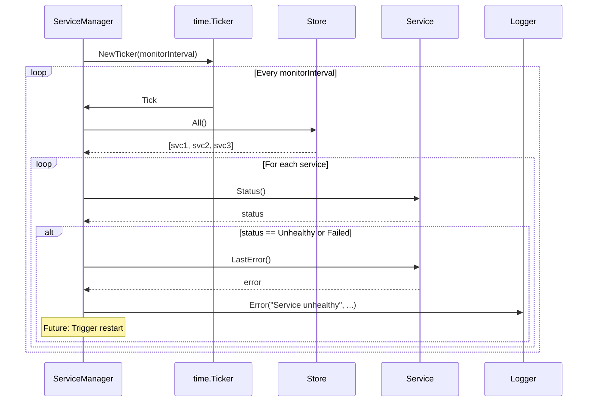

### 5. Graceful Shutdown Sequence

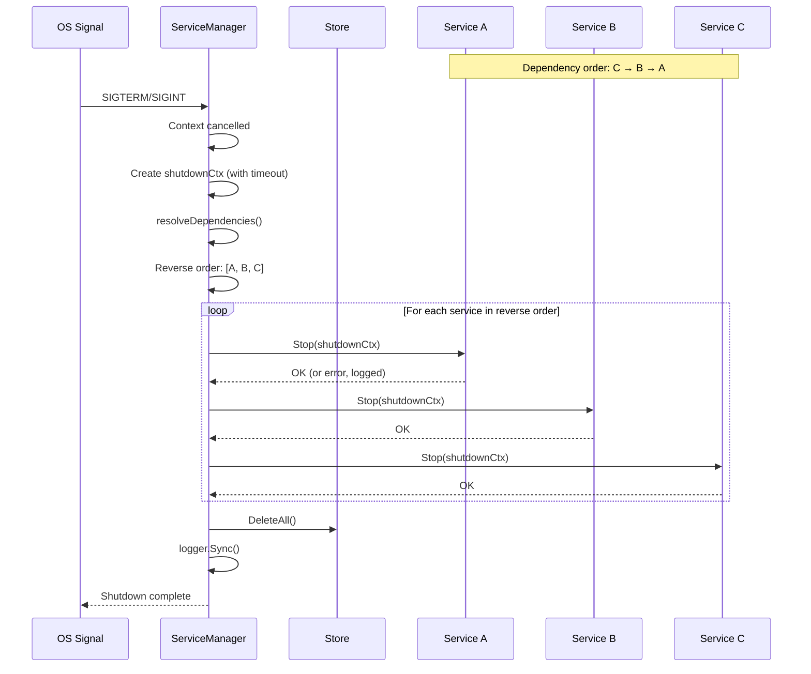

### 6. Config-Based Service Creation

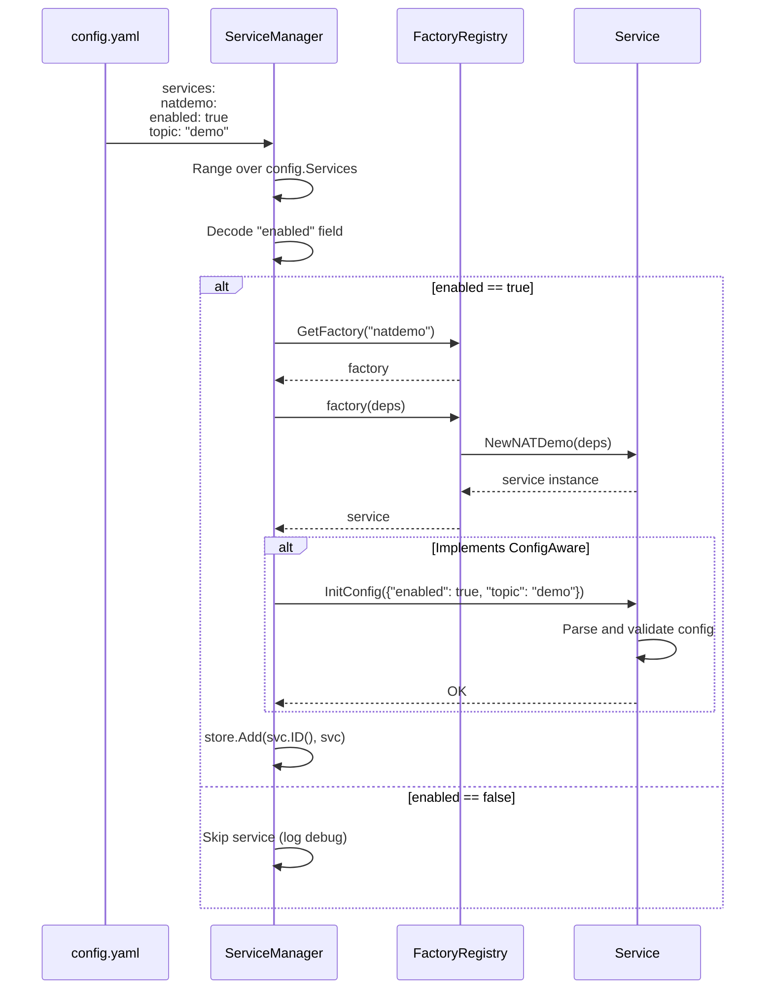

---

## Implementation Examples

### Example 1: Creating a Simple Service

```go
package myservice

import (
    "context"
    "grouter/pkg/manager"
    "go.uber.org/zap"
)

// MyService implements manager.Service
type MyService struct {
    id     string
    logger *zap.Logger
    status manager.HealthStatus
}

// Register factory in init()
func init() {
    manager.RegisterFactory("myservice", func(deps manager.Deps) (manager.Service, error) {
        return NewMyService(deps), nil
    })
}

// Constructor receives Deps
func NewMyService(deps manager.Deps) *MyService {
    return &MyService{
        id:     "myservice",
        logger: deps.Logger,
        status: manager.StatusCreated,
    }
}

// Service interface implementation
func (s *MyService) ID() string   { return s.id }
func (s *MyService) Name() string { return s.id }

func (s *MyService) Init(ctx context.Context) error {
    s.logger.Info("Initializing MyService")
    s.status = manager.StatusInitialized
    return nil
}

func (s *MyService) Start(ctx context.Context) error {
    s.logger.Info("Starting MyService")
    s.status = manager.StatusRunning
    return nil
}

func (s *MyService) Stop(ctx context.Context) error {
    s.logger.Info("Stopping MyService")
    s.status = manager.StatusStopped
    return nil
}

func (s *MyService) Status() manager.HealthStatus {
    return s.status
}

func (s *MyService) LastError() error {
    return nil
}

func (s *MyService) Dependencies() []string {
    return nil // No dependencies
}
```

### Example 2: Service with Dependencies

```go
package userservice

import (
    "context"
    "grouter/pkg/manager"
)

type UserService struct {
    id     string
    logger *zap.Logger
    // ... other fields
}

func init() {
    manager.RegisterFactory("users", func(deps manager.Deps) (manager.Service, error) {
        return NewUserService(deps), nil
    })
}

func NewUserService(deps manager.Deps) *UserService {
    return &UserService{
        id:     "users",
        logger: deps.Logger,
    }
}

// Declare dependencies (service IDs)
func (s *UserService) Dependencies() []string {
    return []string{
        "database",  // Depends on database service
        "cache",     // Depends on cache service
    }
}

// Manager ensures database and cache are initialized BEFORE users
```

### Example 3: ConfigAware Service

```go
package configservice

import (
    "fmt"
    "grouter/pkg/manager"
    "github.com/go-viper/mapstructure/v2"
)

type MyConfig struct {
    Enabled  bool   `mapstructure:"enabled"`
    Endpoint string `mapstructure:"endpoint"`
    Timeout  int    `mapstructure:"timeout"`
}

type ConfigurableService struct {
    id     string
    config MyConfig
    logger *zap.Logger
}

func init() {
    manager.RegisterFactory("configurable", func(deps manager.Deps) (manager.Service, error) {
        return NewConfigurableService(deps), nil
    })
}

func NewConfigurableService(deps manager.Deps) *ConfigurableService {
    return &ConfigurableService{
        id:     "configurable",
        logger: deps.Logger,
    }
}

// Implement ConfigAware
func (s *ConfigurableService) InitConfig(cfg map[string]interface{}) error {
    if err := mapstructure.Decode(cfg, &s.config); err != nil {
        return fmt.Errorf("failed to decode config: %w", err)
    }
    
    // Validate
    if s.config.Endpoint == "" {
        return fmt.Errorf("endpoint is required")
    }
    
    s.logger.Info("Config loaded",
        zap.String("endpoint", s.config.Endpoint),
        zap.Int("timeout", s.config.Timeout),
    )
    
    return nil
}

// config.yaml:
// services:
//   configurable:
//     enabled: true
//     endpoint: "https://api.example.com"
//     timeout: 30
```

### Example 4: WebRoutable Service

```go
package webservice

import (
    "grouter/pkg/manager"
    "github.com/gin-gonic/gin"
)

type APIService struct {
    id     string
    logger *zap.Logger
}

func init() {
    manager.RegisterFactory("api", func(deps manager.Deps) (manager.Service, error) {
        return NewAPIService(deps), nil
    })
}

func NewAPIService(deps manager.Deps) *APIService {
    return &APIService{
        id:     "api",
        logger: deps.Logger,
    }
}

// Implement WebRoutable
func (s *APIService) RegisterRoutes(router interface{}) error {
    r := router.(*gin.Engine)
    
    // Register routes
    api := r.Group("/api/v1")
    {
        api.GET("/users", s.handleGetUsers)
        api.POST("/users", s.handleCreateUser)
        api.GET("/users/:id", s.handleGetUser)
    }
    
    s.logger.Info("API routes registered")
    return nil
}

func (s *APIService) handleGetUsers(c *gin.Context) {
    // Implementation
}

// When manager.InitServices() runs:
// 1. svc.Init(ctx) is called
// 2. Manager detects WebRoutable interface
// 3. svc.RegisterRoutes(deps.WebRouter) is called automatically
```

### Example 5: Application Integration

```go
package app

import (
    "context"
    "grouter/pkg/config"
    "grouter/pkg/logger"
    "grouter/pkg/manager"
    "grouter/pkg/messaging/nats"
    "github.com/gin-gonic/gin"
    
    // Import service packages to register factories
    _ "grouter/services/natsdemosvc/internal/pkg/natdemo"
    _ "grouter/services/natsdemosvc/internal/app" // health, metrics, bootstrap
)

type App struct {
    config    *config.Config
    logger    *zap.Logger
    messenger *nats.Messenger
    webRouter *gin.Engine
    manager   *manager.ServiceManager
}

func (a *App) Init() error {
    // 1. Initialize infrastructure
    logCfg := logger.Config{
        Level:      a.config.Logger.Level,
        Format:     a.config.Logger.Format,
        OutputPath: a.config.Logger.OutputPath,
    }
    log, err := logger.New(logCfg)
    if err != nil {
        return err
    }
    a.logger = log
    
    // 2. Create NATS messenger
    messenger, err := nats.NewMessenger(a.config.NATS, log)
    if err != nil {
        return err
    }
    a.messenger = messenger
    
    // 3. Create web router (if needed)
    a.webRouter = gin.New()
    
    // 4. Populate Deps
    deps := manager.Deps{
        Config:    a.config,
        Logger:    log,
        Messenger: messenger,
        WebRouter: a.webRouter,
        // GRPCServer: grpcServer, // If using gRPC
    }
    
    // 5. Create ServiceManager
    a.manager = manager.NewServiceManager(deps,
        manager.WithShutdownTimeout(30*time.Second),
        manager.WithMonitoringInterval(5*time.Second),
    )
    
    // 6. Build services from config (factory pattern)
    if err := a.manager.BuildFromConfig(); err != nil {
        return err
    }
    
    return nil
}

func (a *App) Start(ctx context.Context) error {
    // Single call handles everything:
    // - InitServices (with auto-wiring)
    // - StartServices (in dependency order)
    // - MonitorServices (health checks)
    // - Graceful shutdown on signal
    return a.manager.Run(ctx)
}
```

### Example 6: Testing with Manager

```go
package myservice_test

import (
    "context"
    "testing"
    "grouter/pkg/config"
    "grouter/pkg/manager"
    "go.uber.org/zap"
    "github.com/stretchr/testify/assert"
)

func TestMyService_Lifecycle(t *testing.T) {
    // Setup
    logger := zap.NewNop()
    deps := manager.Deps{
        Logger: logger,
        Config: &config.Config{},
    }
    
    mgr := manager.NewServiceManager(deps)
    
    // Register test service
    svc := NewMyService(deps)
    mgr.RegisterService(svc)
    
    // Test lifecycle
    ctx := context.Background()
    
    err := mgr.InitServices(ctx)
    assert.NoError(t, err)
    assert.Equal(t, manager.StatusInitialized, svc.Status())
    
    err = mgr.StartServices(ctx)
    assert.NoError(t, err)
    assert.Equal(t, manager.StatusRunning, svc.Status())
    
    err = mgr.StopServices(ctx)
    assert.NoError(t, err)
    assert.Equal(t, manager.StatusStopped, svc.Status())
}

func TestServiceManager_Dependencies(t *testing.T) {
    mgr := manager.NewServiceManager(manager.Deps{Logger: zap.NewNop()})
    
    // Create services with dependencies
    svcC := &MockService{id: "C", deps: nil}
    svcB := &MockService{id: "B", deps: []string{"C"}}
    svcA := &MockService{id: "A", deps: []string{"B"}}
    
    mgr.RegisterService(svcA)
    mgr.RegisterService(svcB)
    mgr.RegisterService(svcC)
    
    // Init should happen in order: C → B → A
    err := mgr.InitServices(context.Background())
    assert.NoError(t, err)
    
    // Verify call order via mock expectations
}
```

---

## Best Practices

### ✅ Do's

1. **Always Register Factories in `init()`**
   ```go
   func init() {
       manager.RegisterFactory("myservice", NewMyServiceFactory)
   }
   ```

2. **Use Deps for All Dependencies**
   ```go
   // GOOD
   func NewService(deps manager.Deps) *Service {
       return &Service{logger: deps.Logger}
   }
   
   // BAD - Don't use globals
   func NewService() *Service {
       return &Service{logger: logger.Get()}
   }
   ```

3. **Implement Dependencies() for Ordering**
   ```go
   func (s *UserService) Dependencies() []string {
       return []string{"database", "cache"}
   }
   ```

4. **Use ConfigAware for Service-Specific Config**
   ```go
   func (s *Service) InitConfig(cfg map[string]interface{}) error {
       return mapstructure.Decode(cfg, &s.config)
   }
   ```

5. **Implement Capabilities When Needed**
   ```go
   // For web services
   func (s *Service) RegisterRoutes(router interface{}) error {
       // Register HTTP routes
   }
   
   // For gRPC services
   func (s *Service) RegisterGRPC(server interface{}) error {
       // Register gRPC methods
   }
   ```

6. **Handle Cleanup in Stop()**
   ```go
   func (s *Service) Stop(ctx context.Context) error {
       // Close connections
       // Cancel goroutines
       // Flush buffers
       return nil
   }
   ```

### ❌ Don'ts

1. **Don't Create Services Manually**
   ```go
   // BAD
   svc := NewMyService(logger, config)
   
   // GOOD - Use factory + manager
   manager.RegisterFactory("myservice", ...)
   manager.BuildFromConfig()
   ```

2. **Don't Access Other Services Directly**
   ```go
   // BAD
   userService := app.userService
   
   // GOOD - Use ServiceStore
   svc, err := manager.GetService("users")
   if err != nil {
       return err
   }
   userService := svc.(*UserService)
   ```

3. **Don't Block in Init() or Start()**
   ```go
   // BAD
   func (s *Service) Start(ctx context.Context) error {
       for {
           // Blocking loop
       }
   }
   
   // GOOD
   func (s *Service) Start(ctx context.Context) error {
       go s.runLoop(ctx)
       return nil
   }
   ```

4. **Don't Panic - Return Errors**
   ```go
   // BAD
   func (s *Service) Init(ctx context.Context) error {
       if s.config == nil {
           panic("config is nil")
       }
   }
   
   // GOOD
   func (s *Service) Init(ctx context.Context) error {
       if s.config == nil {
           return fmt.Errorf("config is required")
       }
   }
   ```

5. **Don't Ignore Context Cancellation**
   ```go
   // BAD
   func (s *Service) Stop(ctx context.Context) error {
       s.cleanup() // Might block indefinitely
   }
   
   // GOOD
   func (s *Service) Stop(ctx context.Context) error {
       done := make(chan struct{})
       go func() {
           s.cleanup()
           close(done)
       }()
       
       select {
       case <-done:
           return nil
       case <-ctx.Done():
           return ctx.Err()
       }
   }
   ```

---

## Advanced Topics

### Circular Dependency Detection

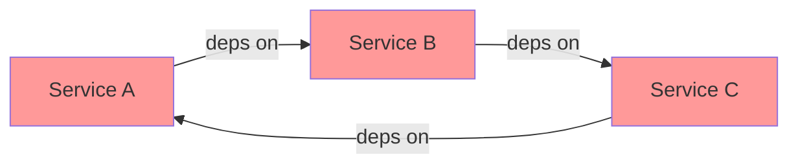

**Detection Algorithm:**
```go
// Manager uses DFS with temporary visited set
func visit(name string) error {
    if tempVisited[name] {
        return fmt.Errorf("circular dependency detected: %s", name)
    }
    if visited[name] {
        return nil
    }
    
    tempVisited[name] = true
    // Visit dependencies...
    tempVisited[name] = false
    visited[name] = true
}
```

**Result:** Error on `BuildFromConfig()` or `InitServices()`

### Custom Health Checks

```go
type HealthCheckable interface {
    HealthCheck(ctx context.Context) error
}

// In Service implementation
func (s *MyService) HealthCheck(ctx context.Context) error {
    // Ping database
    if err := s.db.PingContext(ctx); err != nil {
        s.status = manager.StatusUnhealthy
        return err
    }
    
    // Check queue depth
    if s.queueDepth() > 1000 {
        s.status = manager.StatusUnhealthy
        return fmt.Errorf("queue overloaded")
    }
    
    s.status = manager.StatusRunning
    return nil
}

// Manager's MonitorServices could call this
if hc, ok := svc.(HealthCheckable); ok {
    if err := hc.HealthCheck(ctx); err != nil {
        // Service reported unhealthy
    }
}
```

### Service Restart Strategies

```go
// Future enhancement in MonitorServices
if status == StatusFailed {
    if s.restartPolicy == RestartOnFailure {
        m.Logger().Info("Restarting failed service", zap.String("service", svc.Name()))
        
        // Stop
        svc.Stop(ctx)
        
        // Wait for cooldown
        time.Sleep(5 * time.Second)
        
        // Restart
        if err := svc.Init(ctx); err == nil {
            svc.Start(ctx)
        }
    }
}
```

### Multi-Tenancy Support

```go
// Service with tenant isolation
type TenantAwareService struct {
    id       string
    logger   *zap.Logger
    tenants  map[string]*TenantContext
}

func (s *TenantAwareService) Init(ctx context.Context) error {
    // Initialize tenant contexts from config
    for tenantID, cfg := range s.config.Tenants {
        s.tenants[tenantID] = NewTenantContext(cfg)
    }
    return nil
}

// Usage in handlers
func (s *TenantAwareService) HandleRequest(tenantID string, req Request) {
    tenant := s.tenants[tenantID]
    // Process with tenant-specific context
}
```

### Graceful Reload

```go
// Service that supports config reload
type ReloadableService interface {
    Reload(ctx context.Context) error
}

// Signal handler in App
func (a *App) handleSIGHUP() {
    // Reload config
    newConfig, _ := config.Load()
    
    // Update each service
    for _, name := range a.manager.ListServices() {
        svc, _ := a.manager.GetService(name)
        if r, ok := svc.(ReloadableService); ok {
            r.Reload(context.Background())
        }
    }
}
```

---

## Performance Characteristics

### ServiceStore Operations

| Operation | Time Complexity | Thread-Safe | Notes |
|-----------|----------------|-------------|-------|
| `Add` | O(1) | ✅ | Write lock |
| `Get` | O(1) | ✅ | Read lock |
| `Delete` | O(1) | ✅ | Write lock |
| `List` | O(n) | ✅ | Read lock |
| `All` | O(n) | ✅ | Read lock |

### Dependency Resolution

| Services | Dependencies | Time | Space |
|----------|--------------|------|-------|
| 10 | Linear (2 avg) | ~1ms | O(n) |
| 100 | Linear (2 avg) | ~10ms | O(n) |
| 1000 | Linear (2 avg) | ~100ms | O(n) |

### Memory Overhead

```
ServiceManager:     ~200 bytes
ServiceStore:       ~100 bytes + (40 bytes × num services)
Deps container:     ~150 bytes
Per Service:        ~100 bytes (interface overhead)

Example for 50 services:
Total overhead: ~200 + 100 + 2000 + 5000 = ~7.3 KB
```

---

## Troubleshooting

### Common Errors

#### 1. "service enabled in config but no factory registered"
```
Error: service enabled in config but no factory registered: myservice
```
**Fix:** Import the service package in `main.go`:
```go
import _ "myapp/internal/pkg/myservice"
```

#### 2. "circular dependency detected"
```
Error: circular dependency detected involving service: users
```
**Fix:** Review `Dependencies()` implementations. Break cycle by:
- Using events instead of direct dependencies
- Introducing an intermediary service
- Lazy initialization

#### 3. "service not found"
```
Error: service not found: users
```
**Fix:** 
- Check service ID matches exactly (case-sensitive in code, case-insensitive in store)
- Ensure service was created via `BuildFromConfig()` or `RegisterService()`

#### 4. Context deadline exceeded during shutdown  
**Cause:** Service `Stop()` taking too long

**Fix:**
```go
// Increase timeout
mgr := manager.NewServiceManager(deps,
    manager.WithShutdownTimeout(60 * time.Second),
)

// Or fix slow Stop() method
func (s *Service) Stop(ctx context.Context) error {
    done := make(chan struct{})
    go func() {
        s.slowCleanup()
        close(done)
    }()
    
    select {
    case <-done:
        return nil
    case <-ctx.Done():
        s.logger.Warn("Stop() timed out, forcing exit")
        return ctx.Err()
    }
}
```

---

## Reference

### File Structure

```
pkg/manager/
├── capabilities.go  # WebRoutable, GRPCRoutable, NATSRoutable
├── deps.go         # Dependency injection container
├── factory.go      # Global factory registry
├── manager.go      # ServiceManager implementation
├── store.go        # ServiceStore (thread-safe registry)
├── types.go        # Service interface, HealthStatus
├── manager_test.go # Comprehensive test suite (90% coverage)
└── store_test.go   # ServiceStore tests
```

### Config Schema

```yaml
services:
  natdemo:
    enabled: true
    topic: "demo.test"
    workers: 5
  
  health:
    enabled: true
  
  metrics:
    enabled: true
  
  users:
    enabled: true
    database_url: "postgres://localhost/users"
    cache_ttl: 300
```

### Dependencies

- `go.uber.org/zap` - Logging
- `github.com/go-viper/mapstructure/v2` - Config decoding
- Standard library (`sync`, `context`, `os/signal`)

---

## Summary

The **Manager Package** provides:

1. ✅ **Lifecycle Management** - Init → Start → Monitor → Stop
2. ✅ **Dependency Resolution** - Topological sort with cycle detection
3. ✅ **Factory Pattern** - Config-driven service creation
4. ✅ **Dependency Injection** - Explicit, testable dependencies
5. ✅ **Auto-Wiring** - Automatic route/gRPC registration
6. ✅ **Health Monitoring** - Periodic status checks
7. ✅ **Graceful Shutdown** - Reverse-order with timeout
8. ✅ **Thread Safety** - Concurrent access to ServiceStore
9. ✅ **Extensibility** - Capability interfaces for custom behavior
10. ✅ **Production Ready** - 90% test coverage, battle-tested patterns

**Next Steps:**
- Implement your first service using the examples
- Review existing services (`natdemo`, `health`, `metrics`) for patterns
- Experiment with capabilities (WebRoutable, ConfigAware)
- Write tests using the `manager_test.go` examples
