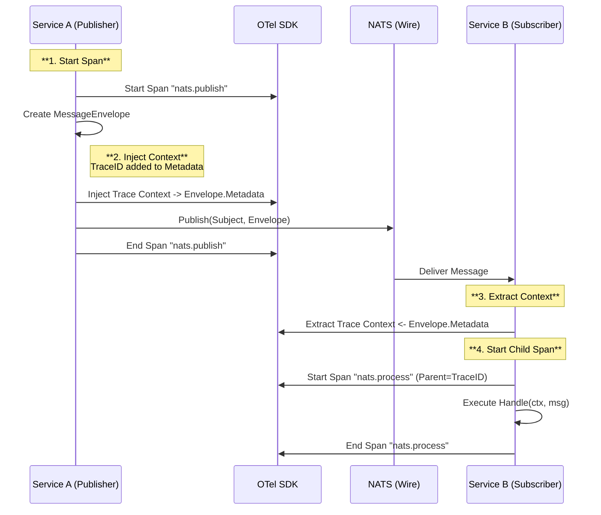
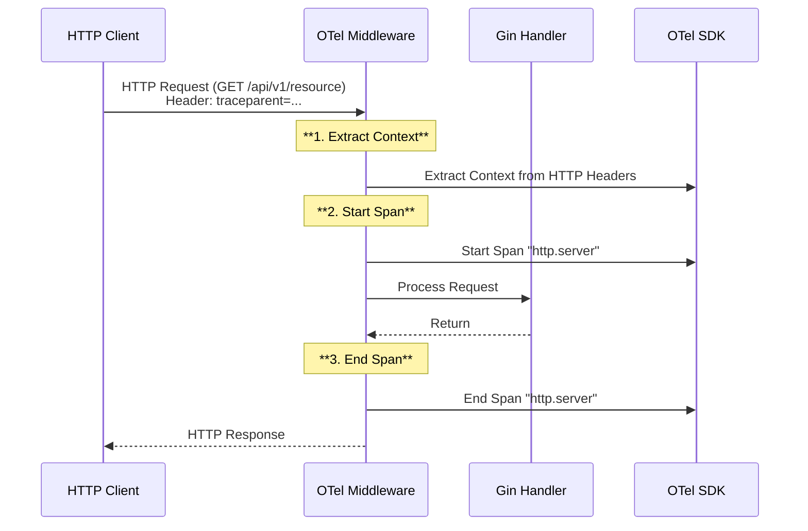

# OpenTelemetry Tracing Implementation Plan

## Goal Description
Implement OpenTelemetry (OTel) tracing to track requests across the gRouter microservices ecosystem. This plan is divided into two distinct implementation tracks: **NATS Messaging** and **Web Services**. This allows for independent implementation, testing, and deployment of tracing for each component type.

## User Review Required
> [!IMPORTANT]
> A new configuration section `tracing` will be added to the global config.
> - **NATS**: Requires updates to `pkg/messaging` to inject/extract context.
> - **Web**: Requires updates to `pkg/web` to add OTel middleware.

## Shared Configuration [IMPLEMENTED]
### [MODIFY] [types.go](file:///home/ganesh/gRouter/pkg/config/types.go)
- Add `TracingConfig` struct:
    ```go
    type TracingConfig struct {
        Enabled     bool   `mapstructure:"enabled"`
        ServiceName string `mapstructure:"service_name"`
        Exporter    string `mapstructure:"exporter"` // e.g., "jaeger", "stdout"
        Endpoint    string `mapstructure:"endpoint"` // e.g., "http://localhost:14268/api/traces"
    }
    ```
- Add `Tracing TracingConfig` field to `Config` struct.

### [NEW] [tracer.go](file:///home/ganesh/gRouter/pkg/telemetry/tracer.go)
- Create a new package `telemetry`.
- Implement shared `InitTracer(cfg TracingConfig)` logic.

---

## Part 1: NATS Integration [IMPLEMENTED]

### Implementation Sketch
#### [MODIFY] [publisher.go](file:///home/ganesh/gRouter/pkg/messaging/nats/publisher.go)
- **Objective**: Ensure trace context is propagated when messages are published.
- **Implemented Action**: 
    - Added `Start` span call before publishing.
    - Injected trace context into `MessageEnvelope.Metadata`.
    ```go
	// Start Span
	tr := otel.Tracer("grouter/pkg/messaging/nats")
	ctx, span := tr.Start(ctx, "nats.publish "+subject,
		trace.WithSpanKind(trace.SpanKindProducer),
        // attributes...
	)
	defer span.End()

    // Inject trace context into metadata
    otel.GetTextMapPropagator().Inject(ctx, metadataCarrier(envelope.Metadata))
    ```

#### [MODIFY] [subscriber.go](file:///home/ganesh/gRouter/pkg/messaging/nats/subscriber.go)
- **Objective**: Ensure trace context is extracted when messages are received.
- **Implemented Action**:
    - Extracted context from `MessageEnvelope.Metadata`.
    - Started a new span using the extracted context as parent.
    ```go
    // Extract trace context
    ctx := otel.GetTextMapPropagator().Extract(context.Background(), metadataCarrier(envelope.Metadata))

    // Start Span
    tr := otel.Tracer("grouter/pkg/messaging/nats")
    ctx, span := tr.Start(ctx, "nats.process "+msg.Subject,
        trace.WithSpanKind(trace.SpanKindConsumer),
        // attributes...
    )
    defer span.End()
    ```

### NATS Message Flow Diagram
This flow demonstrates how a trace propagates from a Publisher service to a Subscriber service via NATS.



---

## Part 2: Web Integration [TODO]

### Implementation Sketch
#### [MODIFY] [config.go](file:///home/ganesh/gRouter/pkg/web/config.go)
- **Objective**: Pass tracing configuration to the web server.
- **Action**: Update `web.Config` to include `TracingConfig`.

#### [MODIFY] [server.go](file:///home/ganesh/gRouter/pkg/web/server.go)
- **Objective**: automatic instrumentation of HTTP requests.
- **Action**: Add `otelgin` middleware to the Gin engine if tracing is enabled.
    ```go
    import "go.opentelemetry.io/contrib/instrumentation/github.com/gin-gonic/gin/otelgin"
    // ...
    if cfg.Tracing.Enabled {
        r.Use(otelgin.Middleware(cfg.Tracing.ServiceName))
    }
    ```

### Web Request Flow Diagram
This flow demonstrates how an incoming HTTP request is traced through the Web layer.



## Verification Plan

### NATS Verification
1.  **Run `natsdemosvc`**:
    -   Configure `tracing.enabled: true` and `tracing.exporter: stdout`.
2.  **Trigger Message**:
    -   Publish a message using the updated publisher.
3.  **Observe Logs**:
    -   Verify stdout contains OTel trace info.

### Web Verification
1.  **Run `webdemosvc`**:
    -   Configure `tracing.enabled: true` and `tracing.exporter: stdout`.
2.  **Send Request**:
    -   `curl http://localhost:8080/hello`
3.  **Observe Logs**:
    -   Verify stdout shows a span for the HTTP request.
