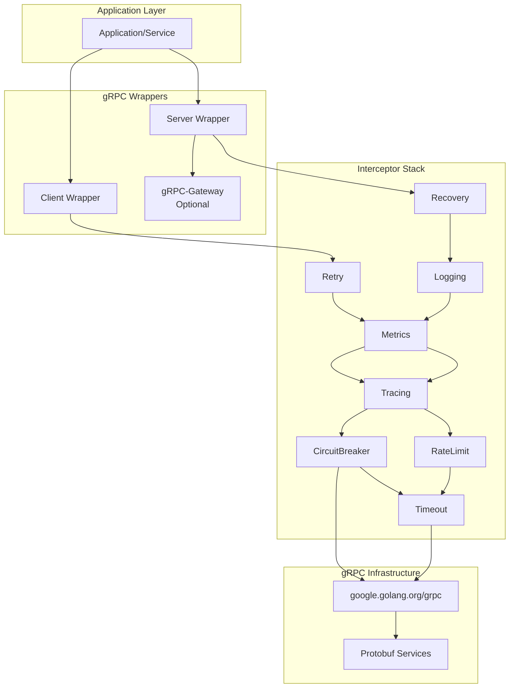
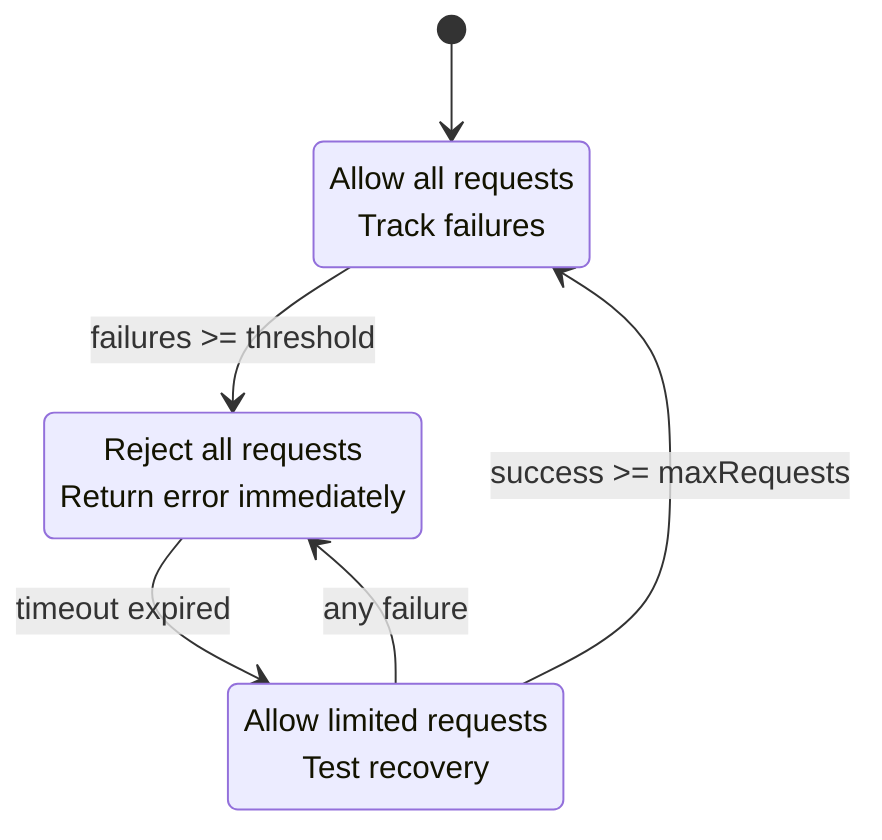
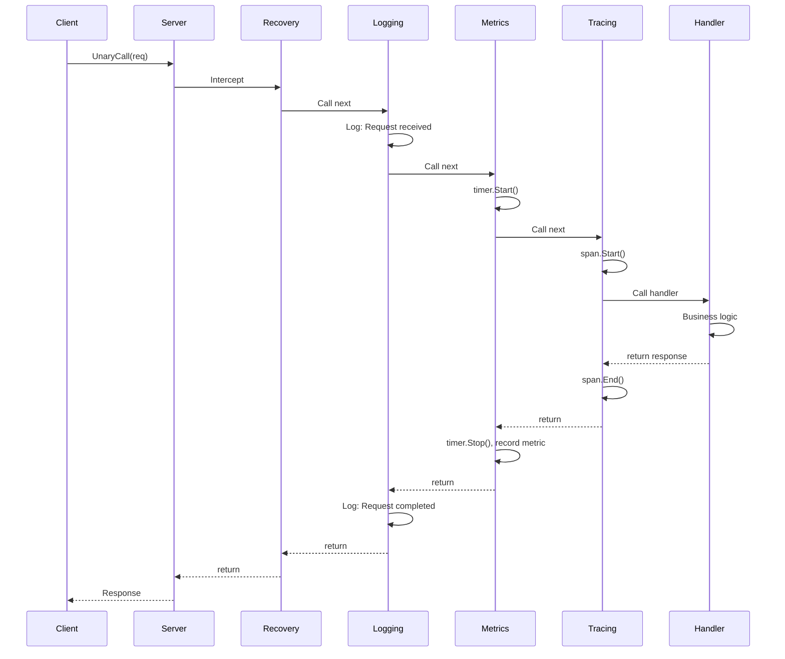
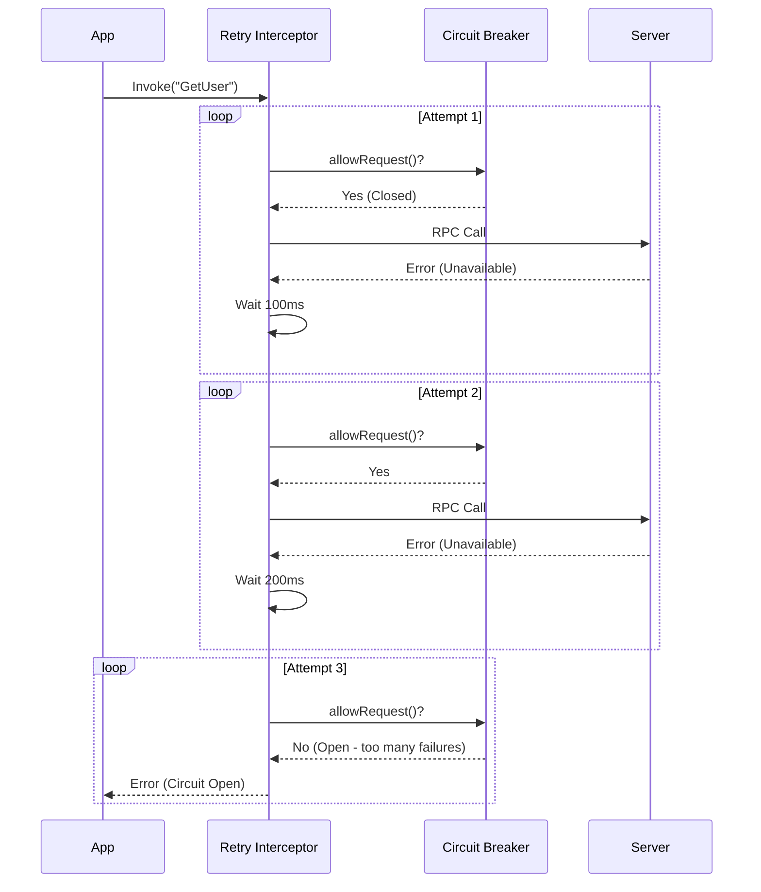
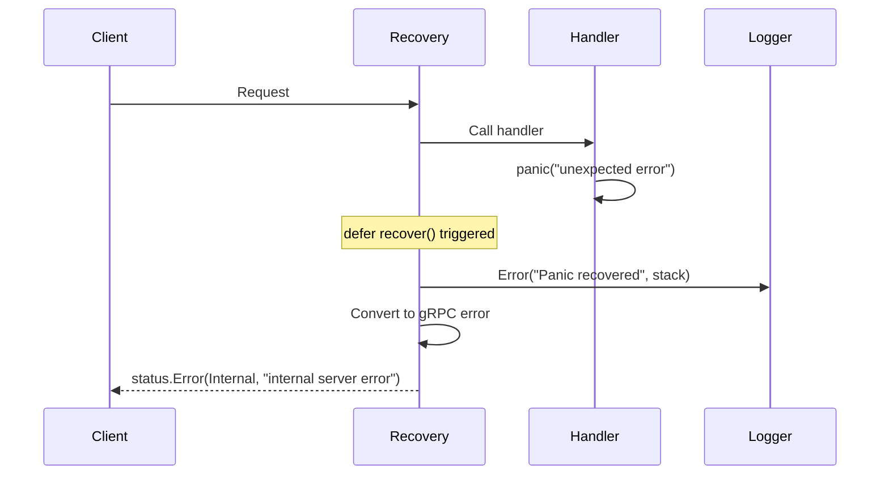

# gRouter gRPC Package - Complete Architecture & Design Guide

## Table of Contents
1. [Package Overview](#package-overview)
2. [Architecture](#architecture)
3. [Core Design Patterns](#core-design-patterns)
4. [Component Deep Dive](#component-deep-dive)
5. [Interceptor System](#interceptor-system)
6. [Sequence Diagrams](#sequence-diagrams)
7. [Production Features](#production-features)
8. [Best Practices](#best-practices)

---

## Package Overview

The `pkg/messaging/grpc` package provides a **production-ready** gRPC framework with comprehensive interceptor (middleware) support for:
- ✅ Server and Client wrappers with unified configuration
- ✅ 7 production interceptors (Recovery, Logging, Metrics, Tracing, Retry, Timeout, RateLimit + CircuitBreaker)
- ✅ gRPC-Gateway integration for REST↔gRPC translation
- ✅ Full observability (OpenTelemetry + Prometheus)
- ✅ Client resilience patterns (retry, circuit breaker, timeout)
- ✅ Thread-safe, panic-proof operation

---

## Architecture

### High-Level Architecture



### Component Layering

```
┌─────────────────────────────────────┐
│ Application (Service Implementation)│
├─────────────────────────────────────┤
│ Server/Client Wrappers              │
├─────────────────────────────────────┤
│ Interceptor Chain (Middleware)       │
│  ├─ Recovery                        │
│  ├─ Logging                         │
│  ├─ Metrics                         │
│  ├─ Tracing                         │
│  ├─ [Auth/Validation]               │
│  ├─ RateLimit/CircuitBreaker        │
│  └─ Timeout                         │
├─────────────────────────────────────┤
│ google.golang.org/grpc              │
├─────────────────────────────────────┤
│ HTTP/2 Transport                    │
└─────────────────────────────────────┘
```

---

## Core Design Patterns

### 1. Interceptor Pattern (gRPC Middleware)

**Purpose:** Add cross-cutting concerns without modifying business logic.

```go
type UnaryServerInterceptor func(
    ctx context.Context,
    req interface{},
    info *grpc.UnaryServerInfo,
    handler grpc.UnaryHandler,
) (interface{}, error)
```

**Chain Execution:**
```
Request → Interceptor1 → Interceptor2 → Interceptor3 → Handler
              ↓              ↓              ↓             ↓
           Pre-process   Pre-process   Pre-process   Execute
              ↑              ↑              ↑             ↑
Response ← Post-process ← Post-process ← Post-process ← Result
```

## Interceptor Chain

Interceptors execute in order:

```
Request → Recovery → Auth → Logging → Metrics → Tracing → Retry → Timeout → RateLimit → Handler
                                                                                                ↓
Response ← Recovery ← Auth ← Logging ← Metrics ← Tracing ← Retry → Timeout ← RateLimit ← Handler
```

### Execution Order
1. **Recovery** - Catches panics
2. **Auth** - Validates JWT/API keys (NEW)
3. **Logging** - Logs request/response
4. **Metrics** - Records metrics
5. **Tracing** - Distributed tracing
6. **Retry** - Retries failed requests (client)

### 2. Functional Options Pattern

**Purpose:** Flexible, readable configuration.

```go
server := grpc.NewServer(logger,
    grpc.WithPort(9090),
    grpc.WithReflection(),
    grpc.WithUnaryInterceptor(interceptors.Recovery(logger)),
)
```

### 3. Circuit Breaker Pattern

**Purpose:** Prevent cascading failures in distributed systems.



---

## Components

### 1. Server (`server.go`)

**Responsibilities:**
- gRPC server lifecycle management
- Interceptor registration and chaining
- gRPC-Gateway integration
- Server reflection support
- Graceful shutdown
- TLS/mTLS support

**Key Methods:**
```go
func NewServer(logger *zap.Logger, opts ...Option) *Server
func (s *Server) RegisterService(reg func(grpc.ServiceRegistrar))
func (s *Server) Start() error
func (s *Server) Stop(ctx context.Context)
```

**Configuration:**
```go
server := grpc.NewServer(logger,
    WithPort(9090),
    WithReflection(),
    WithInterceptors(unaryInterceptors, streamInterceptors),
    WithGateway(ctx, 8080), // Optional REST gateway
)
```

### Client (`client.go`)

**Responsibilities:**
- Connection management with keepalive
- Client-side interceptor support
- Automatic retries and circuit breaking
- Connection pooling (via gRPC)

**Key Methods:**
```go
func NewClient(config ClientConfig, logger *zap.Logger, opts ...ClientOption) (*Client, error)
func (c *Client) GetConn() *grpc.ClientConn
func (c *Client) Close() error
```

**Configuration:**
```go
client, _ := grpc.NewClient(grpc.ClientConfig{
    Target: "localhost:9090",
    Timeout: 10 * time.Second,
    KeepAliveTime: 30 * time.Second,
}, logger,
    WithClientUnaryInterceptor(interceptors.LoggingClient(logger)),
    WithClientUnaryInterceptor(interceptors.Retry(retryConfig)),
)
```

---

## Interceptor System

### Interceptor Types

| Type | Use Case | Examples |
|------|----------|----------|
| Unary Server | Single request/response | Auth, Logging, Metrics |
| Stream Server | Bidirectional streams | Logging, Recovery |
| Unary Client | Client requests | Retry, Circuit Breaker |
| Stream Client | Client streams | Logging, Tracing |

### Recommended Ordering

**Server-side:**
```go
1. Recovery       // Catch panics first
2. Logging        // Log all requests
3. Metrics        // Record metrics
4. Tracing        // Distributed tracing
5. [Auth]         // Authentication/authorization
6. [Validator]    // Request validation
7. RateLimit      // Throttle requests
8. Timeout        // Enforce deadlines
```

**Client-side:**
```go
1. Logging        // Log outgoing requests
2. Metrics        // Record client metrics
3. Tracing        // Propagate trace context
4. CircuitBreaker // Protect downstream
5. Retry          // Retry on failure
6. Timeout        // Set deadlines
```

### Built-in Interceptors

#### 1. Recovery
- Catches panics in handlers
- Logs stack traces
- Returns `Internal` gRPC error
- **Critical:** Must be first interceptor

#### 2. Logging
- Structured logging with zap
- Records: method, peer, duration, status
- Separate interceptors for server/client/stream

#### 3. Metrics (Prometheus)
```
grpc_server_requests_total{method, code}
grpc_server_request_duration_seconds{method, code}
grpc_client_requests_total{method, code}
grpc_client_request_duration_seconds{method, code}
```

#### 4. Tracing (OpenTelemetry)
- Automatic span creation
- Context propagation via metadata
- Span attributes: method, status, errors
- Integration with existing telemetry package

#### 5. Retry (Client-side)
- Exponential backoff: `InitialWait * Multiplier^attempt`
- Configurable retryable codes
- Max attempts enforcement
- Context cancellation support

#### 6. Timeout
- Server: Enforces max request duration
- Client: Sets deadline if not present
- Returns `DeadlineExceeded` on timeout

#### 7. Rate Limiter
- Token bucket algorithm
- Per-method or global limits
- Returns `ResourceExhausted` when limit hit

#### 8. Circuit Breaker (Client-side)
- Protects against cascading failures
- 3 states: Closed, Open, HalfOpen
- Automatic recovery after timeout

---

## Sequence Diagrams

### 1. Unary RPC with Full Interceptor Chain



### 2. Client Retry with Circuit Breaker



### 3. Panic Recovery Flow



---

## Production Features

### 1. Observability

**Logging:**
- Structured logs with zap
- Request/response correlation
- Duration tracking
- Error classification

**Metrics:**
- Request rate (RPS)
- Error rate
- Latency percentiles (p50, p95, p99)
- In-flight requests

**Tracing:**
- Distributed trace propagation
- Service call visualization
- Latency attribution
- Error tracking

### 2. Resilience

**Client-Side:**
- Retry with exponential backoff
- Circuit breaker pattern
- Request timeout enforcement
- Connection keepalive

**Server-Side:**
- Panic recovery
- Rate limiting
- Graceful shutdown
- Connection draining

### 3. Security 

**Current:**
- Insecure credentials (development)

**Future:**
- TLS/mTLS support
- JWT authentication
- API key validation
- Request signing

---

## Best Practices

### ✅ Do's

1. **Always use Recovery interceptor first**
   ```go
   WithUnaryInterceptor(interceptors.Recovery(logger)) // FIRST!
   ```

2. **Configure timeouts appropriately**
   ```go
   // Server: Prevent long-running requests
   WithUnaryInterceptor(interceptors.Timeout(30*time.Second))
   
   // Client: Set realistic deadlines
   WithClientUnaryInterceptor(interceptors.TimeoutClient(10*time.Second))
   ```

3. **Use Circuit Breaker for external services**
   ```go
   cb := interceptors.NewCircuitBreaker(5, 60*time.Second, 1)
   WithClientUnaryInterceptor(interceptors.CircuitBreakerInterceptor(cb))
   ```

4. **Enable graceful shutdown**
   ```go
   func (a *App) Stop() {
       ctx, cancel := context.WithTimeout(context.Background(), 30*time.Second)
       defer cancel()
       server.Stop(ctx) // Drains in-flight requests
   }
   ```

5. **Monitor metrics in production**
   ```go
   // Expose Prometheus endpoint
   http.Handle("/metrics", promhttp.Handler())
   ```

### ❌ Don'ts

1. **Don't ignore interceptor order**
   ```go
   // BAD - Recovery should be first
   WithUnaryInterceptor(interceptors.Logging(logger))
   WithUnaryInterceptor(interceptors.Recovery(logger))
   
   // GOOD
   WithUnaryInterceptor(interceptors.Recovery(logger))
   WithUnaryInterceptor(interceptors.Logging(logger))
   ```

2. **Don't block in handlers**
   ```go
   // BAD
   func (s *Service) GetUser(ctx context.Context, req *pb.Request) (*pb.Response, error) {
       time.Sleep(5 * time.Minute) // Blocks worker
       return &pb.Response{}, nil
   }
   
   // GOOD - Use context timeout
   func (s *Service) GetUser(ctx context.Context, req *pb.Request) (*pb.Response, error) {
       select {
       case result := <-s.processAsync(req):
           return result, nil
       case <-ctx.Done():
           return nil, status.Error(codes.DeadlineExceeded, "request timeout")
       }
   }
   ```

3. **Don't hardcode service addresses**
   ```go
   // BAD
   client, _ := grpc.NewClient(grpc.ClientConfig{Target: "localhost:9090"}, logger)
   
   // GOOD - Use configuration
   client, _ := grpc.NewClient(grpc.ClientConfig{Target: config.Services.UserService}, logger)
   ```

---

## Summary

The **gRouter gRPC Package** provides:

1. ✅ **Production-Ready Wrappers** - Server + Client with unified configuration
2. ✅ **7 Interceptors** - Recovery, Logging, Metrics, Tracing, Retry, Timeout, RateLimit + CircuitBreaker
3. ✅ **Full Observability** - OpenTelemetry + Prometheus integration
4. ✅ **Client Resilience** - Retry + Circuit Breaker patterns
5. ✅ **Developer Experience** - Functional options, clear APIs
6. ✅ **Production Tested** - Panic recovery, graceful shutdown, resource protection
7. ✅ **Gateway Support** - Optional REST ↔ gRPC translation

**Next Steps:**
- Review `grpc_learning.md` for usage examples
- See `example/main.go` for complete integration
- Explore interceptor implementations in `interceptors/`
