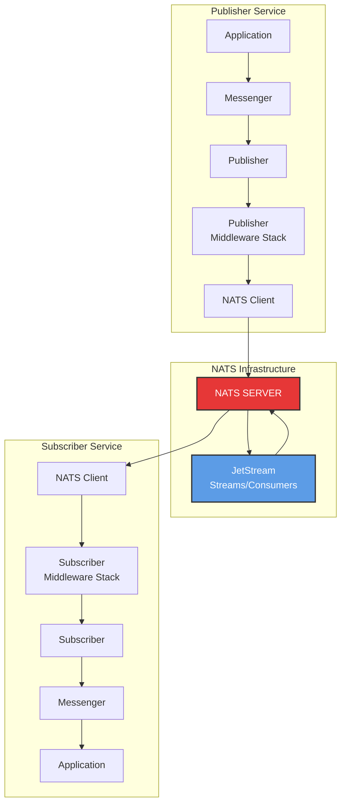
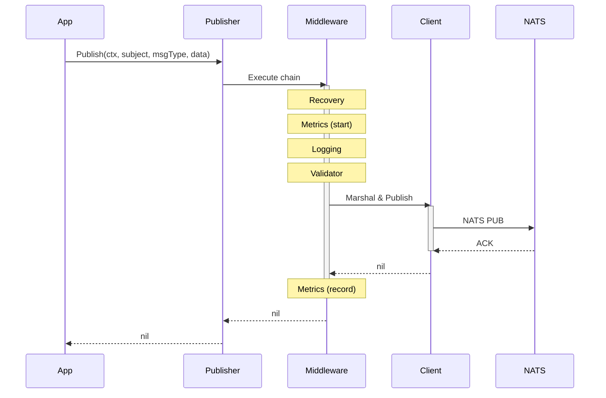
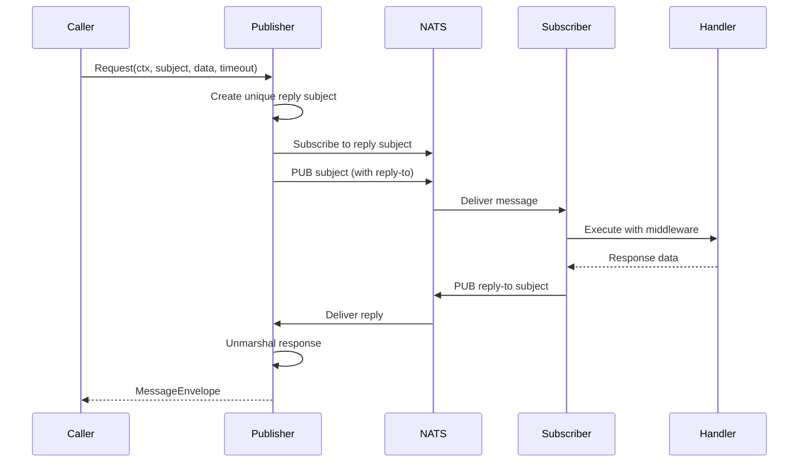
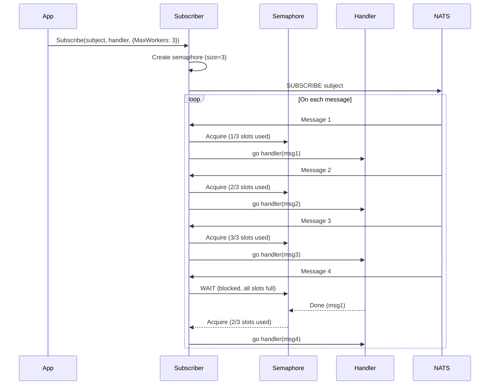
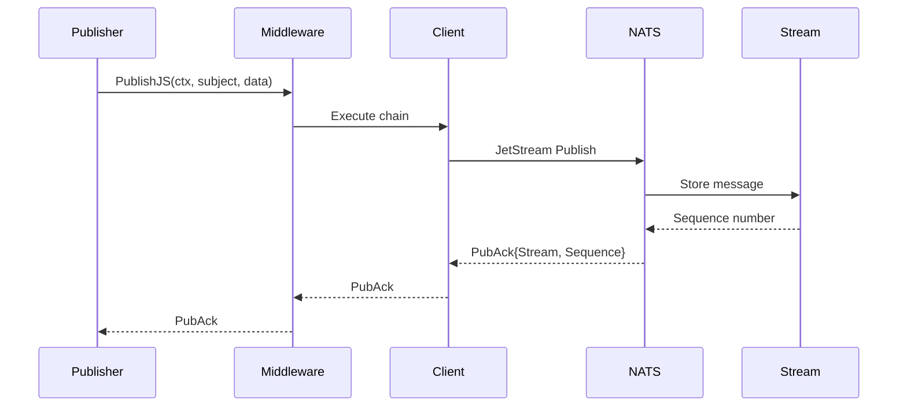
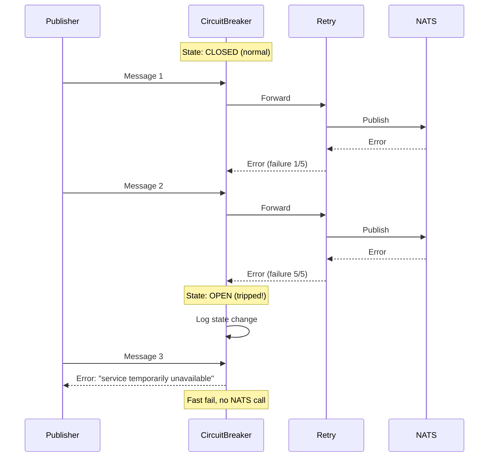
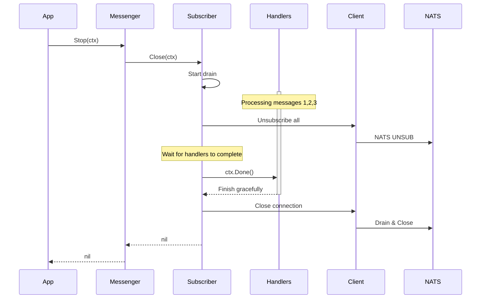

# gRouter NATS Package - Complete Architecture & Design Guide

## Table of Contents
1. [Package Overview](#package-overview)
2. [Architecture](#architecture)
3. [Core Design Patterns](#core-design-patterns)
4. [Component Deep Dive](#component-deep-dive)
5. [Middleware System](#middleware-system)
6. [Sequence Diagrams](#sequence-diagrams)
7. [Production Features](#production-features)
8. [Best Practices](#best-practices)

---

## Package Overview

The `pkg/messaging/nats` package provides a **production-ready** NATS messaging framework with comprehensive middleware support for:
- ✅ Pub/Sub and Request/Reply patterns
- ✅ JetStream for persistence and exactly-once delivery
- ✅ 9 production middleware (Recovery, Metrics, Logging, Tracing, Timeout, RateLimit, Validator, CircuitBreaker, Retry)
- ✅ Full observability (OpenTelemetry + Prometheus)
- ✅ Client resilience patterns (retry, circuit breaker, timeout)
- ✅ Thread-safe, panic-proof operation
- ✅ Configuration validation and graceful shutdown

---

## Architecture

### High-Level Architecture



### Component Layering

```
┌─────────────────────────────────────┐
│ Application (Service Implementation)│
├─────────────────────────────────────┤
│ Messenger (Coordinator)             │
├─────────────────────────────────────┤
│ Publisher / Subscriber               │
├─────────────────────────────────────┤
│ Middleware Chain                    │
│  ├─ Recovery                        │
│  ├─ Metrics                         │
│  ├─ Logging                         │
│  ├─ Tracing                         │
│  ├─ Timeout                         │
│  ├─ RateLimit                       │
│  ├─ Validator                       │
│  ├─ CircuitBreaker                  │
│  └─ Retry                           │
├─────────────────────────────────────┤
│ NATS Client (Connection Manager)    │
├─────────────────────────────────────┤
│ github.com/nats-io/nats.go          │
├─────────────────────────────────────┤
│ TCP Transport                       │
└─────────────────────────────────────┘
```

---

## Core Design Patterns

### 1. Message Envelope Pattern

All messages are wrapped in a standardized envelope for consistency:

```go
type MessageEnvelope struct {
    ID        string            `json:"id"`        // UUID for tracing
    Type      string            `json:"type"`      // Schema identifier
    Timestamp time.Time         `json:"timestamp"` // Creation time
    Source    string            `json:"source"`    // Originating service
    Reply     string            `json:"reply"`     // Reply-to subject
    Data      json.RawMessage   `json:"data"`      // Actual payload
    Metadata  map[string]string `json:"metadata"`  // Context (trace IDs, etc.)
}
```

### 2. Middleware Chain Pattern

```
Outer (First Registered)
  ↓
Recovery → Metrics → Logging → Tracing → Timeout → RateLimit → Validator → CircuitBreaker → Retry
  ↓                                                                                              ↓
PANIC SAFE                                                                            CORE OPERATION
  ↓                                                                                              ↓
Inner (Last Registered)
```

### 3. Graceful Degradation

- Circuit breaker opens on failures → Fail fast
- Retry with exponential backoff → Handle transients
- Rate limiting → Protect downstream
- Timeout enforcement → Prevent resource exhaustion

---

## Component Deep Dive

### Messenger (`messenger.go`)

**Responsibilities:**
- Orchestrates Client, Publisher, and Subscriber
- Configuration validation
- Middleware chain construction
- Lifecycle management

**Key Methods:**
```go
func (m *Messenger) InitFromConfig(cfg *config.Config, logger *zap.Logger) error
func (m *Messenger) Start() error  // Registers middleware
func (m *Messenger) Stop(ctx context.Context) error
```

**Configuration Validation:**
```go
// Validates at initialization
- NATS URL cannot be empty
- Timeouts must be positive
- Circuit breaker threshold > 0
- Rate limit RPS > 0
- Retry max attempts > 0
```

### Client (`client.go`)

**Responsibilities:**
- Connection management with automatic reconnection
- Authentication (Token, User/Pass, Credentials, TLS)
- JetStream context creation
- Event handlers (disconnect, reconnect)

**Key Methods:**
```go
func NewNATSClient(cfg Config, logger *zap.Logger) (*Client, error)
func (c *Client) Connect() error
func (c *Client) Close() error
func (c *Client) IsConnected() bool
func (c *Client) JetStream() nats.JetStreamContext
```

**Connection Options:**
```go
// Automatic configuration
- MaxReconnects
- ReconnectWait
- ConnectionTimeout
- DisconnectErrHandler (with logger)
- ReconnectHandler (with logger)
```

### Publisher (`publisher.go`)

**Responsibilities:**
- Message publishing through middleware chain
- Support for 4 publish patterns (Sync, Request, JetStream, Async JetStream)
- Middleware registration

**Publishing Patterns:**
```go
// 1. Fire-and-forget
Publish(ctx, subject, msgType, data, opts) error

// 2. Request-Reply (synchronous RPC)
Request(ctx, subject, msgType, data, timeout, opts) (*MessageEnvelope, error)

// 3. JetStream (persistent)
PublishJS(ctx, subject, msgType, data, opts) (*nats.PubAck, error)

// 4. JetStream Async (high throughput)
PublishAsyncJS(ctx, subject, msgType, data, opts) (nats.PubAckFuture, error)
```

**Middleware Registration:**
```go
publisher.Use(middleware...)              // For Publish
publisher.UseRequest(middleware...)        // For Request
publisher.UseJS(middleware...)             // For PublishJS
publisher.UseAsyncJS(middleware...)        // For PublishAsyncJS
```

### Subscriber (`subscriber.go`)

**Responsibilities:**
- Message subscription through middleware chain
- Support for 4 subscription patterns (Core, Queue, JetStream Push/Pull)
- Concurrency control (MaxWorkers)
- Graceful shutdown with draining

**Subscription Patterns:**
```go
// 1. Core NATS subscription
Subscribe(subject, handler, opts) (*nats.Subscription, error)

// 2. Queue group (load balancing)
SubscribeQueue(subject, queue, handler, opts) (*nats.Subscription, error)

// 3. JetStream push consumer
SubscribePush(subject, handler, natsOpts...) (*nats.Subscription, error)

// 4. JetStream pull consumer (worker pattern)
SubscribePull(subject, handler, natsOpts...) (*nats.Subscription, error)
```

**Concurrency Control:**
```go
opts := &SubscribeOptions{
    QueueGroup: "workers",
    MaxWorkers: 10, // Limits concurrent handlers
}
```

---

## Middleware System

### Middleware Inventory

| # | Middleware | Type | Purpose | Position |
|---|------------|------|---------|----------|
| 1 | Recovery | Both | Panic safety | Outermost |
| 2 | Metrics | Both | Prometheus metrics | Early |
| 3 | Logging | Both | Structured logging | Early |
| 4 | Tracing | Both | OpenTelemetry | Early |
| 5 | Timeout | Publisher | Deadline enforcement | Middle |
| 6 | RateLimit | Publisher | Traffic control | Middle |
| 7 | Validator | Both | Schema validation | Late |
| 8 | CircuitBreaker | Publisher | Fail fast | Late |
| 9 | Retry | Publisher | Exponential backoff | Innermost |

### Publisher Middleware Chain

```go
// Execution order (reverse of registration)
Recovery (catch panics)
  → Metrics (start timer)
    → Logging (log start)
      → Tracing (create span)
        → Timeout (enforce deadline)
          → RateLimit (wait for token)
            → Validator (check schema)
              → CircuitBreaker (check state)
                → Retry (with backoff)
                  → NATS Publish
                ← Retry (on error)
              ← CircuitBreaker (record result)
            ← Validator
          ← RateLimit
        ← Timeout
      ← Tracing (end span)
    ← Logging (log result)
  ← Metrics (record duration)
← Recovery (return error or panic)
```

### Subscriber Middleware Chain

```go
// Simpler chain (no retry/circuit breaker needed)
Recovery
  → Metrics
    → Logging
      → Tracing
        → Validator
          → Handler
        ← Validator
      ← Tracing
    ← Logging
  ← Metrics
← Recovery
```

### Thread Safety

| Component | Thread-Safe? | Mechanism |
|-----------|-------------|-----------|
| Client | ✅ Yes | NATS native thread safety |
| Publisher | ✅ Yes | Stateless (per-message context) |
| Subscriber | ✅ Yes | sync.WaitGroup for shutdown |
| Validator | ✅ Yes | sync.RWMutex on schema registry |
| Circuit Breaker | ✅ Yes | gobreaker library (atomic) |
| Rate Limiter | ✅ Yes | golang.org/x/time/rate (mutex) |

---

## Sequence Diagrams

### 1. Simple Publish Flow



### 2. Request-Reply Flow (RPC Pattern)



### 3. Subscribe with Concurrency Control



### 4. JetStream Persistent Publish



### 5. Circuit Breaker Open State



### 6. Graceful Shutdown Flow



---

## Production Features

### 1. Observability

**Logging (Zap):**
```go
// Publisher logs
logger.Info("publishing message",
    zap.String("subject", subject),
    zap.String("message_id", env.ID),
    zap.Duration("duration", elapsed),
)

// Subscriber logs
logger.Info("message received",
    zap.String("subject", subject),
    zap.String("message_id", env.ID),
    zap.Error(err),
)
```

**Metrics (Prometheus):**
```
nats_messages_total{service, subject, status}
nats_message_duration_seconds{service, subject}
nats_message_errors_total{service, subject}
```

**Tracing (OpenTelemetry):**
- Automatic span creation for pub/sub
- Trace context propagation via metadata
- Integration with existing telemetry package

### 2. Resilience

**Configuration Validation:**
```go
// validateConfig checks:
- URL not empty
- Timeouts >= 0
- Circuit breaker threshold > 0
- Retry attempts > 0
- Rate limit RPS > 0
```

**Circuit Breaker:**
```go
type CircuitBreakerConfig struct {
    Enabled       bool
    MaxRequests   uint32        // Half-open test requests
    Interval      time.Duration // Failure counting window
    Timeout       time.Duration // Time before retry
    TripThreshold uint32        // Consecutive failures to trip
}
```

**Retry with Exponential Backoff:**
```go
delay = min(InitialInterval * Multiplier^(attempt-1), MaxInterval)

// Example: 100ms * 2^0 = 100ms
//          100ms * 2^1 = 200ms
//          100ms * 2^2 = 400ms
```

**Rate Limiting (Token Bucket):**
```go
type RateLimitConfig struct {
    RequestsPerSecond int  // Sustained rate
    Burst             int  // Burst capacity
}
```

### 3. Error Sanitization

All middleware sanitize errors to prevent information leakage:

```go
// Validator
return fmt.Errorf("message validation failed")  // Generic

// Circuit Breaker
return fmt.Errorf("service temporarily unavailable")  // Generic

// Original errors logged for debugging
logger.Warn("validation failed", zap.Error(originalErr))
```

---

## Best Practices

### ✅ Do's

1. **Initialize via Messenger**
   ```go
   messenger := &Messenger{}
   err := messenger.InitFromConfig(cfg, logger)
   err = messenger.Start() // Registers middleware
   ```

2. **Always use contexts with timeouts**
   ```go
   ctx, cancel := context.WithTimeout(context.Background(), 5*time.Second)
   defer cancel()
   err := publisher.Publish(ctx, subject, msgType, data, nil)
   ```

3. **Register middleware in correct order**
   ```go
   // Recovery FIRST (outermost)
   publisher.Use(PublisherRecoveryMiddleware(logger))
   publisher.Use(PublisherMetricsMiddleware())
   publisher.Use(PublisherLoggingMiddleware(logger))
   // ... more middleware
   ```

4. **Use queue groups for load balancing**
   ```go
   opts := &SubscribeOptions{
       QueueGroup: "order-processors",
       MaxWorkers: 10,
   }
   sub, err := subscriber.Subscribe("orders.created", handler, opts)
   ```

5. **Enable graceful shutdown**
   ```go
   ctx, cancel := context.WithTimeout(context.Background(), 30*time.Second)
   defer cancel()
   messenger.Stop(ctx) // Drains subscriptions
   ```

### ❌ Don'ts

1. **Don't ignore configuration validation errors**
   ```go
   // BAD
   messenger.InitFromConfig(cfg, logger) // Ignores validation errors
   
   // GOOD
   if err := messenger.InitFromConfig(cfg, logger); err != nil {
       log.Fatal("Invalid config:", err)
   }
   ```

2. **Don't block in handlers without context**
   ```go
   // BAD
   func handler(ctx context.Context, subject string, env *MessageEnvelope) error {
       time.Sleep(10 * time.Minute) // Blocks worker
       return nil
   }
   
   // GOOD
   func handler(ctx context.Context, subject string, env *MessageEnvelope) error {
       select {
       case <-processAsync(env):
           return nil
       case <-ctx.Done():
           return ctx.Err()
       }
   }
   ```

3. **Don't reuse clients across services**
   ```go
   // BAD - Shared state
   globalClient, _ := NewNATSClient(cfg, logger)
   service1.SetClient(globalClient)
   service2.SetClient(globalClient)
   
   // GOOD - Isolated per service
   messenger1 := &Messenger{}
   messenger1.InitFromConfig(cfg1, logger)
   messenger2 := &Messenger{}
   messenger2.InitFromConfig(cfg2, logger)
   ```

4. **Don't use JetStream without error handling**
   ```go
   // BAD
   ack, _ := publisher.PublishJS(ctx, subject, msgType, data, nil)
   
   // GOOD
   ack, err := publisher.PublishJS(ctx, subject, msgType, data, nil)
   if err != nil {
       logger.Error("JetStream publish failed", zap.Error(err))
       return err
   }
   logger.Info("Published to stream", zap.Uint64("sequence", ack.Sequence))
   ```

---

## Summary

The **gRouter NATS Package** provides:

1. ✅ **Production-Ready Components** - Messenger + Publisher + Subscriber
2. ✅ **9 Middleware** - Recovery, Metrics, Logging, Tracing, Timeout, RateLimit, Validator, CircuitBreaker, Retry
3. ✅ **Full Observability** - OpenTelemetry + Prometheus + Zap
4. ✅ **Resilience Patterns** - Circuit Breaker + Retry + Rate Limiting
5. ✅ **JetStream Support** - Persistence + Exactly-once delivery
6. ✅ **Thread Safety** - Validated with race detector
7. ✅ **Configuration Validation** - Prevents invalid configurations
8. ✅ **Graceful Shutdown** - Proper resource cleanup

**Next Steps:**
- Review `README.md` for quick start guide
- See `API.md` for complete API reference
- Explore `MIDDLEWARE.md` for custom middleware development
- Check `nats_learning.md` for advanced usage patterns
