# NATS Messaging Library

A robust, production-ready Go messaging library built on top of [NATS](https://nats.io/) and [JetStream](https://docs.nats.io/jetstream).  
It provides a clean, opinionated abstraction for event-driven microservices, ensuring reliable communication with standardized message structures, built-in observability, and flexible middleware.

**[📚 Complete Learning Guide / Usage Patterns](./nats_learning.md)**  
**[🚀 Production Readiness / Enhancement Roadmap](./nats_enhancement.md)**

---

## ✨ Features

- **Standardized Envelope**: `MessageEnvelope` wrapper with ID, Type, Timestamp, Source, and Metadata.
- **Context Awareness**: Full `context.Context` support for timeouts and cancellation.
- **Observability Middleware**: Built-in middleware for **Logging** (Zap), **Metrics** (Prometheus), and **Tracing** (OpenTelemetry).
- **Security**: Support for Token, User/Pass, and **NATS 2.0 Credentials (JWT/NKey)**. TLS/mTLS support.
- **Concurrency Control**: `MaxWorkers` limiting for subscribers to manage load.
- **JetStream Persistence**: At-least-once delivery, Durable Consumers, and Pull Subscriptions for worker patterns.
- **Load Balancing**: Native NATS Queue Groups support.
- **Graceful Shutdown**: `sync.WaitGroup` based handling to ensure active messages complete processing before shutdown.

## 🏗 Architecture



```mermaid
graph LR
    subgraph Publisher Service
        direction TB
        P[Publisher] -->|1. Publish| PMW[Pub Middleware]
        PMW -->|2. Encode| PClient[NATS Client]
    end

    %% Central Infrastructure
    PClientV[ ] -.->|Network| Server
    PClient --> PClientV
    
    subgraph Infrastructure
        Server[NATS SERVER / JetStream]
    end

    %% Subscriber Connection
    Server -.->|Network| SClient
    
    subgraph Subscriber Service
        direction TB
        SClient[NATS Client] -->|3. Decode| SMW[Sub Middleware]
        SMW -->|4. Handle| H[Handler]
    end

    style Server fill:#E63737,stroke:#333,stroke-width:2px,color:#fff
    style PClientV height:0,width:0,margin:0,display:none
```

### Message Envelope
Ensures consistency across all services.
```go
type MessageEnvelope struct {
    ID        string            `json:"id"`
    Type      string            `json:"type"`      // Event Type
    Timestamp time.Time         `json:"timestamp"`
    Source    string            `json:"source"`    // Origin Service
    Reply     string            `json:"reply"`     // Reply-To Subject
    Data      json.RawMessage   `json:"data"`      // Payload
    Metadata  map[string]string `json:"metadata"`  // Tracing/Routing context
}
```

### Middleware System
Wrap publishers and subscribers with cross-cutting concerns.
```go
// Register global middleware
subscriber.Use(
    messaging.LoggingMiddleware(logger),
    messaging.MetricsMiddleware(),
    messaging.TracingMiddleware(tracer),
)
```

## 🚀 Quick Start

### 1. Client Setup
```go
logger, _ := zap.NewProduction()
cfg := messaging.Config{
    URL: "nats://localhost:4222",
    // For Production:
    // CredsFile: "/path/to/user.creds", 
}

client, err := messaging.NewNATSClient(cfg, logger)
if err != nil { /* ... */ }
defer client.Close() // Automatically handles graceful shutdown

err = client.Connect()
```

### 2. Publishing (Fire-and-Forget)
```go
pub := messaging.NewPublisher(client, "order-service")
err := pub.Publish(ctx, "orders.created", "OrderCreated", orderData, nil)
```

### 3. Subscribing
```go
sub := messaging.NewSubscriber(client, "inventory-service")
sub.Subscribe("orders.created", func(ctx, subject, env) error {
    log.Printf("Received Order: %s", env.ID)
    return nil
}, &messaging.SubscribeOptions{
    QueueGroup: "inventory-workers", // Load balance
    MaxWorkers: 10,                 // Concurrency limit
})
```

### 4. JetStream (Reliable)
```go
// Publish to Stream
ack, err := pub.PublishJS(ctx, "orders.critical", "CriticalOrder", data)

// Subscribe (Push)
sub.SubscribePush("orders.critical", handler, nats.Durable("critical-processor"))
```

## ⚙️ Configuration

| Field | Description |
|-------|-------------|
| `URL` | NATS Connection String (e.g., `nats://localhost:4222`) |
| `CredsFile` | Path to NATS 2.0+ Credentials file (Recommended) |
| `Token` | Simple Auth Token |
| `UseTLS` | Enable TLS/SSL |
| `CertFile`/`KeyFile` | mTLS Client Certificates |
| `Metrics.Enabled` | Enable internal client metrics |

## 👨‍💻 Developer Manual

### 1. Prerequisites
- **Go**: 1.21+
- **Bazel**: 6.0+ (Optional, for reproducible builds)
- **Docker**: For running local NATS server (Integration tests)

### 2. Build

**Using Go Standard Toolchain:**
```bash
# Download dependencies
go mod download

# Verify compilation
go build -v ./pkg/messaging/nats/...
```

**Using Bazel:**
```bash
# Sync dependencies (if using Gazelle)
bazel run //:gazelle

# Build the package
bazel build //pkg/messaging/nats/...
```

### 3. Testing

**Using Go:**
```bash
# 1. Run Unit Tests (Fast, no external deps)
go test -v -short ./pkg/messaging/nats/...

# 2. Run Integration Tests (Requires NATS)
# Start NATS first:
docker run -d --rm --name nats-dev -p 4222:4222 nats:latest -js

# Run all tests (Client, Publisher, Subscriber)
go test -v -count=1 ./pkg/messaging/nats/...
```

**Using Bazel:**
```bash
# Run all tests in the package
bazel test //pkg/messaging/nats:nats_test

# Run with output streaming (to see logs)
bazel test --test_output=streamed //pkg/messaging/nats:nats_test
```

## 🔮 Roadmap

We are actively working on making this package fully production-ready.  
See **[nats_enhancement.md](./nats_enhancement.md)** for detailed designs on:
1.  **Pluggable Codecs** (Protobuf/MessagePack support)
2.  **Publisher Resilience** (Circuit Breakers)
3.  **Strict Validation**
4.  **JetStream DLQ**
