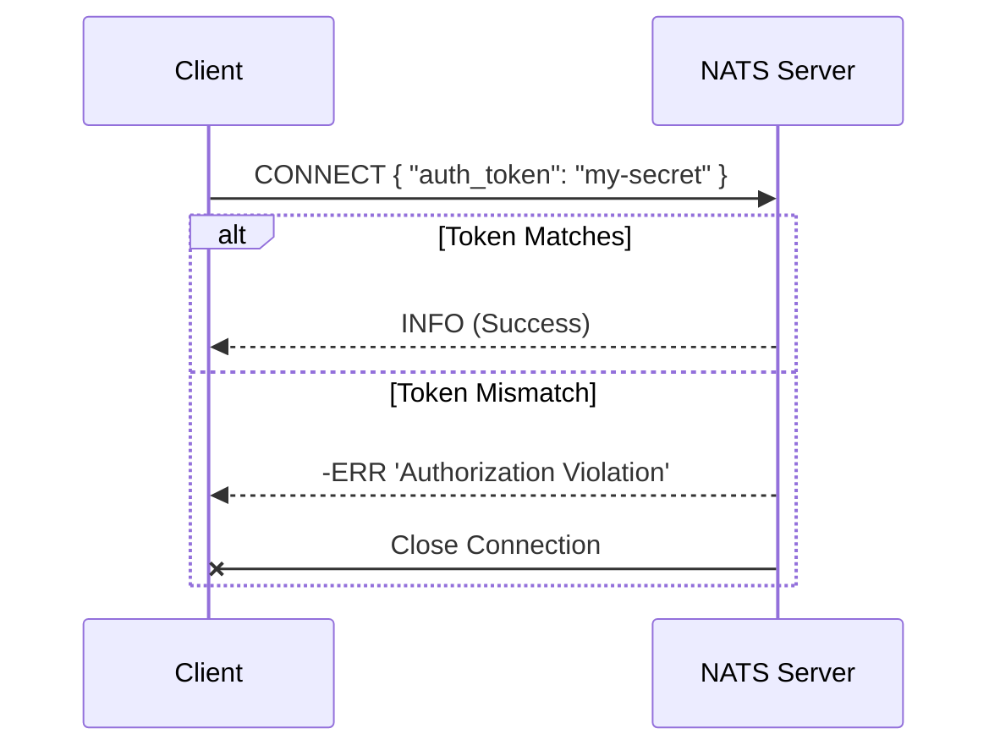
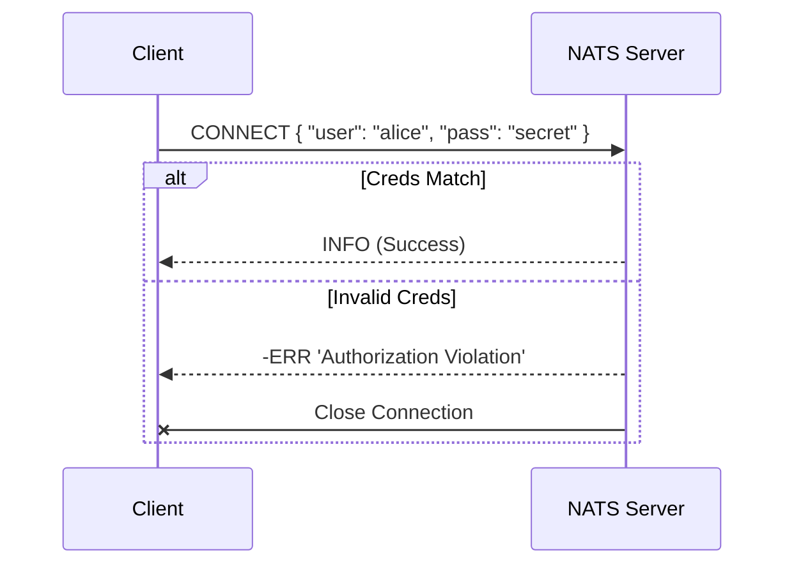
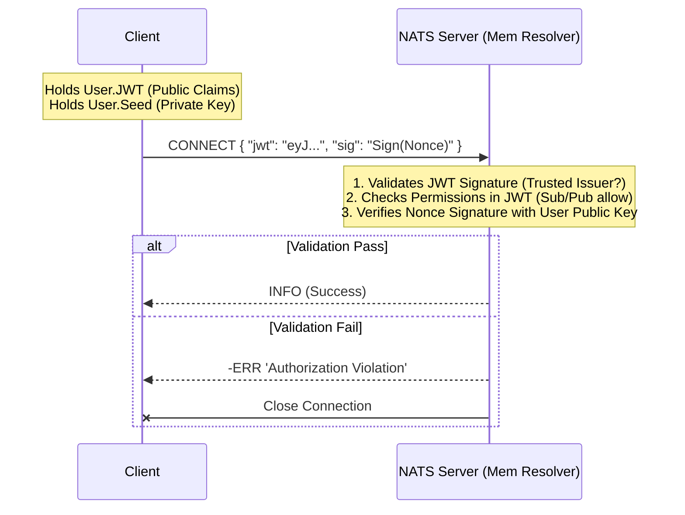
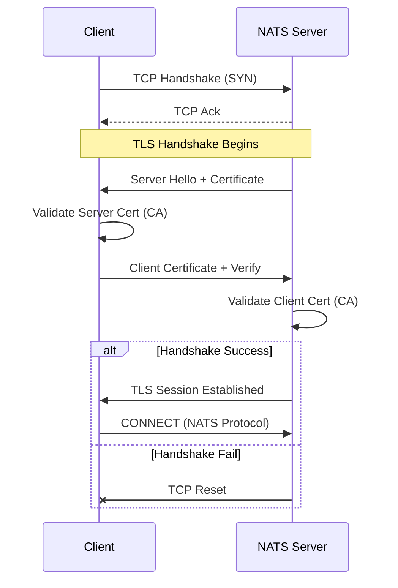

# NATS Client Authentication Examples

This directory contains examples for connecting to NATS using four different authentication methods, ranging from simple development setups to production-grade security.


---

## 📊 Authentication Flows

### 1. Token Auth
Simple shared secret exchange. Server checks if client token matches config.



### 2. User/Pass Auth
Standard credential exchange.



### 3. Decentralized Authentiation (JWT/NKEY) - **Production Standard**
Server does NOT hold user secrets. It only knows the **Account Public Key** (embedded in JWT).
Client holds **User Private Key** (NKEY) and **User JWT** (signed by Account).



### 4. Mutual TLS (mTLS)
Identity proved by X.509 Certificate Chain.



---

## ⚖️ When to Use Which?

| Method | Security Level | Operational Complexity | Best Use Case |
| :--- | :--- | :--- | :--- |
| **Token** | ⭐ | ⭐ | **Local Development**, Docker Compose, CI/CD pipelines where security is low priority. |
| **User/Pass** | ⭐⭐ | ⭐⭐ | **Legacy Systems**, simple internal apps where you need to distinguish a few clients. |
| **Credentials** | ⭐⭐⭐⭐ | ⭐⭐⭐ | **Production Microservices**. Standard for NATS 2.0. Gives you fine-grained permissions (ACLs) without restarting servers. Zero-trust compatible. |
| **mTLS** | ⭐⭐⭐⭐⭐ | ⭐⭐⭐⭐⭐ | **High Compliance**. Fintech, Banking, IoT devices over public internet. Use when you need to verify identity at the lowest network layer. |

---


## 🚀 Quick Start (Automated Verification)

Use the helper script to generate assets and run any example interactively:

```bash
# 1. Generate Certificates and Credentials
./generate_assets.sh

# 2. Run the Verification Menu
./setup_and_verify.sh
```

---

## 📖 Step-by-Step Manual Guide

If you want to run these manually without the helper script, follow the steps below for each method.

### 1. Token Authentication
**Best for**: Local development, quick prototypes.

1.  Start NATS Server:
    ```bash
    nats-server -auth "my-secret-token" -p 4222
    ```
2.  Run Client:
    ```bash
    go run token/main.go
    ```

### 2. User/Password Authentication
**Best for**: Simple internal setups.

1.  Start NATS Server:
    ```bash
    nats-server --user myuser --pass mypassword -p 4222
    ```
2.  Run Client:
    ```bash
    go run userpass/main.go
    ```

### 3. Credentials (NKEYs/JWT) Authentication
**Best for**: Production, Zero Trust, Multi-tenant systems.  
**Prerequisite**: `nsc` tool installed.

1.  **Generate Credentials** (One-time setup):
    ```bash
    ./generate_assets.sh
    ```
    This creates `assets/user.creds` and `assets/server.conf`.

2.  **Start NATS Server** (Using memory resolver):
    ```bash
    nats-server -c assets/server.conf -p 4222
    ```

3.  **Run Client**:
    ```bash
    go run creds/main.go
    ```

### 4. Mutual TLS (mTLS) Authentication
**Best for**: High compliance, Banking, IoT.  
**Prerequisite**: `openssl` installed.

1.  **Generate Certificates** (One-time setup):
    ```bash
    ./generate_assets.sh
    ```
    This creates CA, Server, and Client certificates in `assets/`.

2.  **Start NATS Server** (Enforcing TLS):
    ```bash
    nats-server --tls --tlscert assets/server.pem --tlskey assets/server.key --tlscacert assets/ca.pem -p 4222
    ```

3.  **Run Client**:
    ```bash
    go run tls/main.go
    ```
