# Messaging Library Learning Guide

This document details the features supported by the messaging package, focusing on NATS patterns. Each section includes a sequence diagram and a Go code example.

## Only Core NATS Patterns

### 1. Basic Publish-Subscribe Pattern

This is the fundamental "fire-and-forget" pattern. A publisher sends a message to a subject, and any active subscriber listening to that subject receives it. If there are no subscribers, the message is lost.

#### Sequence Diagram

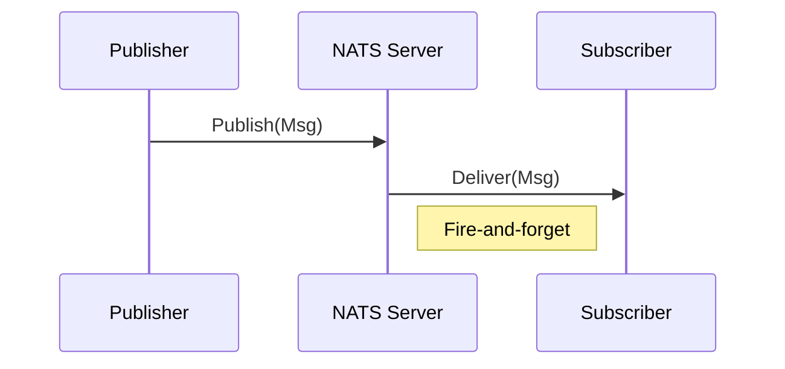
```mermaid
sequenceDiagram
    participant Publisher
    participant NATS Server
    participant Subscriber

    Publisher->>NATS Server: Publish(Msg)
    NATS Server->>Subscriber: Deliver(Msg)
    Note right of NATS Server: Fire-and-forget
```

#### Go Code Example

```go
package main

import (
	"context"
	"log"
	"time"

	"github.com/myproject/gRouter/pkg/messaging"
	"go.uber.org/zap"
)

func main() {
	logger, _ := zap.NewProduction()
	client, _ := messaging.NewNATSClient(messaging.Config{URL: "nats://localhost:4222"}, logger)
	client.Connect()
	defer client.Close()

	// 1. Subscriber
	sub := messaging.NewSubscriber(client, "service-b")
	sub.Subscribe("orders.created", func(ctx context.Context, subject string, env *messaging.MessageEnvelope) error {
		log.Printf("Received order: %s", string(env.Data))
		return nil
	}, nil)

	// 2. Publisher
	pub := messaging.NewPublisher(client, "service-a")
	
	ctx := context.Background()
	data := map[string]string{"order_id": "123", "amount": "100"}
	
	// Sync publish
	if err := pub.Publish(ctx, "orders.created", "OrderCreated", data, nil); err != nil {
		log.Fatal(err)
	}
}
```

### 1.1 Synchronous vs Asynchronous Publishing

The library supports both synchronous (buffered with flush) and asynchronous (buffered without immediate flush) publishing.

#### Sequence Diagram

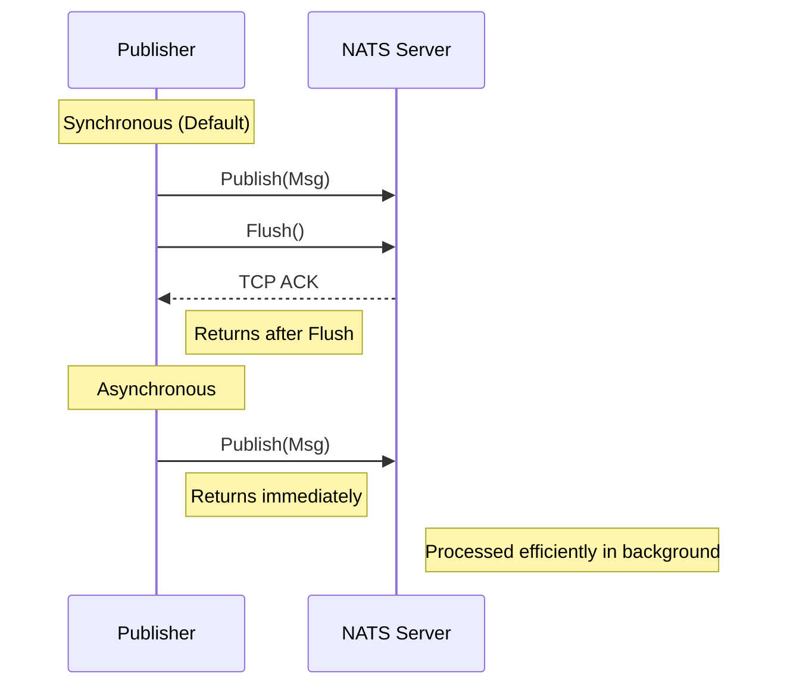
```mermaid
sequenceDiagram
    participant Publisher
    participant NATS Server

    Note over Publisher: Synchronous (Default)
    Publisher->>NATS Server: Publish(Msg)
    Publisher->>NATS Server: Flush()
    NATS Server-->>Publisher: TCP ACK
    Note right of Publisher: Returns after Flush

    Note over Publisher: Asynchronous
    Publisher->>NATS Server: Publish(Msg)
    Note right of Publisher: Returns immediately
    Note right of NATS Server: Processed efficiently in background
```

#### Go Code Example

```go
package main

import (
	"context"
	"log"

	"github.com/myproject/gRouter/pkg/messaging"
)

func main() {
	// ... client setup ...
	pub := messaging.NewPublisher(client, "service-a")
	ctx := context.Background()
	data := map[string]string{"msg": "hello"}

	// 1. Synchronous Publish (Default)
	// This waits for the network buffer to flush to the server.
	// Use this when you want reasonable assurance the message left the client.
	err := pub.Publish(ctx, "events.sync", "EventSync", data, nil)
	if err != nil {
		log.Printf("Sync publish failed: %v", err)
	}

	// 2. Asynchronous Publish
	// This queues the message in the buffer and returns immediately.
	// Use this for high-throughput where individual message latency tracking isn't critical.
	asyncOpts := &messaging.PublishOptions{Async: true}
	err = pub.Publish(ctx, "events.async", "EventAsync", data, asyncOpts)
	if err != nil {
		log.Printf("Async publish failed: %v", err)
	}
}
```

### 1.2 Fan-Out Pattern (One-to-Many)

NATS natively supports fan-out messaging. If multiple subscribers listen to the same subject (and are NOT in a Queue Group), the server delivers a copy of the message to **all** of them.

#### Sequence Diagram

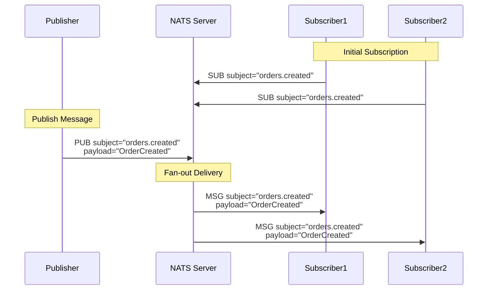
```mermaid
sequenceDiagram
    participant Publisher
    participant NATS Server
    participant Subscriber1
    participant Subscriber2
    
    Note over Subscriber1,Subscriber2: Initial Subscription
    Subscriber1->>NATS Server: SUB subject="orders.created"
    Subscriber2->>NATS Server: SUB subject="orders.created"
    
    Note over Publisher: Publish Message
    Publisher->>NATS Server: PUB subject="orders.created"<br/>payload="OrderCreated"
    
    Note over NATS Server: Fan-out Delivery
    NATS Server->>Subscriber1: MSG subject="orders.created"<br/>payload="OrderCreated"
    NATS Server->>Subscriber2: MSG subject="orders.created"<br/>payload="OrderCreated"
```

#### Go Code Example

```go
package main

import (
	"context"
	"log"

	"github.com/myproject/gRouter/pkg/messaging"
	"go.uber.org/zap"
)

func main() {
	// ... setup client ...

	// 1. Subscriber A
	sub1 := messaging.NewSubscriber(client, "service-b")
	sub1.Subscribe("orders.created", func(ctx context.Context, subject string, env *messaging.MessageEnvelope) error {
		log.Printf("[Sub-1] Received order: %s", env.ID)
		return nil
	}, nil)

	// 2. Subscriber B (Intentionally listening to SAME subject)
	sub2 := messaging.NewSubscriber(client, "service-c")
	sub2.Subscribe("orders.created", func(ctx context.Context, subject string, env *messaging.MessageEnvelope) error {
		log.Printf("[Sub-2] Received order: %s", env.ID)
		return nil
	}, nil)

	// 3. Publish Message
	pub := messaging.NewPublisher(client, "service-a")
	
	// Both sub1 and sub2 will receive this message
	pub.Publish(context.Background(), "orders.created", "OrderCreated", nil, nil)
}
```

### 2. Request-Reply Pattern

This pattern allows for synchronous-like communication where a publisher sends a request and waits for a response from a subscriber.

#### Sequence Diagram

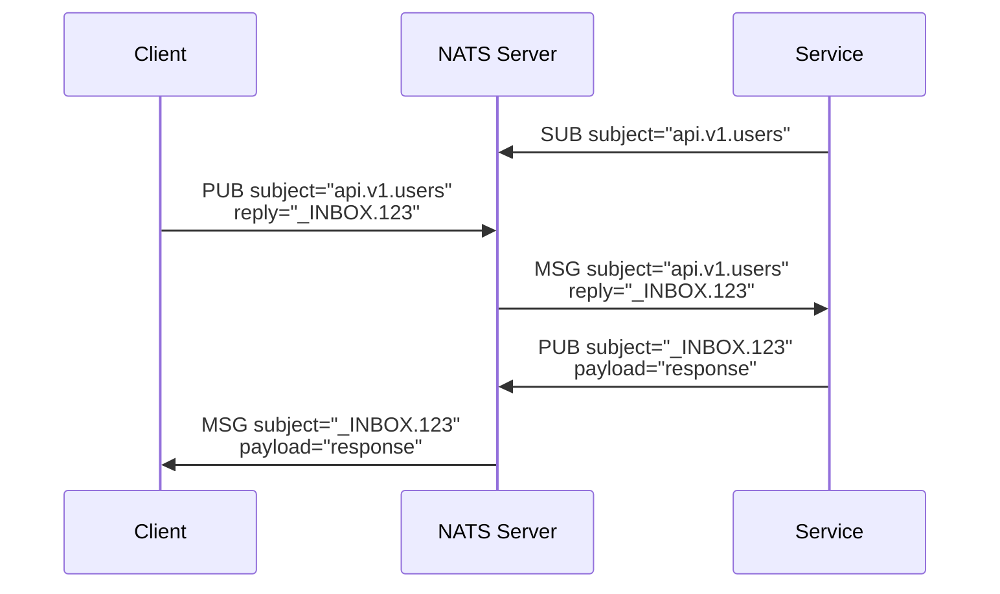
```mermaid
sequenceDiagram
    participant Client
    participant NATS Server
    participant Service
    
    Service->>NATS Server: SUB subject="api.v1.users"
    
    Client->>NATS Server: PUB subject="api.v1.users"<br/>reply="_INBOX.123"
    NATS Server->>Service: MSG subject="api.v1.users"<br/>reply="_INBOX.123"
    
    Service->>NATS Server: PUB subject="_INBOX.123"<br/>payload="response"
    NATS Server->>Client: MSG subject="_INBOX.123"<br/>payload="response"
```

#### Go Code Example

```go
package main

import (
	"context"
	"fmt"
	"log"
	"time"

	"github.com/myproject/gRouter/pkg/messaging"
	"go.uber.org/zap"
)

func main() {
	logger, _ := zap.NewProduction()
	client, _ := messaging.NewNATSClient(messaging.Config{URL: "nats://localhost:4222"}, logger)
	client.Connect()
	defer client.Close()

	// 1. Responder (Server)
	responder := messaging.NewSubscriber(client, "service-b")
	responder.Subscribe("math.double", func(ctx context.Context, subject string, env *messaging.MessageEnvelope) error {
		// Process request
		var input int
		// ... unmarshal env.Data to input ...
		result := input * 2

		// Send reply using the Reply subject from the envelope
		publisher := messaging.NewPublisher(client, "service-b")
		return publisher.Publish(ctx, env.Reply, "MathResponse", result, nil)
	}, nil)

	// 2. Requester (Client)
	requester := messaging.NewPublisher(client, "service-a")
	
	ctx, cancel := context.WithTimeout(context.Background(), 2*time.Second)
	defer cancel()

	response, err := requester.Request(ctx, "math.double", "MathRequest", 10, 2*time.Second)
	if err != nil {
		log.Fatal(err)
	}

	fmt.Printf("Response: %s\n", string(response.Data))
}
```

### 3. Load Balancing (Queue Groups)

Queue groups allow you to balance the load of message processing across multiple instances of a service. Only one member of the group receives each message.

#### Sequence Diagram

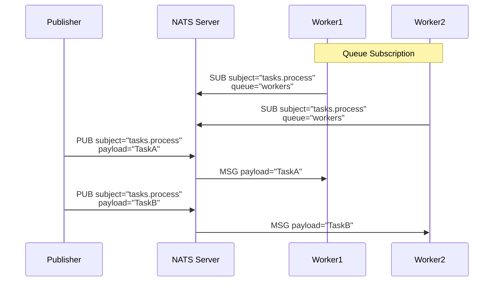
```mermaid
sequenceDiagram
    participant Publisher
    participant NATS Server
    participant Worker1
    participant Worker2
    
    Note over Worker1,Worker2: Queue Subscription
    Worker1->>NATS Server: SUB subject="tasks.process"<br/>queue="workers"
    Worker2->>NATS Server: SUB subject="tasks.process"<br/>queue="workers"
    
    Publisher->>NATS Server: PUB subject="tasks.process"<br/>payload="TaskA"
    NATS Server->>Worker1: MSG payload="TaskA"
    
    Publisher->>NATS Server: PUB subject="tasks.process"<br/>payload="TaskB"
    NATS Server->>Worker2: MSG payload="TaskB"
```

#### Go Code Example

```go
package main

import (
	"context"
	"log"

	"github.com/myproject/gRouter/pkg/messaging"
	"go.uber.org/zap"
)

func main() {
	logger, _ := zap.NewProduction()
	client, _ := messaging.NewNATSClient(messaging.Config{URL: "nats://localhost:4222"}, logger)
	client.Connect()
	defer client.Close()

	handler := func(ctx context.Context, subject string, env *messaging.MessageEnvelope) error {
		log.Printf("Worker processing: %s", env.ID)
		return nil
	}

	// Instance 1
	sub1 := messaging.NewSubscriber(client, "worker-1")
	sub1.Subscribe("jobs.process", handler, &messaging.SubscribeOptions{
		QueueGroup: "job-processors",
	})

	// Instance 2
	sub2 := messaging.NewSubscriber(client, "worker-2")
	sub2.Subscribe("jobs.process", handler, &messaging.SubscribeOptions{
		QueueGroup: "job-processors",
	})

	// Publisher will have messages distributed between sub1 and sub2
	pub := messaging.NewPublisher(client, "job-dispatch")
	pub.Publish(context.Background(), "jobs.process", "Job", nil, nil)
}
```

### 3.1 Queue Groups vs Local Workers

It is important to understand the difference between **Queue Groups** and **MaxWorkers**:

*   **Queue Groups**: Load balancing **across** different application instances (e.g., different Pods). NATS distributes messages round-robin to members of the group.
*   **MaxWorkers**: Concurrency control **within** a single application instance. It limits how many goroutines can process messages simultaneously in that specific subscriber.

**Combined Power**: If you have `3` instances in a Queue Group, and each has `MaxWorkers: 10`, your system can process `30` messages concurrently.

#### Sequence Diagram

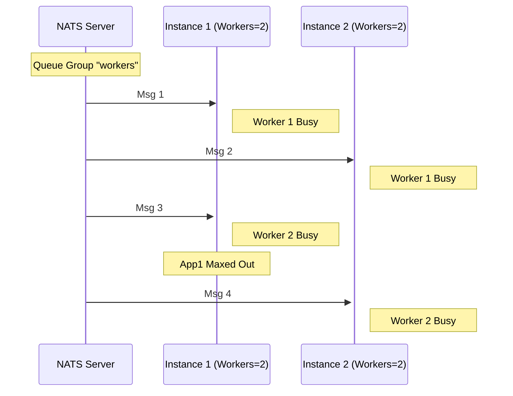
```mermaid
sequenceDiagram
    participant NATS Server
    participant App1 as Instance 1 (Workers=2)
    participant App2 as Instance 2 (Workers=2)

    Note over NATS Server: Queue Group "workers"
    
    NATS Server->>App1: Msg 1
    activate App1
    Note right of App1: Worker 1 Busy
    
    NATS Server->>App2: Msg 2
    activate App2
    Note right of App2: Worker 1 Busy

    NATS Server->>App1: Msg 3
    activate App1
    Note right of App1: Worker 2 Busy
    Note over App1: App1 Maxed Out

    NATS Server->>App2: Msg 4
    activate App2
    Note right of App2: Worker 2 Busy
```

#### Go Code Example

```go
package main

import (
	"context"
	"log"
	"time"

	"github.com/myproject/gRouter/pkg/messaging"
)

func main() {
	// ... client setup ...

	// Define a slow handler to demonstrate concurrency
	slowHandler := func(ctx context.Context, subject string, env *messaging.MessageEnvelope) error {
		log.Printf("[%s] Start processing: %s", env.Source, env.ID)
		time.Sleep(1 * time.Second) // Simulate work
		log.Printf("[%s] Done processing: %s", env.Source, env.ID)
		return nil
	}

	// Instance 1: Part of "processors" group, limited to 2 concurrent messages
	sub1 := messaging.NewSubscriber(client, "instance-1")
	sub1.Subscribe("data.process", slowHandler, &messaging.SubscribeOptions{
		QueueGroup: "processors", // Shares load with other instances
		MaxWorkers: 2,            // Limits local concurrency
	})

	// Instance 2: Part of "processors" group, limited to 2 concurrent messages
	sub2 := messaging.NewSubscriber(client, "instance-2")
	sub2.Subscribe("data.process", slowHandler, &messaging.SubscribeOptions{
		QueueGroup: "processors", // Shares load with other instances
		MaxWorkers: 2,            // Limits local concurrency
	})

	// If we publish 10 messages rapidly:
	// - NATS distributes them roughly 5 to sub1, 5 to sub2.
	// - sub1 starts 2 immediately, queues the other 3 until workers free up.
	// - sub2 starts 2 immediately, queues the other 3 until workers free up.
}
```

## JetStream Patterns (Persistence & Reliability)

### 4. JetStream Publish Patterns

#### 4.1 Synchronous Publish (PublishJS)

**Function**: `PublishJS` blocks until the NATS server acknowledges the message persistence (PubAck). This guarantees at-least-once delivery but has higher latency due to the round-trip time.

**Sequence Diagram**:
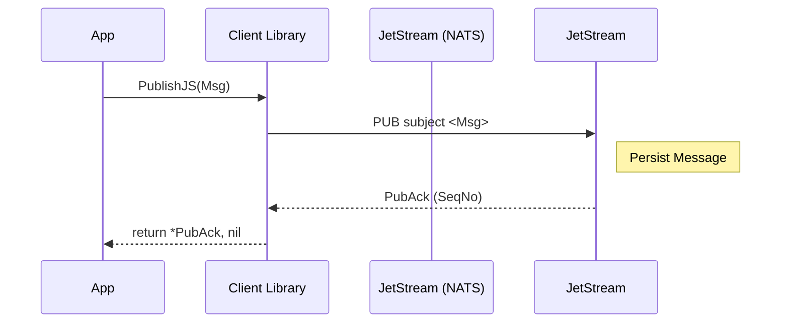
```mermaid
sequenceDiagram
    participant App
    participant Client Library
    participant JetStream (NATS)

    App->>Client Library: PublishJS(Msg)
    Client Library->>JetStream: PUB subject <Msg>
    Note right of JetStream: Persist Message
    JetStream-->>Client Library: PubAck (SeqNo)
    Client Library-->>App: return *PubAck, nil
```

**Go Code Example**:
```go
	// Synchronous Publish - Safer, Higher Latency
	ack, err := pub.PublishJS(ctx, "orders.critical", "OrderCreated", map[string]string{"id": "1"}, nil)
	if err != nil {
		log.Fatal(err)
	}
	log.Printf("Sync Publish: Sequence %d", ack.Sequence)
```

#### 4.2 Asynchronous Publish (PublishAsyncJS)

**Function**: `PublishAsyncJS` returns a `PubAckFuture` immediately. The actual publish happens in the background. The application can continue processing and check the future later (or ignore it if occasional loss is acceptable relative to throughput). This offers high throughput.

**Sequence Diagram**:
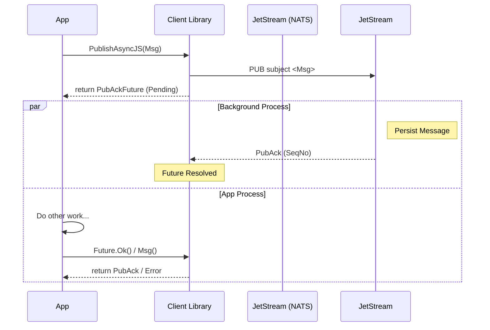
```mermaid
sequenceDiagram
    participant App
    participant Client Library
    participant JetStream (NATS)

    App->>Client Library: PublishAsyncJS(Msg)
    Client Library->>JetStream: PUB subject <Msg>
    Client Library-->>App: return PubAckFuture (Pending)
    
    par Background Process
        Note right of JetStream: Persist Message
        JetStream-->>Client Library: PubAck (SeqNo)
        Note over Client Library: Future Resolved
    and App Process
        App->>App: Do other work...
        App->>Client Library: Future.Ok() / Msg()
        Client Library-->>App: return PubAck / Error
    end
```

**Go Code Example**:
```go
	// Asynchronous Publish - High Throughput
	future, err := pub.PublishAsyncJS(ctx, "orders.logs", "LogEntry", map[string]string{"level": "info"}, nil)
	if err != nil {
		log.Fatal(err)
	}
	
	// Do other work...
	
	// Wait for ack
	select {
	case <-future.Ok():
		ack, _ := future.Msg()
		log.Printf("Async Publish: Sequence %d", ack.Sequence)
	case err := <-future.Err():
		log.Printf("Async Publish Failed: %v", err)
	}
```


### 5. JetStream Subscription Patterns

#### 5.1 Push Subscription (SubscribePush)

**Function**: `SubscribePush` delegates message flow to the NATS server. The server "pushes" messages to the client library as fast as possible (subject to flow control). This is similar to standard NATS subscriptions but with JetStream guarantees (persistence, replay).

**Sequence Diagram**:
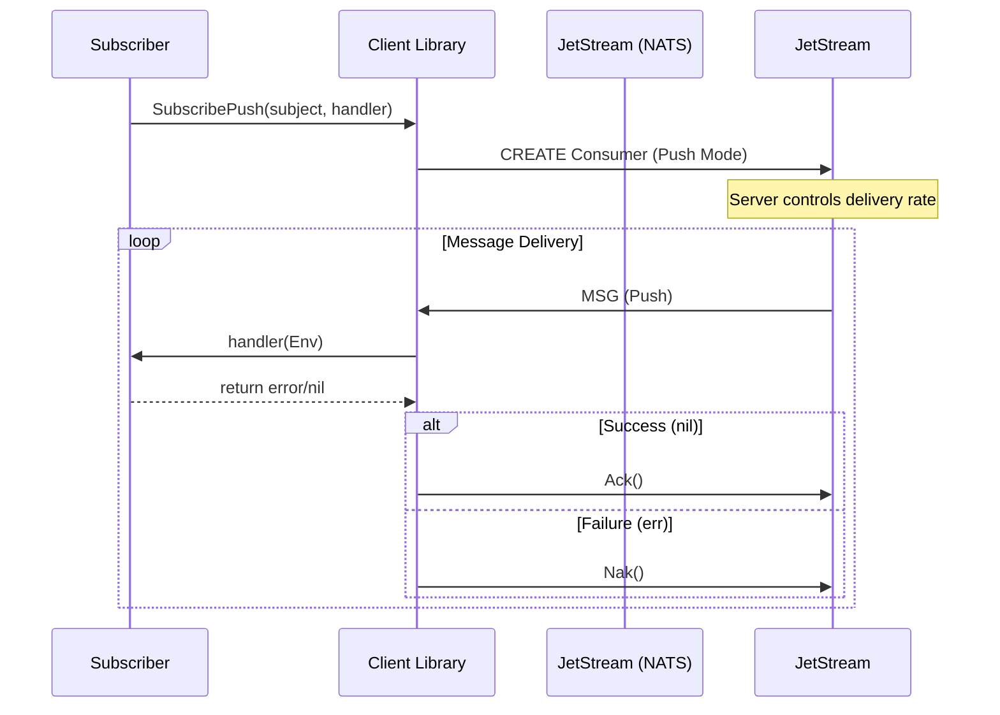
```mermaid
sequenceDiagram
    participant Subscriber
    participant Client Library
    participant JetStream (NATS)

    Subscriber->>Client Library: SubscribePush(subject, handler)
    Client Library->>JetStream: CREATE Consumer (Push Mode)
    Note over JetStream: Server controls delivery rate
    
    loop Message Delivery
        JetStream->>Client Library: MSG (Push)
        Client Library->>Subscriber: handler(Env)
        Subscriber-->>Client Library: return error/nil
        
        alt Success (nil)
            Client Library->>JetStream: Ack()
        else Failure (err)
            Client Library->>JetStream: Nak()
        end
    end
```

**Go Code Example**:
```go
	// Push Subscription - Server Pushes Messages
	err := sub.SubscribePush("orders.critical", func(ctx context.Context, subject string, env *messaging.MessageEnvelope) error {
		log.Printf("Processing critical order: %s", env.ID)
		// Return nil automatically sends Ack
		return nil
	}, nats.Durable("order-processor"))
```


#### 5.2 Pull Subscription (SubscribePull)

**Function**: `SubscribePull` gives the client control. The client "pulls" batches of messages when it is ready. This is ideal for batch processing ("Worker Pattern") or when the consumer needs to handle heavy loads without being overwhelmed by a push stream.

**Sequence Diagram**:
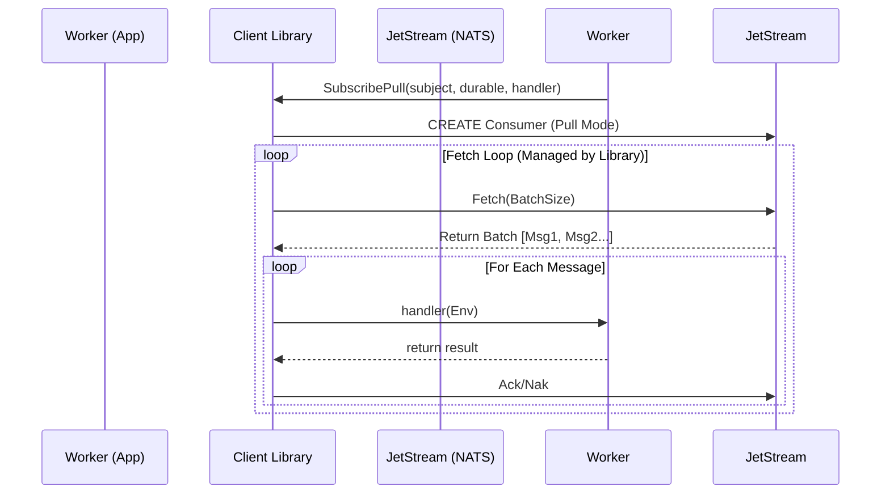
```mermaid
sequenceDiagram
    participant Worker (App)
    participant Client Library
    participant JetStream (NATS)

    Worker->>Client Library: SubscribePull(subject, durable, handler)
    Client Library->>JetStream: CREATE Consumer (Pull Mode)
    
    loop Fetch Loop (Managed by Library)
        Client Library->>JetStream: Fetch(BatchSize)
        JetStream-->>Client Library: Return Batch [Msg1, Msg2...]
        
        loop For Each Message
            Client Library->>Worker: handler(Env)
            Worker-->>Client Library: return result
            Client Library->>JetStream: Ack/Nak
        end
    end
```

**Go Code Example**:
```go
	// Pull Subscription - Client Pulls Messages (Worker Pattern)
	err := sub.SubscribePull("jobs.heavy", "heavy-job-processor", func(ctx context.Context, subject string, env *messaging.MessageEnvelope) error {
		log.Printf("Processing heavy job: %s", env.ID)
		time.Sleep(100 * time.Millisecond) // Simulate heavy work
		return nil
	}, 
		messaging.WithBatchSize(10),
		messaging.WithFetchTimeout(5*time.Second),
	)
```


### 7. Middleware Sequential Flow

Middleware in this library follows the "onion" or "chain of responsibility" pattern. When you register multiple middlewares, they wrap each other.

**Order of Execution:**
1.  Middleware 1 (Pre-processing)
2.  Middleware 2 (Pre-processing)
3.  **Handler / Publisher**
4.  Middleware 2 (Post-processing)
5.  Middleware 1 (Post-processing)

#### Sequence Diagram

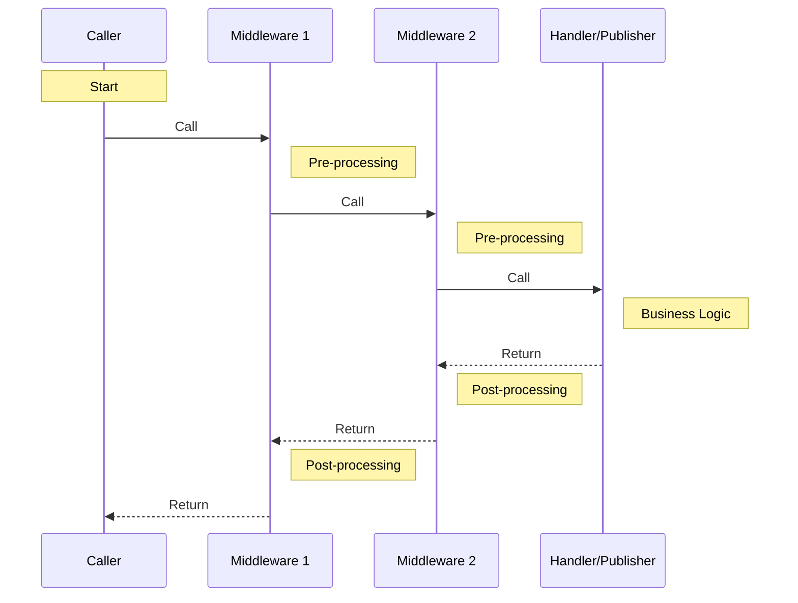
```mermaid
sequenceDiagram
    participant Call as Caller
    participant MW1 as Middleware 1
    participant MW2 as Middleware 2
    participant Handler as Handler/Publisher

    Note over Call: Start
    Call->>MW1: Call
    Note right of MW1: Pre-processing
    MW1->>MW2: Call
    Note right of MW2: Pre-processing
    MW2->>Handler: Call
    Note right of Handler: Business Logic
    Handler-->>MW2: Return
    Note right of MW2: Post-processing
    MW2-->>MW1: Return
    Note right of MW1: Post-processing
    MW1-->>Call: Return
```

#### Go Code Example

```go
package main

import (
	"context"
	"fmt"
	"log"

	"github.com/myproject/gRouter/pkg/messaging"
)

func main() {
	// ... client setup ...
	sub := messaging.NewSubscriber(client, "service-b")

	// Middleware 1
	mw1 := func(next messaging.HandlerFunc) messaging.HandlerFunc {
		return func(ctx context.Context, subject string, env *messaging.MessageEnvelope) error {
			fmt.Println(">> MW1: Pre-processing")
			err := next(ctx, subject, env)
			fmt.Println("<< MW1: Post-processing")
			return err
		}
	}

	// Middleware 2
	mw2 := func(next messaging.HandlerFunc) messaging.HandlerFunc {
		return func(ctx context.Context, subject string, env *messaging.MessageEnvelope) error {
			fmt.Println("  >> MW2: Pre-processing")
			err := next(ctx, subject, env)
			fmt.Println("  << MW2: Post-processing")
			return err
		}
	}

	// Register in order: MW1 first, then MW2
	sub.Use(mw1, mw2)

	sub.Subscribe("middleware.demo", func(ctx context.Context, subject string, env *messaging.MessageEnvelope) error {
		fmt.Println("    -- HANDLER: Business Logic --")
		return nil
	}, nil)
}
```

## 8. Authentication & Security Flows

This section details the authentication mechanisms supported by the gRouter messaging client, including configuration examples and sequence diagrams for the handshake process.

### 8.1 Token Authentication

**Use Case**: Simple internal services where a shared secret is sufficient.

**Configuration**:
```yaml
nats:
  token: "my-secret-token"
```

**Server Setup**:
```bash
nats-server --auth "my-secret-token"
docker run -d   --name nats   -p 4222:4222   nats:latest   --auth mysecrettoken
```

**Client Setup**:
```yaml
# configs/config.yaml
nats:
  url: "nats://localhost:4222"
  token: "my-secret-token"
```

**Sequence Diagram**:

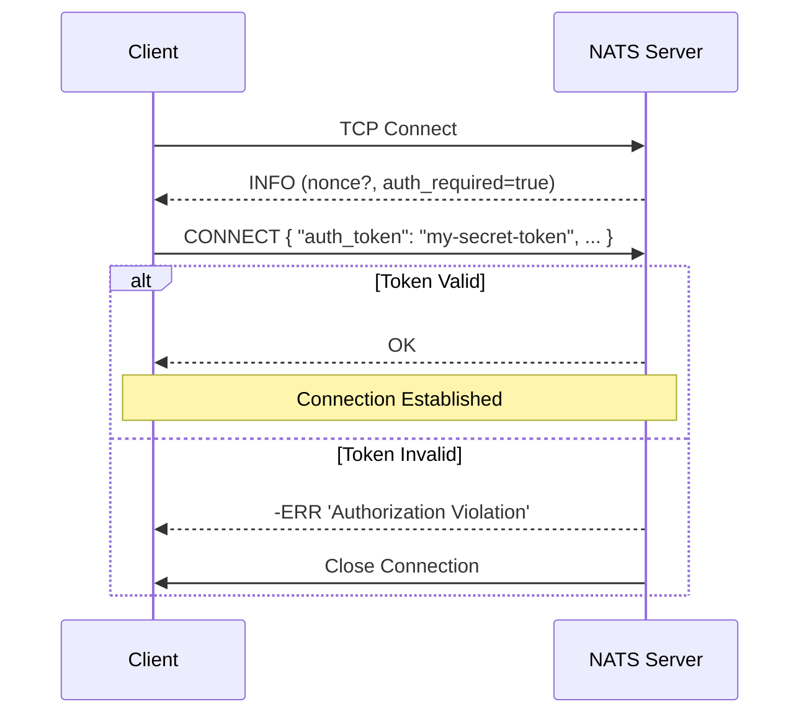
```mermaid
sequenceDiagram
    participant Client
    participant Server as NATS Server

    Client->>Server: TCP Connect
    Server-->>Client: INFO (nonce?, auth_required=true)
    Client->>Server: CONNECT { "auth_token": "my-secret-token", ... }
    
    alt Token Valid
        Server-->>Client: OK
        Note over Client, Server: Connection Established
    else Token Invalid
        Server-->>Client: -ERR 'Authorization Violation'
        Server->>Client: Close Connection
    end
```

### 8.2 Username / Password

**Use Case**: Legacy systems or simple multi-user setups.

**Configuration**:
```yaml
nats:
  username: "my-user"
  password: "my-password"
```

**Server Setup**:
```bash
nats-server --user "my-user" --pass "my-password"
sudo docker run -d --name nats -p 4222:4222 nats:latest --user myuser --pass mypassword
```

**Client Setup**:
```yaml
# configs/config.yaml
nats:
  url: "nats://localhost:4222"
  username: "my-user"
  password: "my-password"
```

**Sequence Diagram**:

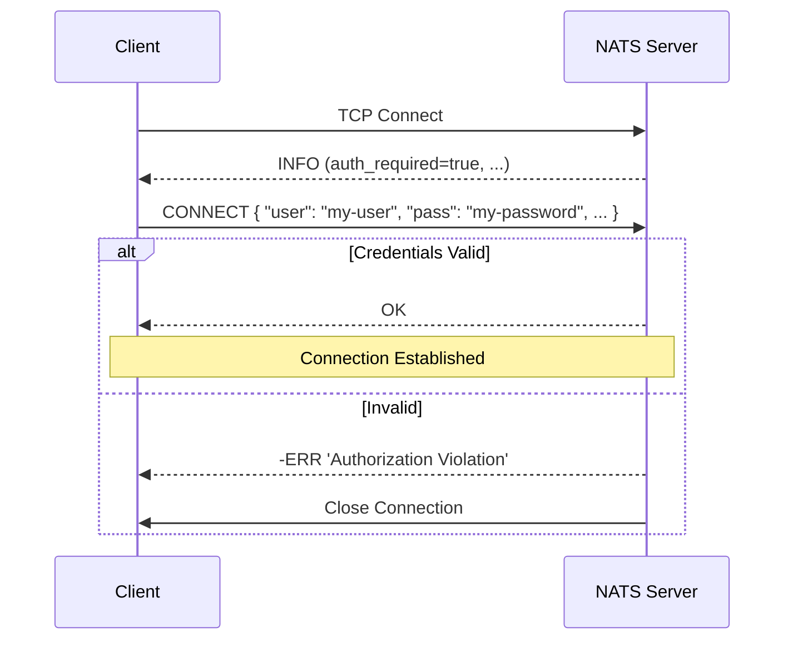
```mermaid
sequenceDiagram
    participant Client
    participant Server as NATS Server

    Client->>Server: TCP Connect
    Server-->>Client: INFO (auth_required=true, ...)
    Client->>Server: CONNECT { "user": "my-user", "pass": "my-password", ... }
    
    alt Credentials Valid
        Server-->>Client: OK
        Note over Client, Server: Connection Established
    else Invalid
        Server-->>Client: -ERR 'Authorization Violation'
        Server->>Client: Close Connection
    end
```

### 8.3 NATS 2.0 Credentials (User JWT + NKEY)

**Use Case**: Zero-trust production environments, multi-tenant operators. This uses a Challenge-Response mechanism directly signed by the private key (NKEY Seed).

**Configuration**:
```yaml
nats:
  creds_file: "/path/to/user.creds" # Contains JWT and NKEY Seed
```

**Credential Generation (nsc)**:

0.  **Install nsc**:
    ```bash
    curl -sf https://binaries.nats.dev/nats-io/nsc/v2@latest | sh
    ls nsc
    ```
1.  **Initialize Operator**:
    ```bash
    nsc add operator --name my_operator
    nsc edit operator --service-url nats://localhost:4222
    ```
2.  **Create Account**:
    ```bash
    nsc add account --name my_account
    ```
3.  **Create User & Generate Creds**:
    ```bash
    nsc add user --name my_user
    nsc generate creds -a my_account -n my_user > user.creds
    ```
    *Place `user.creds` in a secure location readable by the client.*

**Server Setup**:
Requires a configuration file referencing the Operator JWT and System Account.

**1. Generate Config Files**:
```bash
# Export Operator JWT
nsc describe operator --raw > operator.jwt

# Generate complete config with preloaded accounts (for MEMORY resolver)
nsc generate config --mem-resolver --sys-account SYS --force > nats-server.conf
```

**2. Run Server with Docker**:
```bash
docker run -d --name nats-2.0 \
  -p 4222:4222 \
  -v $(pwd)/nats-server.conf:/nats/nats-server.conf \
  -v $(pwd)/operator.jwt:/nats/operator.jwt \
  nats:latest -c /nats/nats-server.conf
```

793:

**Client Setup**:
```yaml
# configs/config.yaml
nats:
  url: "nats://localhost:4222"
  creds_file: "/path/to/user.creds"
```

**Sequence Diagram**:

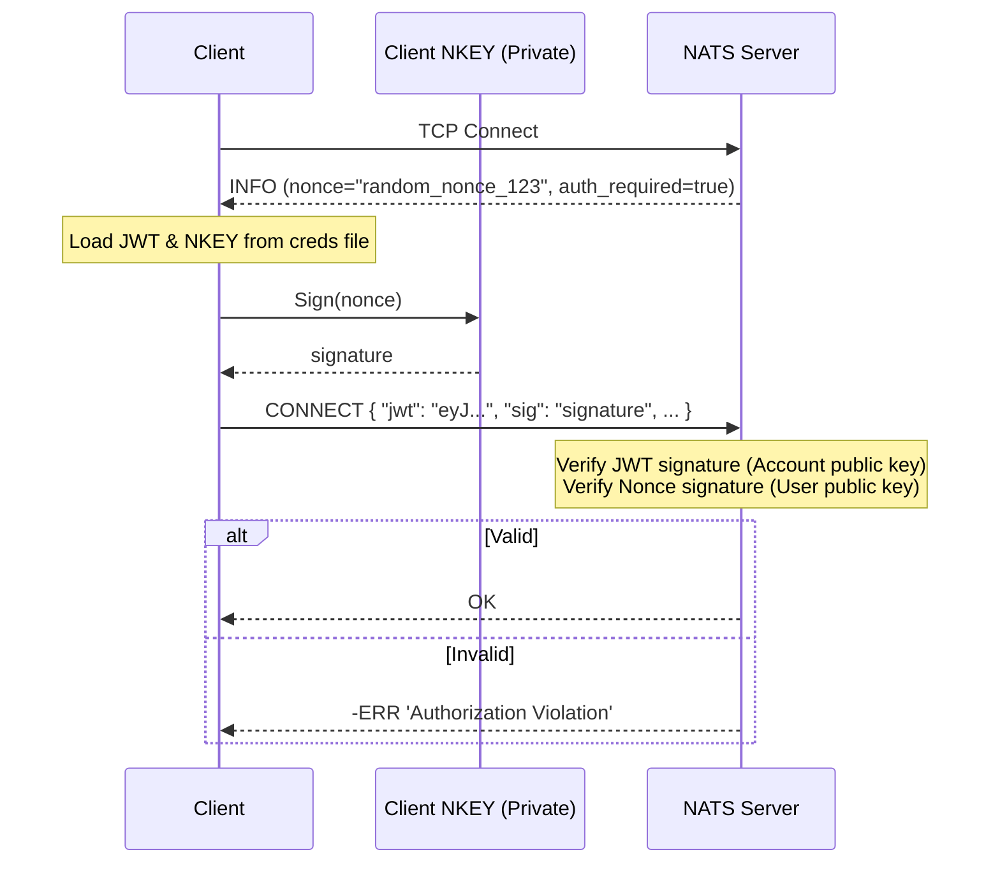
```mermaid
sequenceDiagram
    participant Client
    participant Key as Client NKEY (Private)
    participant Server as NATS Server

    Client->>Server: TCP Connect
    Server-->>Client: INFO (nonce="random_nonce_123", auth_required=true)
    
    Note over Client: Load JWT & NKEY from creds file
    Client->>Key: Sign(nonce)
    Key-->>Client: signature
    
    Client->>Server: CONNECT { "jwt": "eyJ...", "sig": "signature", ... }
    
    Note over Server: Verify JWT signature (Account public key)<br/>Verify Nonce signature (User public key)
    
    alt Valid
        Server-->>Client: OK
    else Invalid
        Server-->>Client: -ERR 'Authorization Violation'
    end
```

### 8.4 TLS & mTLS (Mutual TLS)

**Use Case**: Encrypting traffic (TLS) and identifying clients via Certificates (mTLS).

**Configuration**:
```yaml
nats:
  use_tls: true
  ca_file: "/path/to/ca.pem"
  cert_file: "/path/to/client-cert.pem" # Required for mTLS
  key_file: "/path/to/client-key.pem"   # Required for mTLS
```

**Certificate Generation (mkcert)**:
1.  **Install mkcert**: `brew install mkcert` (or equivalent) & `mkcert -install`
2.  **Generate Server Certs**:
    ```bash
    mkcert -key-file server.key -cert-file server.pem localhost 127.0.0.1 ::1
    ```
3.  **Generate Client Certs**:
    ```bash
    mkcert -client -key-file client-key.pem -cert-file client-cert.pem client
    ```
4.  **Get CA Root**:
    ```bash
    cp "$(mkcert -CAROOT)/rootCA.pem" ca.pem
    ```
    *Ensure `server.key` and `client-key.pem` are kept secure.*

**Server Setup**:
```bash
# Run locally
nats-server --tls --tlscert=server.pem --tlskey=server.key --tlscacert=ca.pem --tlsverify

# Run with Docker
docker run -d --name nats-tls \
  -p 4222:4222 \
  -v $(pwd)/server.pem:/etc/nats/certs/server.pem \
  -v $(pwd)/server.key:/etc/nats/certs/server.key \
  -v $(pwd)/ca.pem:/etc/nats/certs/ca.pem \
  nats:latest \
  --tls --tlscert=/etc/nats/certs/server.pem --tlskey=/etc/nats/certs/server.key --tlscacert=/etc/nats/certs/ca.pem --tlsverify
```
*Note: `--tlsverify` enforces mTLS (client must present a valid cert).*

**Client Setup**:
```yaml
# configs/config.yaml
nats:
  url: "tls://localhost:4222"
  use_tls: true
  ca_file: "./certs/ca.pem"
  # Add these for mTLS:
  cert_file: "./certs/client.pem"
  key_file: "./certs/client-key.pem"
```

**Sequence Diagram**:

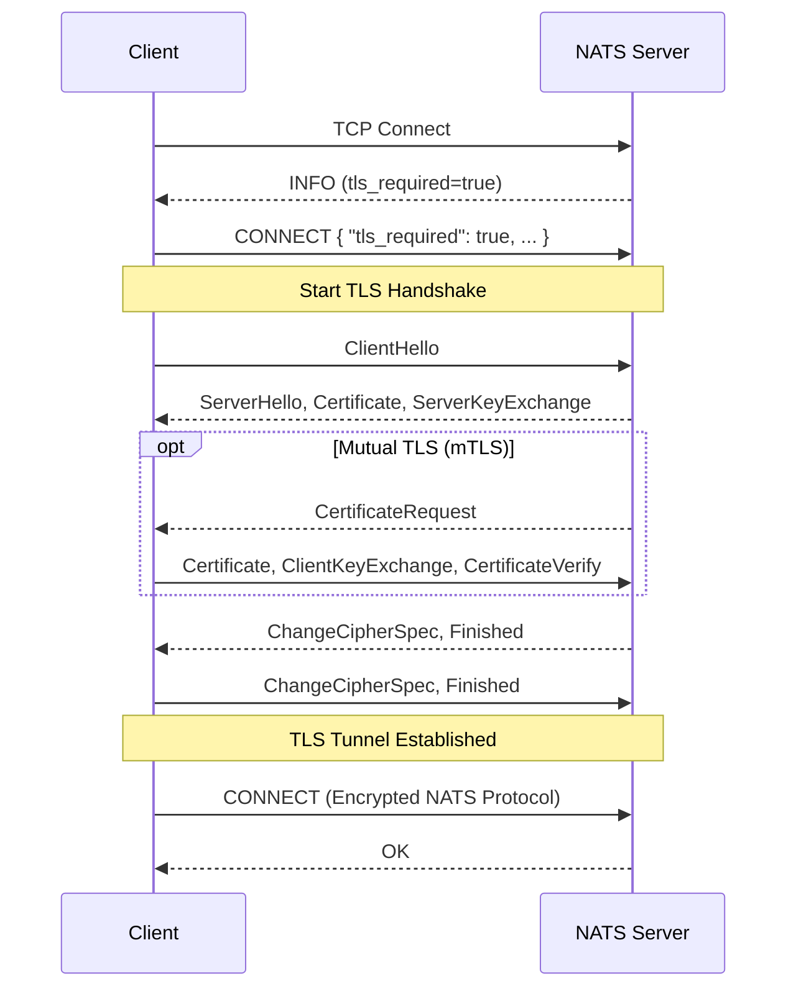
```mermaid
sequenceDiagram
    participant Client
    participant Server as NATS Server

    Client->>Server: TCP Connect
    Server-->>Client: INFO (tls_required=true)
    Client->>Server: CONNECT { "tls_required": true, ... }
    
    Note over Client, Server: Start TLS Handshake
    
    Client->>Server: ClientHello
    Server-->>Client: ServerHello, Certificate, ServerKeyExchange
    
    opt Mutual TLS (mTLS)
        Server-->>Client: CertificateRequest
        Client->>Server: Certificate, ClientKeyExchange, CertificateVerify
    end
    
    Server-->>Client: ChangeCipherSpec, Finished
    Client->>Server: ChangeCipherSpec, Finished
    
    Note over Client, Server: TLS Tunnel Established
    
    Client->>Server: CONNECT (Encrypted NATS Protocol)
    Server-->>Client: OK
```

## 9. Stream Management

While often managed via CLI, you can programmatically manage JetStream streams using the client.

### Stream Hierarchy Diagram

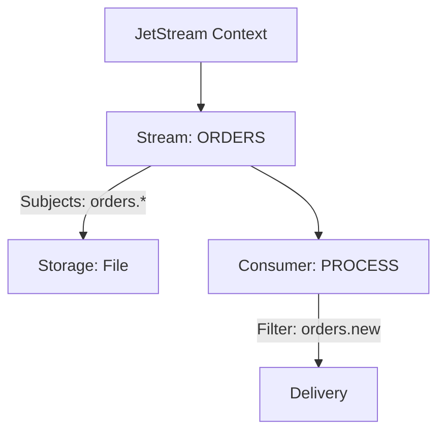
```mermaid
graph TD
    JS[JetStream Context] --> Stream[Stream: ORDERS]
    Stream -->|Subjects: orders.*| Storage[Storage: File]
    Stream --> Consumer[Consumer: PROCESS]
    Consumer -->|Filter: orders.new| Delivery
```

### Go Code Example (Create & Update Stream)

```go
package main

import (
	"log"
	"time"

	"github.com/nats-io/nats.go"
	"github.com/myproject/gRouter/pkg/messaging"
	"go.uber.org/zap"
)

func main() {
	logger, _ := zap.NewProduction()
	client, _ := messaging.NewNATSClient(messaging.Config{URL: "nats://localhost:4222"}, logger)
	client.Connect()

	// 1. Get JetStream Context
	js, err := client.JetStream()
	if err != nil {
		log.Fatal(err)
	}

	// 2. Define Stream Configuration
	streamConfig := &nats.StreamConfig{
		Name:     "ORDERS",
		Subjects: []string{"orders.>"},
		Storage:  nats.FileStorage,
		Replicas: 1,
		MaxAge:   24 * time.Hour, // Retention policy
	}

	// 3. Create or Update Stream
	// AddStream is idempotent-ish but will fail if properties clash.
	// Check if exists first often good practice, or just handle error.
	streamInfo, err := js.AddStream(streamConfig)
	if err != nil {
		log.Printf("Error creating stream: %v", err)
		
		// If it exists, maybe we want to update it?
		log.Println("Attempting to update stream...")
		streamInfo, err = js.UpdateStream(streamConfig)
		if err != nil {
			log.Fatal("Failed to update stream: ", err)
		}
	}

	log.Printf("Stream %s created/updated. Current msg count: %d", streamInfo.Config.Name, streamInfo.State.Msgs)

	// 4. Delete Stream (Cleanup)
	// err = js.DeleteStream("ORDERS")
}
```

### 10. Supported Middleware Services

The library provides built-in middleware factories in `pkg/messaging/nats/middleware.go` for common observability patterns.

#### 10.1 Logging Middleware

**Functions**: `LoggingMiddleware` (Subscriber), `PublisherLoggingMiddleware` (Publisher)
**Purpose**: Logs the details (Subject, ID, Type), duration, and outcome of every message processed or published.

**Sequence Diagram**:
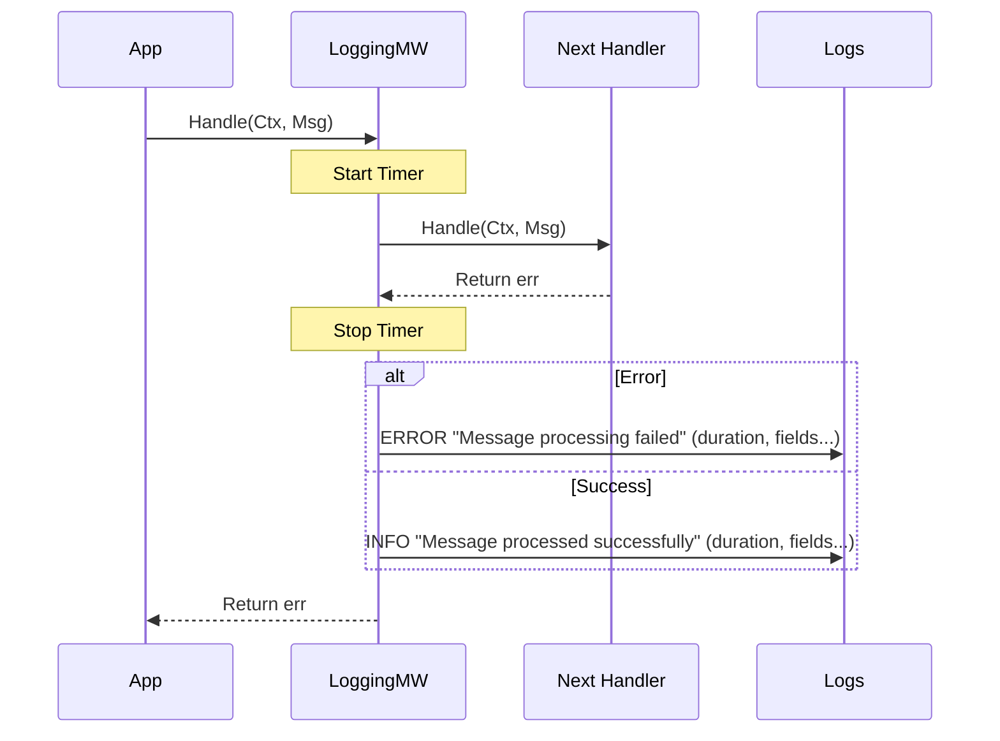
```mermaid
sequenceDiagram
    participant App
    participant Middleware as LoggingMW
    participant Handler as Next Handler
    
    App->>Middleware: Handle(Ctx, Msg)
    Note over Middleware: Start Timer
    
    Middleware->>Handler: Handle(Ctx, Msg)
    Handler-->>Middleware: Return err
    
    Note over Middleware: Stop Timer
    
    alt Error
        Middleware->>Logs: ERROR "Message processing failed" (duration, fields...)
    else Success
        Middleware->>Logs: INFO "Message processed successfully" (duration, fields...)
    end
    
    Middleware-->>App: Return err
```

#### 10.2 Metrics Middleware

**Functions**: `MetricsMiddleware` (Subscriber), `PublisherMetricsMiddleware` (Publisher)
**Purpose**: Collects Prometheus metrics for monitoring system health and performance.
*   **Counters**: `messaging_subscribe_total`, `messaging_publish_total` (Labels: subject, type, status)
*   **Histograms**: `messaging_subscribe_duration_seconds`, `messaging_publish_duration_seconds`

**Sequence Diagram**:
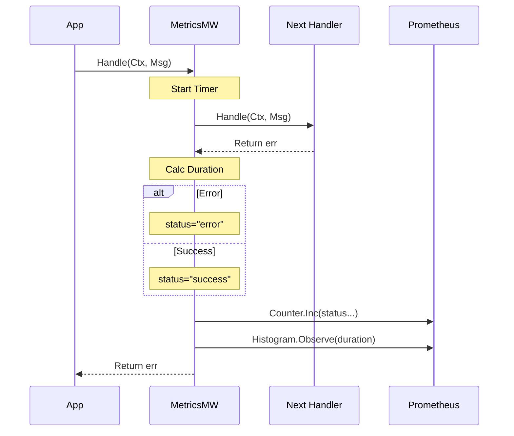
```mermaid
sequenceDiagram
    participant App
    participant Middleware as MetricsMW
    participant Handler as Next Handler
    participant Prom as Prometheus
    
    App->>Middleware: Handle(Ctx, Msg)
    Note over Middleware: Start Timer
    
    Middleware->>Handler: Handle(Ctx, Msg)
    Handler-->>Middleware: Return err
    
    Note over Middleware: Calc Duration
    
    alt Error
        Note over Middleware: status="error"
    else Success
        Note over Middleware: status="success"
    end
    
    Middleware->>Prom: Counter.Inc(status...)
    Middleware->>Prom: Histogram.Observe(duration)
    
    Middleware-->>App: Return err
```

#### 10.3 Tracing Middleware

**Functions**: `TracingMiddleware` (Subscriber), `PublisherTracingMiddleware` (Publisher)
**Purpose**: Integrates with OpenTelemetry (OTEL) for distributed tracing.
*   **Subscriber**: Extracts parent span context from `MessageEnvelope.Metadata` and starts a new `messaging.receive` span.
*   **Publisher**: Starts a new `messaging.send` span.

**Sequence Diagram**:
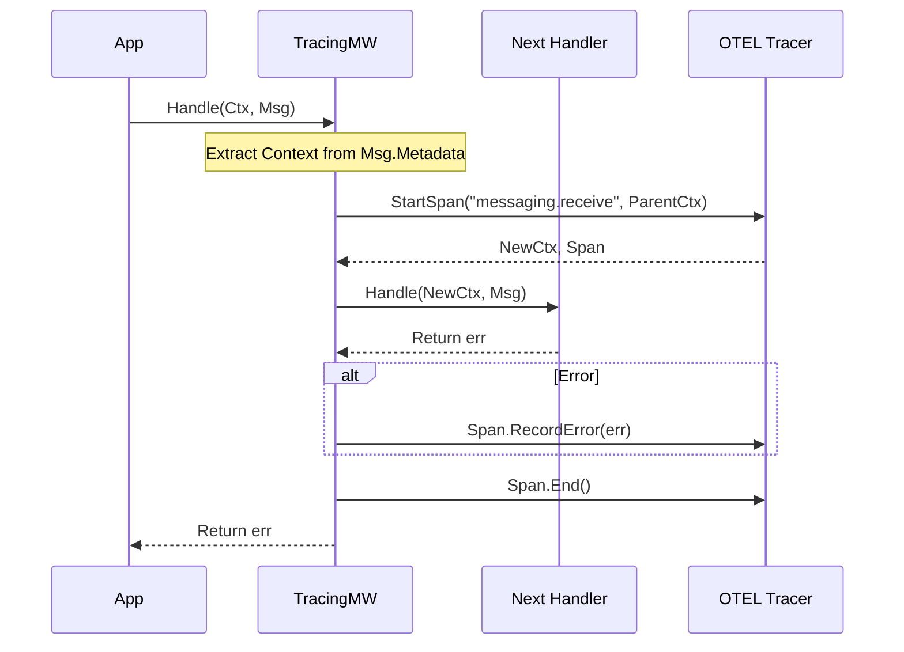
```mermaid
sequenceDiagram
    participant App
    participant Middleware as TracingMW
    participant Handler as Next Handler
    participant Tracer as OTEL Tracer
    
    App->>Middleware: Handle(Ctx, Msg)
    
    Note over Middleware: Extract Context from Msg.Metadata
    Middleware->>Tracer: StartSpan("messaging.receive", ParentCtx)
    Tracer-->>Middleware: NewCtx, Span
    
    Middleware->>Handler: Handle(NewCtx, Msg)
    Handler-->>Middleware: Return err
    
    alt Error
        Middleware->>Tracer: Span.RecordError(err)
    end
    
    Middleware->>Tracer: Span.End()
    
    Middleware-->>App: Return err
```


## 9. Testing Distributed Tracing

This section explains how to verify distributed tracing in your NATS-based services using OpenTelemetry.

### 9.1 Tracing Flow

The following sequence diagram illustrates how trace context is propagated across NATS messages.

#### Sequence Diagram

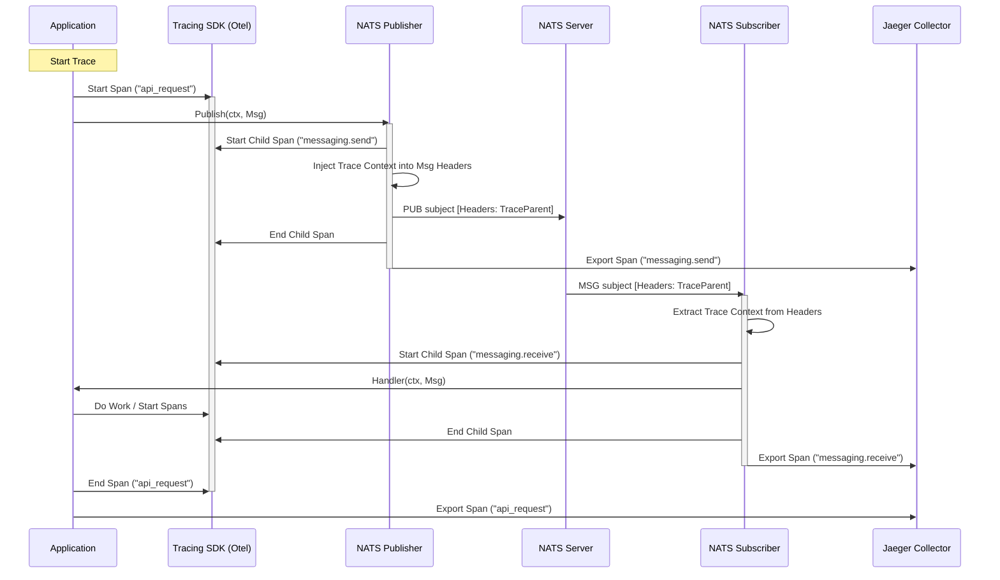
```mermaid
sequenceDiagram
    participant App as Application
    participant SDK as Tracing SDK (Otel)
    participant Pub as NATS Publisher
    participant NATS as NATS Server
    participant Sub as NATS Subscriber
    participant Jaeger as Jaeger Collector

    Note over App: Start Trace
    App->>SDK: Start Span ("api_request")
    activate SDK
    
    App->>Pub: Publish(ctx, Msg)
    activate Pub
    Pub->>SDK: Start Child Span ("messaging.send")
    Pub->>Pub: Inject Trace Context into Msg Headers
    Pub->>NATS: PUB subject [Headers: TraceParent]
    Pub->>SDK: End Child Span
    Pub->>Jaeger: Export Span ("messaging.send")
    deactivate Pub

    NATS->>Sub: MSG subject [Headers: TraceParent]
    
    activate Sub
    Sub->>Sub: Extract Trace Context from Headers
    Sub->>SDK: Start Child Span ("messaging.receive")
    Sub->>App: Handler(ctx, Msg)
    App->>SDK: Do Work / Start Spans
    Sub->>SDK: End Child Span
    Sub->>Jaeger: Export Span ("messaging.receive")
    deactivate Sub

    App->>SDK: End Span ("api_request")
    deactivate SDK
    App->>Jaeger: Export Span ("api_request")
```

### 9.2 Testing with Console (Stdout)

This is the simplest way to verify that your service is generating spans.

1.  **Configure Service**:
    Ensure your `config.yaml` has tracing enabled with `stdout` exporter.
    ```yaml
    tracing:
      enabled: true
      service_name: "natsdemosvc"
      exporter: "stdout"
    nats:
      tracing:
        enabled: true
    ```

2.  **Run Service**:
    ```bash
    go run cmd/main.go
    ```

3.  **Generate Traffic**:
    Send a message via CLI.
    ```bash
    nats pub natsdemosvc.natdemo.create '{"type": "natdemo.create", "id": "1", "data": {}, "source": "cli"}'
    ```

4.  **Verify Output**:
    Check the terminal running the service. You should see JSON output representing spans:
    ```json
    {
      "Name": "messaging.receive natsdemosvc.natdemo.create",
      "SpanContext": {
        "TraceID": "...",
        "SpanID": "..."
      },
      "Attributes": [
        {"Key": "messaging.subject", "Value": "natsdemosvc.natdemo.create"}
      ]
    }
    ```

### 9.3 Testing with Jaeger (UI)

For visual inspection of traces.

1.  **Start Jaeger**:
    ```bash
    docker run -d --name jaeger \
                -e COLLECTOR_ZIPKIN_HOST_PORT=:9411 \
                -p 5775:5775/udp \
                -p 6831:6831/udp \
                -p 6832:6832/udp \
                -p 5778:5778 \
                -p 16686:16686 \
                -p 14268:14268 \
                -p 14250:14250 \
                -p 9411:9411 \
                -p 4317:4317 \
                -p 4318:4318 \
                jaegertracing/all-in-one:1.60
    ```

2.  **Configure Service**:
    Update `config.yaml` to point to Jaeger (ensure your code supports Jaeger/OTLP exporter, commonly via HTTP/GRPC).
    ```yaml
    tracing:
      enabled: true
      exporter: "jaeger" # mapped to OTLP internally
      endpoint: "http://localhost:4318" # Jaeger OTLP HTTP port
    ```

3.  **Run & Generate Traffic**:
    Same as above.

4.  **Verify in UI**:
    *   Open [http://localhost:16686](http://localhost:16686).
    *   Select Service: `natsdemosvc`.
    *   Click **Find Traces**.
    *   You should see a trace showing the flow from Publisher -> Subscriber.
