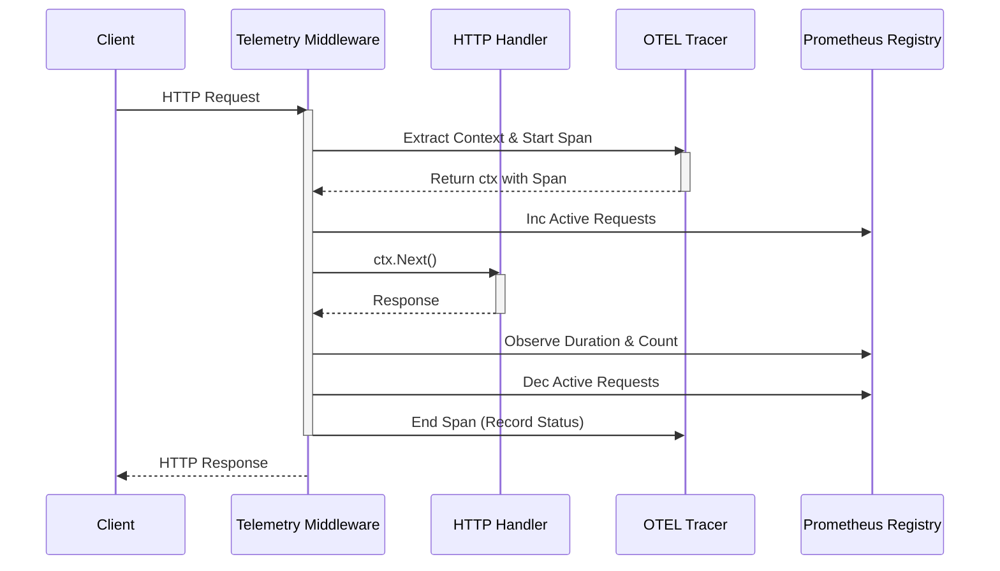

# Telemetry Package Documentation

The `pkg/telemetry` package provides observability infrastructure for the `gRouter` project, including distributed tracing (OpenTelemetry) and metrics (Prometheus).

## Features

- **Distributed Tracing**: Implementation of OpenTelemetry (OTEL) for trace propagation and export.
- **Metrics**: Standard Prometheus metrics for HTTP requests, durations, and active connections.
- **Middleware**: Gin middleware that automatically instruments HTTP handlers with tracing and metrics.
- **Pluggable Exporters**: Supports explicit configuration for exporters (currently `stdout`, extensible to Jaeger/OTLP).
- **Correlation**: Automatically correlates traces with metrics where possible via context propagation.

## Design

The telemetry package is designed to be a singleton-like utility initialized at application startup.

### Tracing Flow
1. **Initialization**: `InitTracer` is called with configuration. It sets the global OTEL TracerProvider and Propagator (W3C TraceContext).
2. **Instrumentation**: Middleware extracts the trace context from incoming HTTP headers (if any).
3. **Span Creation**: A new span is started for the request, tagged with semantic attributes (method, URL, route).
4. **Context Propagation**: The context containing the span is injected into the request context for downstream use.
5. **Export**: On completion, spans are batched and exported (default: `stdout`).

### Metrics Flow
1. **Initialization**: `InitMetrics` registers Prometheus collectors.
2. **Instrumentation**: Middleware records metrics data points.
3. **Exposition**: Use `PrometheusHandler()` to expose metrics at `/metrics` (usually on a separate admin port).

## Sequence Flow Diagrams

### Request Telemetry Flow



## Build and Run

### Configuration

Telemetry is configured via the global configuration file (`config.yaml`):

```yaml
tracing:
  enabled: true
  service_name: "my-service"
  exporter: "stdout" # Options: stdout

metrics:
  enabled: true
  path: "/metrics"
```

### Usage in Code

**Initialization:**

```go
import "grouter/pkg/telemetry"

// Init Tracing
shutdown, err := telemetry.InitTracer(cfg.Tracing)
if err != nil {
    log.Fatal(err)
}
defer shutdown(context.Background())

// Init Metrics
telemetry.InitMetrics(cfg.Metrics)
```

**Middleware:**

```go
r := gin.New()
r.Use(telemetry.Middleware("my-service"))
```

**Exposing Metrics:**

```go
r.GET("/metrics", telemetry.PrometheusHandler())
```

### Verification

To verify telemetry is working:
1. Enable `stdout` exporter in config.
2. Run your service.
3. Make an HTTP request.
4. Check standard output for JSON trace data.
5. Check `/metrics` endpoint for Prometheus text format.
