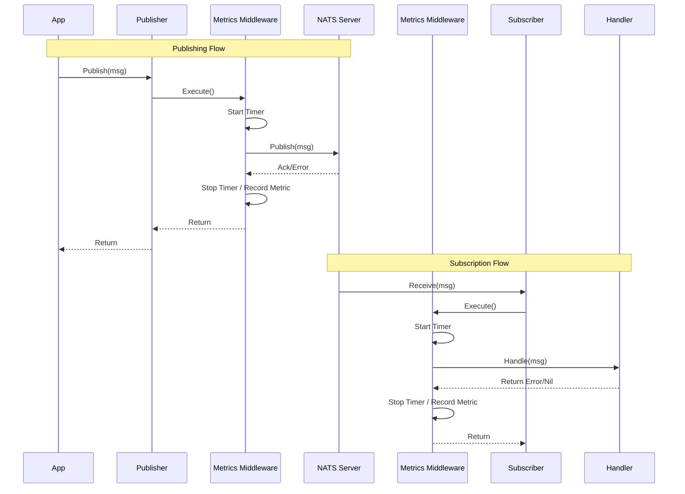

# Metrics & Observability

gRouter provides built-in observability through Prometheus metrics, covering both HTTP requests and NATS messaging operations. This document outlines the design, architecture, and data flow of the metrics system.

## Feature Description

The metrics system automatically collects and exposes telemetry data for:
-   **HTTP traffic**: Request counts, latency, and status codes.
-   **NATS Messaging**: Published messages, received messages, and processing duration.
-   **Runtime stats**: Go runtime memory, CPU, and goroutine statistics.

Metrics are exposed via the standard `/metrics` endpoint, which can be scraped by Prometheus.

## Design & Architecture

The metrics implementation follows a **Middleware Pattern** to ensure separation of concerns and non-intrusive instrumentation.

### Components

1.  **Metrics Middleware (`pkg/messaging/middleware.go`)**:
    -   Intercepts NATS Publisher and Subscriber operations.
    -   Uses `promauto` to register and update global metrics.
    -   Calculates duration and tracks success/failure status.

2.  **Gin Middleware (`pkg/web/server.go`)**:
    -   Uses `gin-gonic/gin` middleware to track HTTP request latency and status codes.
    -   Mounts the `promhttp` handler to expose the `/metrics` endpoint.

3.  **Configuration (`pkg/config`)**:
    -   Metrics logic is enabled/disabled via `web.metrics.enabled` in `config.yaml`.
    -   The `ServiceManager` orchestrates the attachment of middleware based on this config.

## Metrics Flow

The following diagram illustrates how metrics are collected during message flow:



## Available Metrics

### NATS Messaging
| Metric Name | Type | Labels | Description |
| :--- | :--- | :--- | :--- |
| `messaging_publish_total` | Counter | `subject`, `type`, `status` | Total messages published. |
| `messaging_publish_duration_seconds` | Histogram | `subject`, `type` | Latency of publish operations. |
| `messaging_subscribe_total` | Counter | `subject`, `type`, `status` | Total messages received (consumed). |
| `messaging_subscribe_duration_seconds` | Histogram | `subject`, `type` | Duration of message processing handler. |

### HTTP Server
Standard Prometheus HTTP metrics are exposed, including:
-   `promhttp_metric_handler_requests_total`
-   `promhttp_metric_handler_requests_in_flight`

### Go Runtime
Standard Go runtime metrics (memory, GC, threads) are automatically included.

## Configuration

To enable metrics, update your `config.yaml`:

```yaml
web:
  metrics:
    enabled: true
    path: "/metrics"
```
