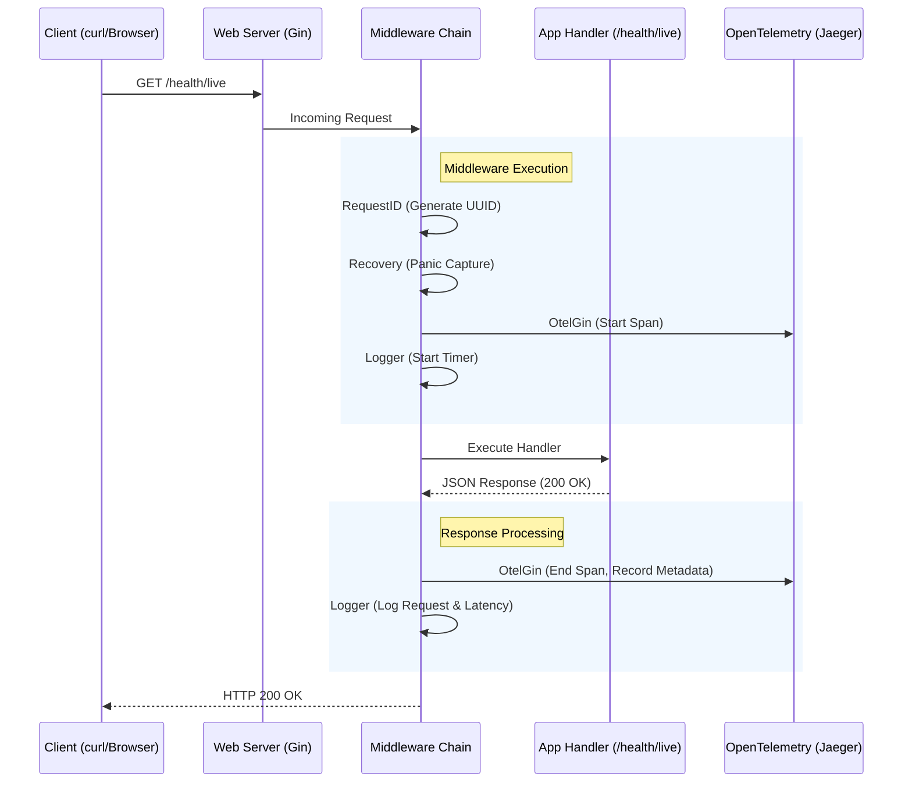
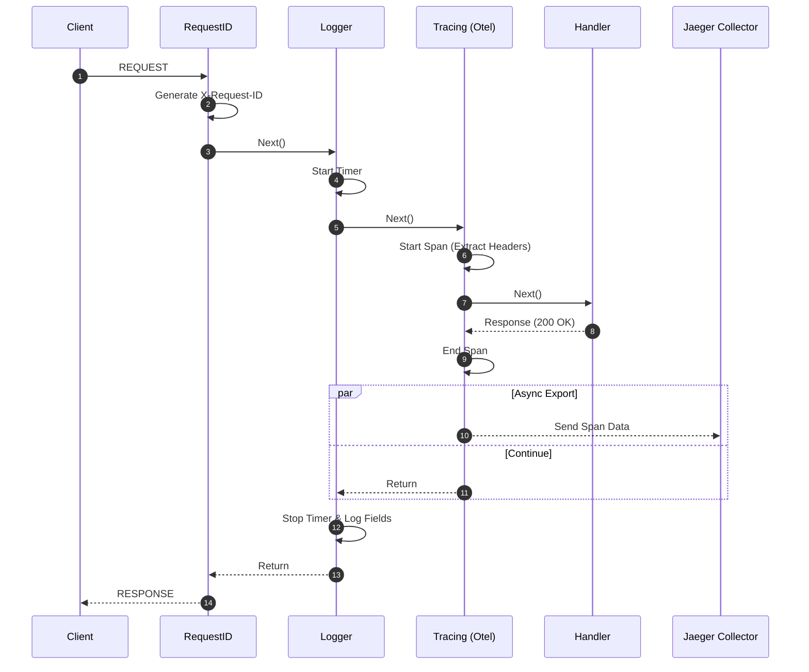
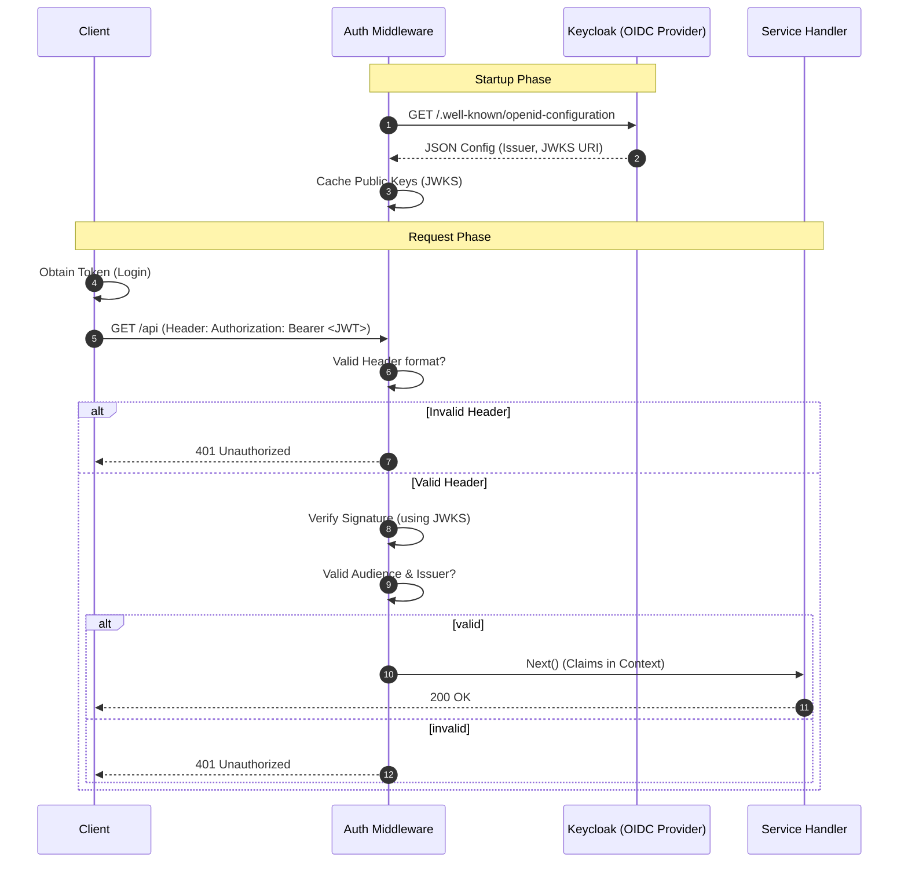

# Web Service Architecture & Learning Guide

This document provides a comprehensive overview of the `gRouter` web service architecture, specifically verifying flows within the `webdemosvc`.

## 1. Overall Web Service Architecture

The `webdemosvc` is built on top of the `pkg/web` framework, which provides a production-ready HTTP server with integrated middleware for observability (logging, metrics, tracing) and reliability (recovery, rate limiting).

### Service Flow

The following sequence diagram illustrates the lifecycle of a request as it flows through the `ServiceManager`, `WebServer`, and various middleware before reaching the application handler.



### Detailed Middleware Flow (Tracing Focus)

The following diagram details the exact execution order and asynchronous observability exports.



### Component Interaction

1.  **ServiceManager**: Orchestrates the startup of `WebServer` and NATS connection.
2.  **WebServer**: A wrapper around `gin.Engine` that applies default configuration and middleware.
3.  **App Handler**: The specific business logic (e.g., in `webdemosvc/internal/pkg/webdemo`).

## 2. Middleware Services

The `pkg/web` framework includes several key middleware services. Below is a detailed guide for each.

### 2.1 RequestID
**Description**: Assigns a unique `X-Request-ID` to every request. This ID is used for correlation across logs and tracing.
*   **Configurable**: No (Always enabled).
*   **Verification**:
    ```bash
    curl -v http://localhost:8081/health/live
    ```
    *Look for `X-Request-Id` in the response headers.*

### 2.2 Panic Recovery
**Description**: Recovers from panics that occur during request handling, preventing the entire server from crashing.
*   **Configurable**: No (Always enabled).
*   **Verification**: Trigger a panic in a handler (dev only). The server will log the stack trace and return 500.

### 2.3 Logger
**Description**: Logs details about each incoming HTTP request (Method, Path, Status, Latency, IP).
*   **Configurable**: Yes via `config.yaml`.
*   **Configuration**:
    ```yaml
    web:
      logging:
        enabled: true
    ```
*   **Verification**:
    1.  Enable logging.
    2.  Send a request: `curl http://localhost:8081/health/live`
    3.  Check logs coverage (stdout or file):
        ```
        INFO    web/server.go:267       HTTP Request    {"request_id": "...", "status": 200, ...}
        ```

### 2.4 OpenTelemetry (Tracing)
**Description**: Automatically instruments requests to create trace spans, capturing timing and metadata.
*   **Configurable**: Yes via `config.yaml`.
*   **Configuration**:
    ```yaml
    tracing:
      enabled: true
      service_name: "grouter-web"
      exporter: "otlp" # or "stdout"
      endpoint: "http://localhost:4318"
    ```
*   **Verification (stdout)**:
    1.  Set `exporter: "stdout"`.
    2.  Send request.
    3.  Check console for JSON span output.
*   **Verification (Jaeger)**:
    1.  Set `exporter: "otlp"`.
    2.  Ensure Jaeger is running (see [Section 4](#4-setup--verification-procedure)).
    3.  Send request.
    4.  Check Jaeger UI at `http://localhost:16686`.

### 2.5 Rate Limiting
**Description**: Protects the service from abuse by limiting the number of requests per second.
*   **Configurable**: Yes via `config.yaml`.
*   **Configuration**:
    ```yaml
    web:
      rate_limit:
        enabled: true
        requests_per_second: 100
        burst: 200
    ```
*   **Verification**:
    1.  Lower the limit to something small (e.g., 1 req/sec).
    2.  Send rapid requests:
        ```bash
        for i in {1..5}; do curl -i http://localhost:8081/health/live; done
        ```
    3.  Expect `429 Too Many Requests` responses.

### 2.6 CORS (Cross-Origin Resource Sharing)
**Description**: Controls which domains can access the API from a browser.
*   **Configurable**: Yes via `config.yaml`.
*   **Configuration**:
    ```yaml
    web:
      cors:
        enabled: true
        allowed_origins: ["*"]
        allowed_methods: ["GET", "POST"]
    ```
*   **Verification**:
    ```bash
    curl -v -H "Origin: http://example.com" -X OPTIONS http://localhost:8081/health/live
    ```
    *Look for `Access-Control-Allow-Origin: *` in response.*

### 2.7 Security Headers
**Description**: Adds standard security headers to responses (HSTS, XSS Protection, etc.).
*   **Configurable**: Yes via `config.yaml`.
*   **Configuration**:
    ```yaml
    web:
      security:
        enabled: true
        hsts_max_age: 31536000
    ```
*   **Verification**:
    ```bash
    curl -v http://localhost:8081/health/live
    ```
    *Look for headers like `Strict-Transport-Security`, `X-Content-Type-Options`, etc.*

### 2.8 Authentication (OIDC/JWT)
**Description**: Verification of OpenID Connect ID Tokens (JWT) via a configured Identity Provider (e.g., Keycloak).
*   **Configurable**: Yes via `config.yaml`.
*   **Configuration**:
    ```yaml
    web:
      auth:
        enabled: true
        issuer: "http://localhost:8080/realms/grouter"
        audience: "account" # or specific client ID
    ```
*   **Verification**:
    1.  Ensure Keycloak is running.
    2.  Obtain token:
        ```bash
        TOKEN=$(curl -s -d "client_id=webdemo" ... http://localhost:8080/.../token | jq -r .access_token)
        ```
    3.  Call API:
        ```bash
        curl -H "Authorization: Bearer $TOKEN" http://localhost:8081/health/live
        ```

## 3. Tracing Configuration

Distributed tracing allows you to visualize the path of a request across services.

### Configuration (`config.yaml`)

To enable tracing, update the `tracing` section in your service configuration.

```yaml
tracing:
  enabled: true                  # Master switch
  service_name: "grouter-web"    # Service name appearing in Jaeger
  exporter: "otlp"               # Exporter: "stdout" (console) or "otlp" (collector)
  endpoint: "http://localhost:4318" # Collector endpoint
```

### Exporter Options
*   **stdout**: Prints trace spans to the console. Useful for local debugging without infrastructure.
*   **otlp**: Sends traces to an OTLP collector (like Jaeger or Zipkin).

## 4. Setup & Verification Procedure

### Prequisites
*   Docker (for Jaeger)

### Step 1: Start Jaeger (Infrastructure)
Run Jaeger in a container to collect and visualize traces.

```bash
docker run -d --name jaeger \
  -e COLLECTOR_ZIPKIN_HOST_PORT=:9411 \
  -p 5775:5775/udp \
  -p 6831:6831/udp \
  -p 6832:6832/udp \
  -p 5778:5778 \
  -p 16686:16686 \
  -p 14268:14268 \
  -p 14250:14250 \
  -p 4317:4317 \
  -p 4318:4318 \
  jaegertracing/all-in-one:latest
```

*   **UI**: [http://localhost:16686](http://localhost:16686)
*   **Collector (HTTP)**: `http://localhost:4318`

### Step 2: Run Service
Start your service with tracing enabled.

```bash
go run services/webdemosvc/cmd/webdemosvc/main.go --config services/webdemosvc/internal/config/config.yaml
```

### Step 3: Generate Traffic
Send requests to your service.

```bash
curl http://localhost:8081/health/live
```

### Step 4: Verify in Jaeger
1.  Open [http://localhost:16686](http://localhost:16686).
2.  Select **Service**: `grouter-web` (or your configured service name).
3.  Click **Find Traces**.
4.  Click on a trace to view the span details and timeline.


*(Example placeholder image)*

## 5. Authentication Flow

The following diagram details the message flow for authenticated requests.



## 6. Authentication Setup & Verification

### Step 1: Start Keycloak
Run a local Keycloak instance for testing.

```bash
docker run -d --name keycloak -p 8080:8080 \
  -e KEYCLOAK_ADMIN=admin -e KEYCLOAK_ADMIN_PASSWORD=admin \
  quay.io/keycloak/keycloak:23.0.0 start-dev
```

### Step 2: Configure Realm & Client
Once Keycloak is up (check `http://localhost:8080/admin`):
1.  Sign in as `admin` / `admin`.
2.  Create Realm: `grouter`.
3.  Create Client: `webdemo` (Access Type: `public`, Standard Flow: `ON`, Direct Access Grants: `ON`).
4.  Create User: `user` (Credentials: `pass`, Default Email Verified: `ON`).

### Step 3: Get Token
Simulate a login to get an access token.

```bash
TOKEN=$(curl -s -d "client_id=webdemo" \
  -d "username=user" \
  -d "password=pass" \
  -d "grant_type=password" \
  http://localhost:8080/realms/grouter/protocol/openid-connect/token | jq -r .access_token)

echo $TOKEN
```

### Step 4: Verify Service Access
1.  **Without Token**:
    ```bash
    curl -v http://localhost:8081/health/live
    # Expected: 401 Unauthorized
    ```
2.  **With Token**:
    ```bash
    curl -v -H "Authorization: Bearer $TOKEN" http://localhost:8081/health/live
    # Expected: 200 OK
    ```
