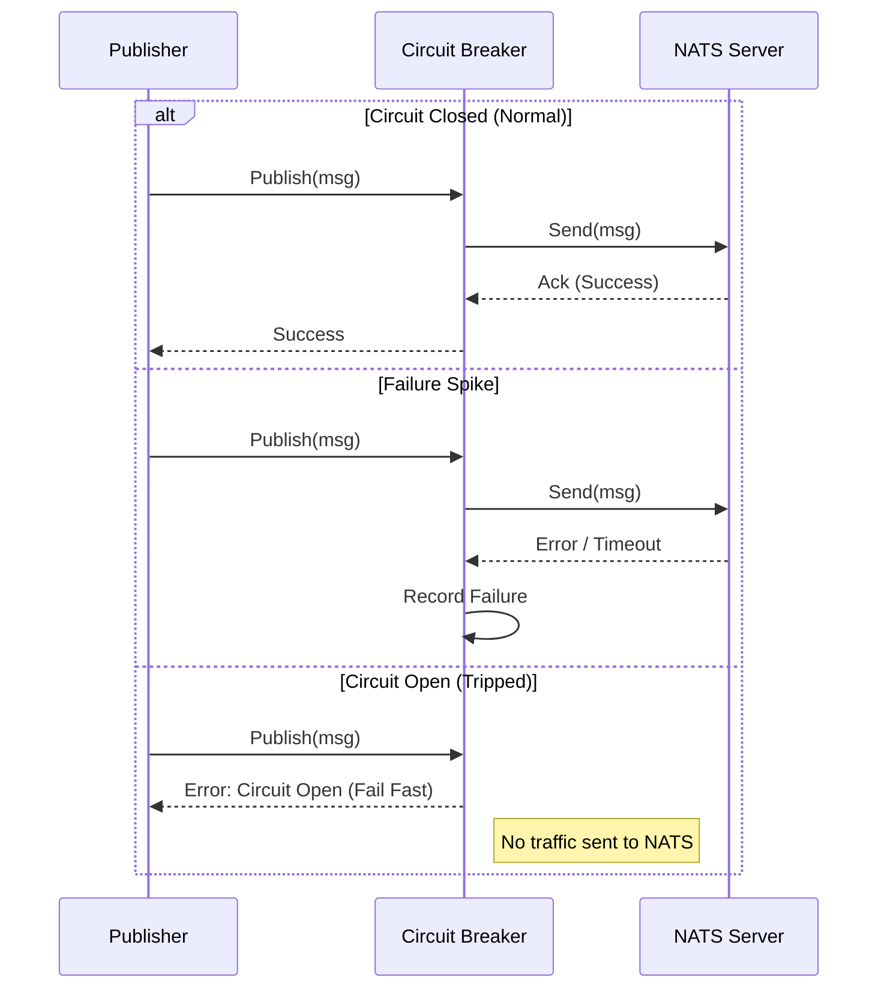
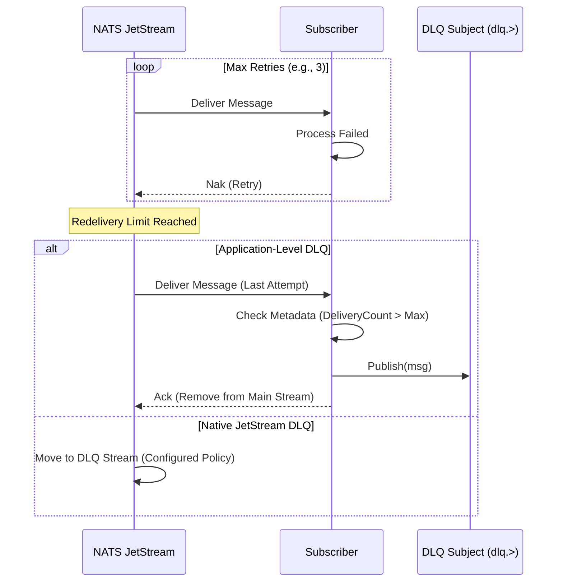
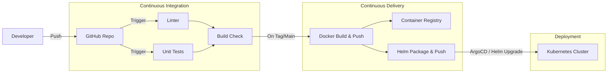
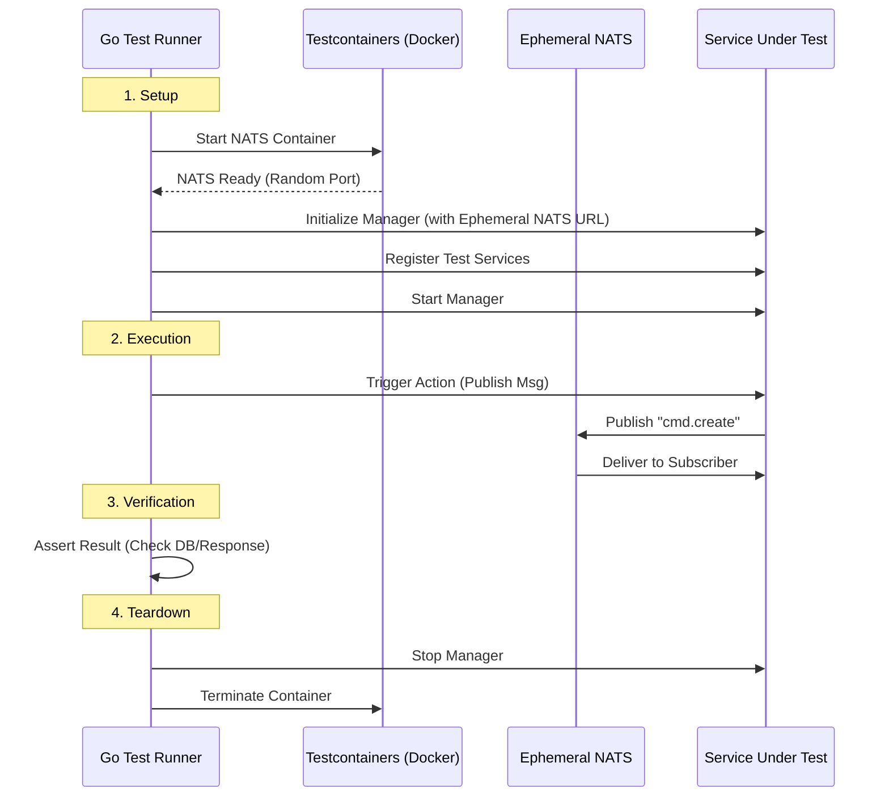

# Production Readiness Gap Analysis

This document outlines the missing features and areas for improvement required to make `gRouter` production-ready.

## 1. Observability
*   **Missing**: **Distributed Tracing**.
    *   **Status**: Planning phase. See `pkg/manager/otel_integration_plan.md`.
    *   **Impact**: Critical for debugging cross-service requests and NATS message flows.
    *   **Action**: Implement OpenTelemetry (OTel) integration across `manager`, `messaging`, and `web` packages.
*   **Present**: Structured Logging (Zap) and Metrics (Prometheus).

## 2. Resilience Patterns

### A. Circuit Breaker
**Goal**: Prevent cascading failures when a downstream service is down.

**Design Flow**:

**Implementation Sketch**:
1.  **Add Dependency**: `github.com/sony/gobreaker`.
2.  **Modify `NATSPublisher`**:
    *   Add `cb *gobreaker.CircuitBreaker`.
    *   Wrap `publish` logic inside `cb.Execute(func() error { ... })`.

### B. Dead Letter Queue (DLQ)
**Goal**: Capture messages that fail processing after max retries.

**Design Flow**:

**Implementation Sketch**:
1.  **Native Approach (Recommended)**:
    *   Configure `MaxDeliver` in the JetStream Consumer Config.
    *   Create a separate Stream/Consumer binding for the DLQ subject.
2.  **Application Approach** (if custom logic needed):
    *   In `NATSSubscriber`, inspect `msg.Metadata.NumDelivered`.
    *   If `NumDelivered > Limit`, publish to `dlq.<original_subject>` and `Ack`.

## 3. DevOps & Deployment

### Architecture Flow
**Goal**: Automate the path from code commit to production deployment.

### Mandatory Pipelines (GitHub Actions)

#### A. Pull Request (PR) Pipeline
*   **Trigger**: On PR open/update to `main`.
*   **Jobs**:
    1.  **Lint**: Run `golangci-lint` to enforce code standards.
    2.  **Test**: Run `go test ./...` (Unit tests).
    3.  **Build Verification**: Run `go build` (or Bazel build) to ensure no compilation errors.
    4.  **Security Scan**: (Optional) Run `trivy` or `govulncheck` to catch vulnerabilities early.

#### B. Release Pipeline
*   **Trigger**: On Tag push (e.g., `v1.0.0`).
*   **Jobs**:
    1.  **Test**: Run tests again to be safe.
    2.  **Docker Build**: Build the container image.
    3.  **Docker Push**: Push to registry (e.g., GHCR, DockerHub) tagged with version.
    4.  **Helm Publish**: Package the Helm chart and push to OCI registry or Chartmuseum.

### Implementation Sketch
1.  **Create Workflows**:
    *   `.github/workflows/ci.yaml` (Lint, Test).
    *   `.github/workflows/release.yaml` (Build, Push).
2.  **Helm Chart**:
    *   Populate `deployments/helm/grouter` with `Chart.yaml`, `values.yaml`, and templates.
    *   Ensure `values.yaml` supports overriding image tag and config.

## 4. Testing Strategy: End-to-End (E2E)

### Strategy Overview
**Goal**: Verify the entire system flow—from `Service A` publishing a message to `Service B` consuming it—in an isolated, reproducible environment.
**Tools**: `testcontainers-go` to spin up ephemeral infrastructure (NATS, Postgres) during `go test`.

### High-Level Design

### Implementation Sketch
1.  **Dependencies**:
    *   Add `github.com/testcontainers/testcontainers-go`.
    *   Add `github.com/testcontainers/testcontainers-go/modules/nats` (if available, or generic).
2.  **Test Structure**:
    *   Create `tests/e2e/main_test.go` to handle `TestMain` (setup/teardown).
    *   Create `tests/e2e/flow_test.go` for specific scenarios.
3.  **CI Integration**:
    *   Ensure GitHub Actions runner supports Docker (standard runners do).
    *   The E2E tests will run automatically as part of `go test ./...` if configured correctly (or use build tags like `//go:build e2e`).
## Implementation Checklist
- [ ] **Phase 1: Observability** - Implement OTel Tracing.
- [ ] **Phase 2: DevOps** - Create Docker pipelines and Helm Charts.
- [ ] **Phase 3: Resilience** - Add Circuit Breaker and DLQ.
- [ ] **Phase 4: Robustness** - Add E2E Integration Tests.
