# Pulumi IaaS Architecture Design

## System Architecture Overview

```mermaid
graph TB
    subgraph "Multi-Cloud Deployment"
        subgraph "GCP Region"
            GKE[GKE Cluster]
            GCS[Cloud Storage]
            GCSQL[Cloud SQL]
            GLB[Global Load Balancer]
        end
        
        subgraph "AWS Region"
            EKS[EKS Cluster]
            S3[S3 Storage]
            RDS[RDS Database]
            ALB[Application LB]
        end
        
        subgraph "Azure Region"
            AKS[AKS Cluster]
            BLOB[Blob Storage]
            ADB[Azure Database]
            AzLB[Azure LB]
        end
        
        subgraph "On-Premises"
            K8S[Kubernetes]
            NFS[NFS Storage]
            PG[PostgreSQL]
            NGINX[NGINX]
        end
    end
    
    subgraph "Global Services"
        DNS[Global DNS]
        CDN[CDN]
        WAF[Web Application Firewall]
    end
    
    DNS --> GLB
    DNS --> ALB
    DNS --> AzLB
    DNS --> NGINX
    
    CDN --> GLB
    CDN --> ALB
```

## Cloud-Specific Architectures

### GCP Architecture

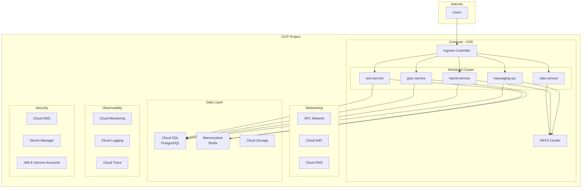

### AWS Architecture

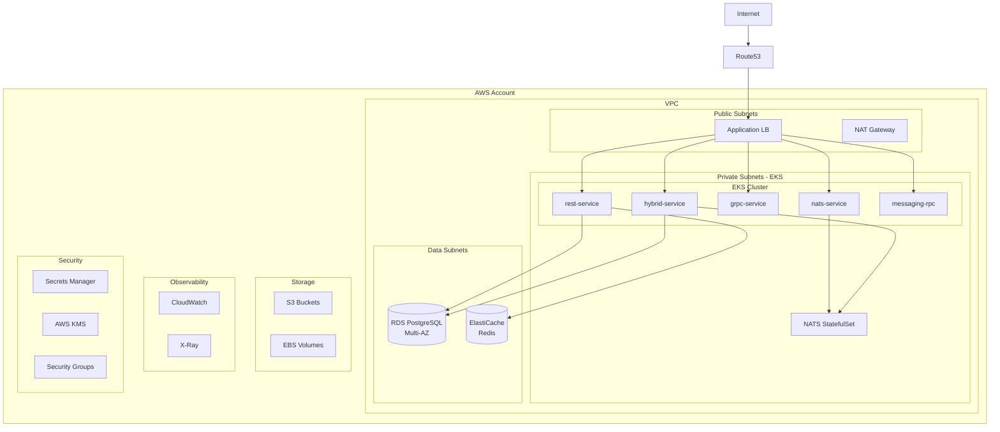

### Azure Architecture

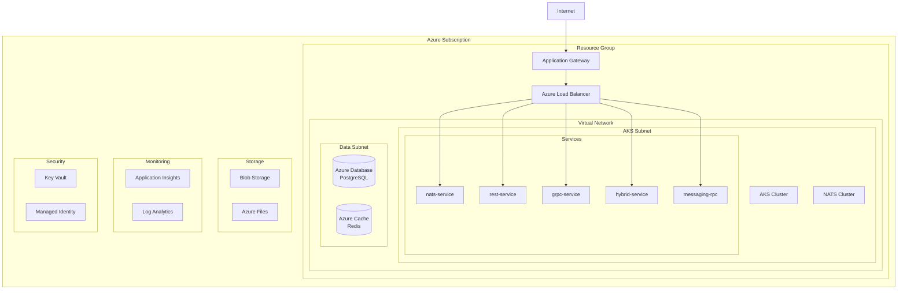

## Network Topology

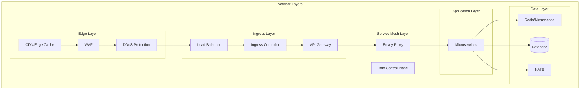

## Service Mesh Design

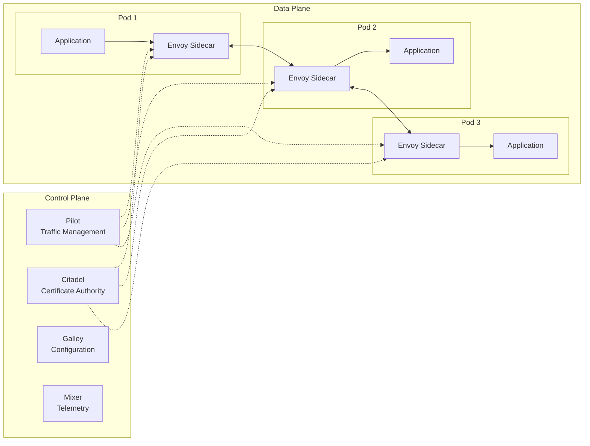

## Data Flow Architecture

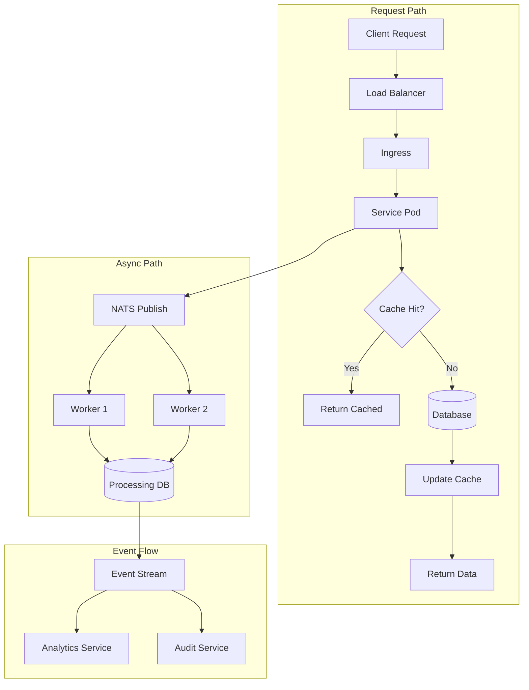

## Deployment Architecture

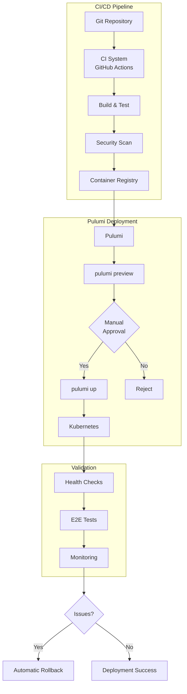

## Security Architecture

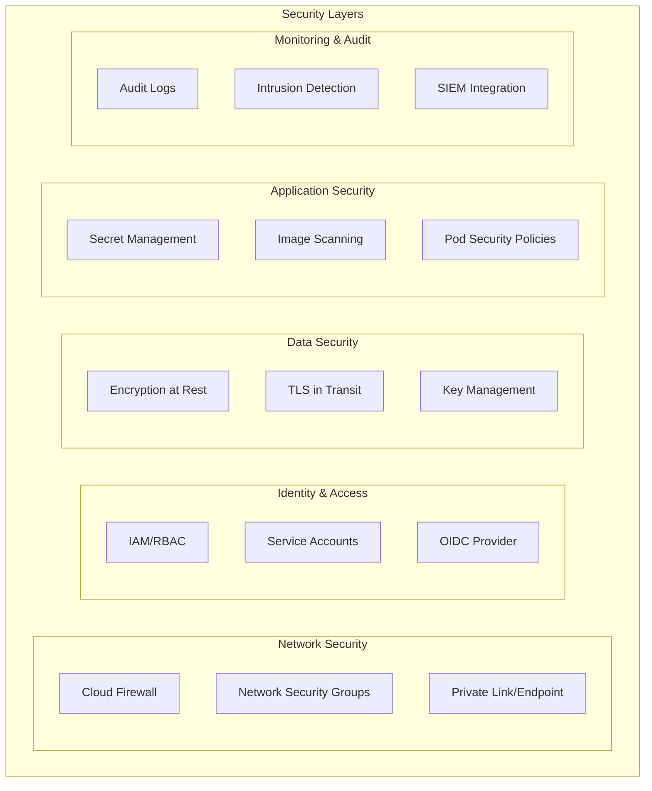

## High Availability Design

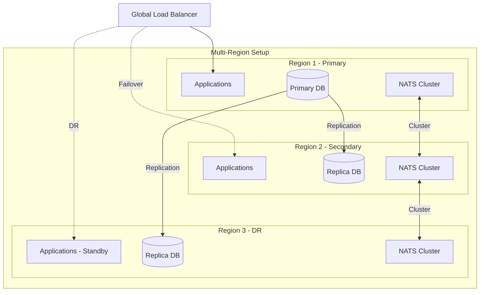

## Observability Stack

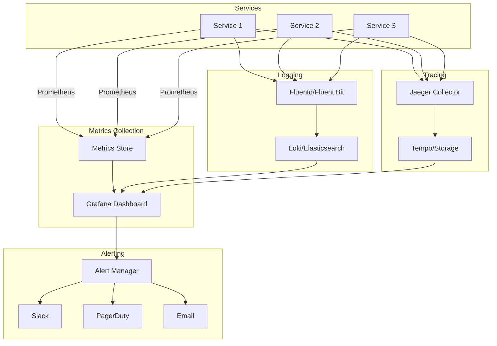

## Disaster Recovery Design

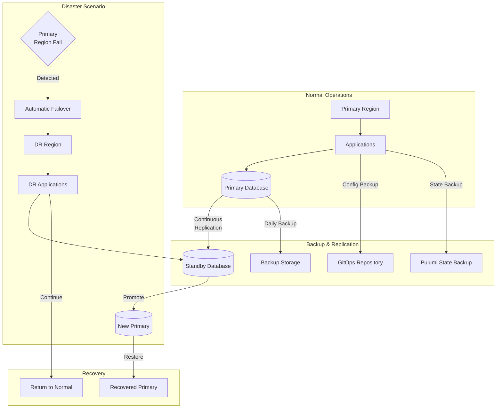

## Cost Optimization Architecture

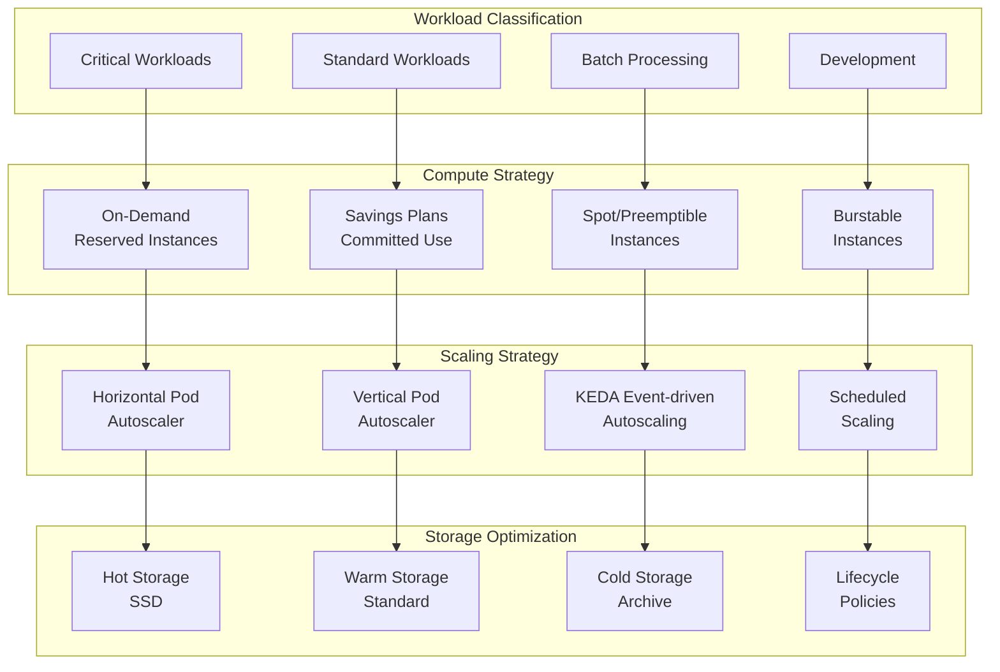

## Service Dependencies

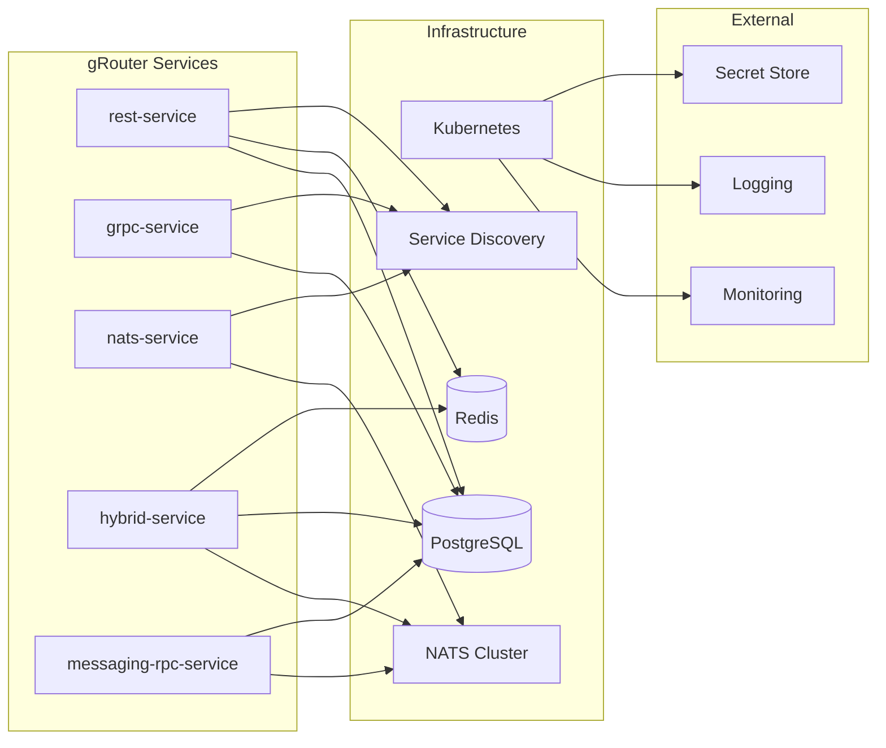

## Technology Stack

| Layer | Technology | Purpose |
|-------|-----------|---------|
| **IaC** | Pulumi (TypeScript) | Infrastructure as Code |
| **Orchestration** | Kubernetes | Container orchestration |
| **Compute** | GKE/EKS/AKS | Managed Kubernetes |
| **Database** | PostgreSQL | Primary data store |
| **Cache** | Redis | Application cache |
| **Messaging** | NATS | Async messaging |
| **Load Balancing** | Cloud LB / Ingress | Traffic distribution |
| **Service Mesh** | Istio (optional) | Service-to-service communication |
| **Monitoring** | Prometheus + Grafana | Metrics & dashboards |
| **Logging** | Loki / ELK | Log aggregation |
| **Tracing** | Jaeger / Tempo | Distributed tracing |
| **Secrets** | Cloud KMS / Vault | Secret management |
| **Storage** | S3 / GCS / Blob | Object storage |
| **CI/CD** | GitHub Actions | Automation |
| **Registry** | GCR / ECR / ACR | Container images |

## Design Principles

1. **Cloud Native**: Leverage managed services where possible
2. **High Availability**: Multi-AZ deployments, health checks, auto-recovery
3. **Scalability**: Horizontal scaling, load balancing, caching
4. **Security**: Defense in depth, least privilege, encryption
5. **Observability**: Comprehensive monitoring, logging, tracing
6. **Cost Optimization**: Right-sizing, auto-scaling, reserved capacity
7. **Disaster Recovery**: Backups, replication, failover automation
8. **DevOps**: Infrastructure as Code, CI/CD, GitOps
