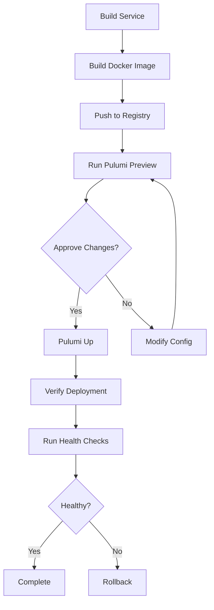

# Pulumi IaaS Deployment Requirements

## Overview

Requirements for deploying gRouter microservices across multiple cloud providers (GCP, AWS, Azure) and on-premises infrastructure using Pulumi.

## Deployment Targets

### 1. Google Cloud Platform (GCP)
**Primary Services:**
- GKE (Google Kubernetes Engine) for container orchestration
- Cloud Run for serverless deployments
- Cloud SQL for managed databases
- Cloud Pub/Sub for messaging (alternative to NATS)
- Cloud Load Balancing
- Cloud NAT & VPC networking
- Cloud Storage for artifacts

**Requirements:**
- GCP project with billing enabled
- Service account with appropriate IAM roles
- Pulumi GCP provider configured
- VPC with private subnets
- Cloud DNS for service discovery

### 2. Amazon Web Services (AWS)
**Primary Services:**
- EKS (Elastic Kubernetes Service) for containers
- ECS/Fargate for serverless containers
- RDS for managed databases
- MSK (Managed Streaming for Kafka) or self-hosted NATS
- Application Load Balancer (ALB)
- VPC with NAT Gateway
- S3 for storage

**Requirements:**
- AWS account with appropriate permissions
- IAM roles for services
- Pulumi AWS provider configured
- VPC with multiple availability zones
- Route53 for DNS

### 3. Microsoft Azure
**Primary Services:**
- AKS (Azure Kubernetes Service) for containers
- Azure Container Instances for serverless
- Azure Database for PostgreSQL
- Azure Service Bus or Event Grid
- Azure Load Balancer
- Virtual Network (VNet)
- Azure Blob Storage

**Requirements:**
- Azure subscription
- Service principals with contributor access
- Pulumi Azure provider configured
- Resource groups per environment
- Azure DNS zones

### 4. On-Premises
**Primary Infrastructure:**
- Kubernetes cluster (k8s, k3s, or OpenShift)
- PostgreSQL database cluster
- NATS cluster for messaging
- HAProxy or NGINX for load balancing
- Local storage (NFS, Ceph, or similar)
- Monitoring stack (Prometheus/Grafana)

**Requirements:**
- Kubernetes cluster access (kubeconfig)
- Pulumi Kubernetes provider
- Network access to cluster
- Container registry (Harbor, Registry)
- Certificate management (cert-manager)

## Common Requirements Across All Platforms

### Infrastructure Components

**1. Compute**
```
- Container orchestration (Kubernetes preferred)
- Auto-scaling capabilities
- Health checks and readiness probes
- Resource limits (CPU, memory)
```

**2. Networking**
```
- Private subnets for services
- NAT for outbound traffic
- Load balancers for ingress
- Service mesh (optional: Istio, Linkerd)
- DNS for service discovery
```

**3. Data Storage**
```
- Managed PostgreSQL database
- Persistent volumes for stateful services
- Object storage for logs/artifacts
- Backup and restore capabilities
```

**4. Messaging**
```
- NATS cluster (3+ nodes for HA)
- Or cloud-native alternatives (Pub/Sub, SQS, Service Bus)
- Message persistence for critical flows
```

**5. Observability**
```
- Metrics collection (Prometheus)
- Log aggregation (Loki, ELK)
- Distributed tracing (Jaeger, Tempo)
- Dashboards (Grafana)
- Alerting rules
```

**6. Security**
```
- TLS/SSL certificates
- Secrets management (Vault, cloud KMS)
- Network policies
- RBAC configurations
- Container image scanning
```

## Pulumi Project Structure

```
pulumi/
├── common/
│   ├── networking.ts          # VPC, subnets, security groups
│   ├── storage.ts              # Databases, object storage
│   ├── monitoring.ts           # Observability stack
│   └── security.ts             # Secrets, certificates
├── providers/
│   ├── gcp/
│   │   ├── Pulumi.yaml
│   │   ├── index.ts            # GCP main entry point
│   │   ├── gke.ts              # GKE cluster
│   │   ├── cloudrun.ts         # Cloud Run services
│   │   └── services.ts         # Deploy gRouter services
│   ├── aws/
│   │   ├── Pulumi.yaml
│   │   ├── index.ts            # AWS main entry point
│   │   ├── eks.ts              # EKS cluster
│   │   ├── ecs.ts              # ECS/Fargate setup
│   │   └── services.ts         # Deploy gRouter services
│   ├── azure/
│   │   ├── Pulumi.yaml
│   │   ├── index.ts            # Azure main entry point
│   │   ├── aks.ts              # AKS cluster
│   │   └── services.ts         # Deploy gRouter services
│   └── onprem/
│       ├── Pulumi.yaml
│       ├── index.ts            # K8s deployment
│       └── services.ts         # Deploy to existing cluster
└── services/
    ├── nats-service/
    ├── rest-service/
    ├── grpc-service/
    ├── messaging-rpc-service/
    └── hybrid-service/
```

## Service Deployment Pattern

Each gRouter service should be deployable with:

**1. Container Image**
```yaml
- Built from templates/*/Dockerfile
- Pushed to container registry
- Tagged with version/commit hash
- Scanned for vulnerabilities
```

**2. Kubernetes Manifests**
```yaml
apiVersion: apps/v1
kind: Deployment
metadata:
  name: <service-name>
spec:
  replicas: 3
  template:
    spec:
      containers:
      - name: service
        image: <registry>/<service>:<tag>
        env:
        - name: NATS_URL
          value: "nats://nats:4222"
        resources:
          requests:
            cpu: "100m"
            memory: "128Mi"
          limits:
            cpu: "500m"
            memory: "512Mi"
```

**3. Service Configuration**
```yaml
apiVersion: v1
kind: Service
metadata:
  name: <service-name>
spec:
  type: ClusterIP  # or LoadBalancer for public
  ports:
  - port: 8080
    targetPort: 8080
```

## Multi-Cloud Deployment Strategy

### Option 1: Multi-Cloud Active-Active
```
GCP (Primary)     AWS (Secondary)    Azure (Tertiary)
    ↓                  ↓                   ↓
Load Balancer → Route traffic based on latency/health
```

### Option 2: Cloud-Specific Deployments
```
GCP: Production workloads
AWS: Development/staging
Azure: DR/backup
On-Prem: Sensitive data processing
```

### Option 3: Hybrid Cloud
```
On-Prem: Core services + databases
Cloud: Burst capacity + edge services
```

## Environment Configuration

```typescript
// Pulumi stack configs
interface StackConfig {
  provider: 'gcp' | 'aws' | 'azure' | 'onprem';
  environment: 'dev' | 'staging' | 'prod';
  region: string;
  
  kubernetes: {
    nodeCount: number;
    nodeSize: string;
    version: string;
  };
  
  database: {
    instanceType: string;
    storage: number;
    backupRetention: number;
  };
  
  nats: {
    clusterSize: number;
    jetstream: boolean;
  };
  
  services: {
    [serviceName: string]: {
      enabled: boolean;
      replicas: number;
      resources: ResourceRequirements;
    };
  };
}
```

## Dependencies

**Pulumi Packages:**
```json
{
  "dependencies": {
    "@pulumi/pulumi": "^3.x",
    "@pulumi/kubernetes": "^4.x",
    "@pulumi/gcp": "^7.x",
    "@pulumi/aws": "^6.x",
    "@pulumi/azure-native": "^2.x",
    "@pulumi/docker": "^4.x",
    "@pulumi/random": "^4.x",
    "@pulumi/tls": "^5.x"
  }
}
```

## Deployment Workflow



## Cost Optimization

**GCP:**
- Use preemptible VMs for non-critical workloads
- Committed use discounts for steady-state
- Cloud Run for sporadic traffic

**AWS:**
- Spot instances for batch processing
- Savings plans for predictable usage
- Fargate Spot for dev environments

**Azure:**
- Reserved instances for production
- Azure Hybrid Benefit
- AKS node pools with spot VMs

**On-Prem:**
- Resource quotas per namespace
- Horizontal pod autoscaling
- Cluster autoscaling (if supported)

## Security Best Practices

1. **Secrets Management**
   - Never commit secrets to git
   - Use cloud KMS or HashiCorp Vault
   - Rotate credentials regularly

2. **Network Security**
   - Private clusters when possible
   - Network policies between services
   - TLS everywhere (mTLS preferred)

3. **Access Control**
   - RBAC for Kubernetes
   - IAM roles with least privilege
   - Audit logging enabled

4. **Container Security**
   - Scan images for vulnerabilities
   - Use distroless or minimal base images
   - Run as non-root user

## Monitoring & Alerting

**Key Metrics:**
```
- Pod CPU/Memory usage
- Request latency (p50, p95, p99)
- Error rates
- NATS message lag
- Database connections
- Ingress traffic
```

**Alerts:**
```
- Service down > 5 minutes
- Error rate > 5%
- Latency > 1s (p95)
- Database connections > 80%
- Disk usage > 85%
```

## Disaster Recovery

**Backup Strategy:**
- Daily database backups
- Config backups in git
- Container images in multiple registries
- Pulumi state backups

**Recovery Plan:**
- RPO (Recovery Point Objective): 1 hour
- RTO (Recovery Time Objective): 30 minutes
- Automated failover for critical services
- Regular DR drills

## Getting Started

### 1. Prerequisites
```bash
# Install Pulumi
curl -fsSL https://get.pulumi.com | sh

# Install cloud CLIs
# GCP: gcloud
# AWS: aws cli
# Azure: az cli

# Authenticate
pulumi login
gcloud auth login
aws configure
az login
```

### 2. Initialize Project
```bash
mkdir pulumi-grouter && cd pulumi-grouter
pulumi new typescript
npm install @pulumi/gcp @pulumi/aws @pulumi/azure-native @pulumi/kubernetes
```

### 3. Deploy
```bash
# Set stack config
pulumi config set gcp:project my-project
pulumi config set gcp:region us-central1

# Preview changes
pulumi preview

# Deploy
pulumi up
```

## Next Steps

1. Create Pulumi projects for each cloud provider
2. Build Docker images for all gRouter services
3. Define Kubernetes manifests
4. Set up CI/CD pipelines
5. Configure monitoring and alerting
6. Test disaster recovery procedures
7. Document runbooks for operations
