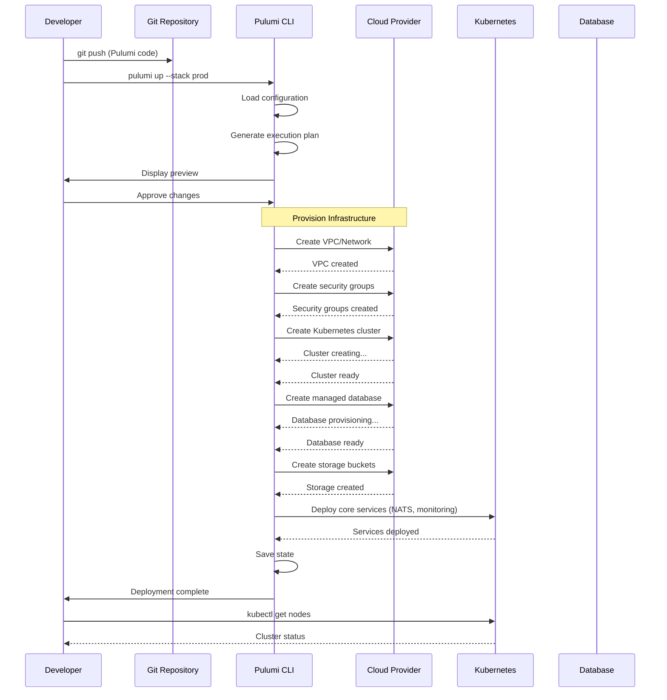
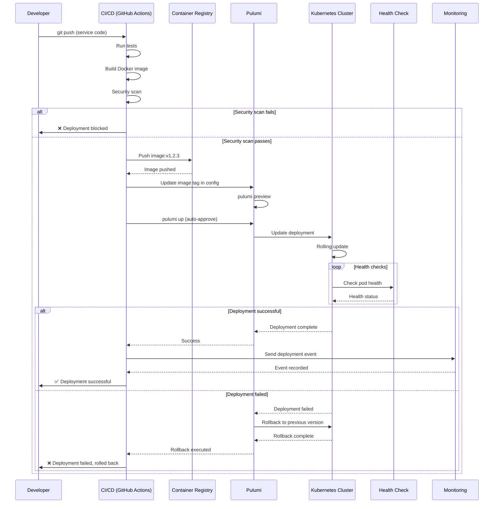
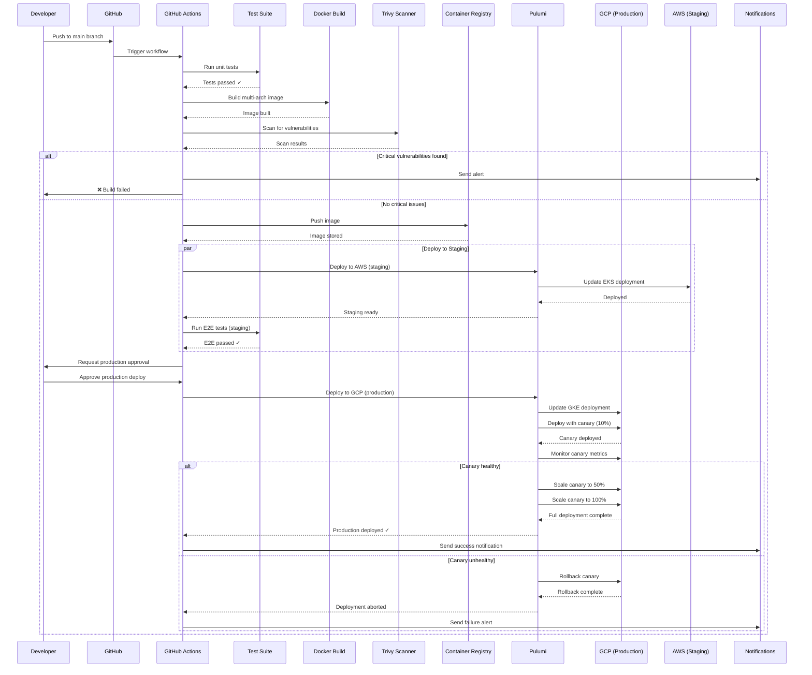
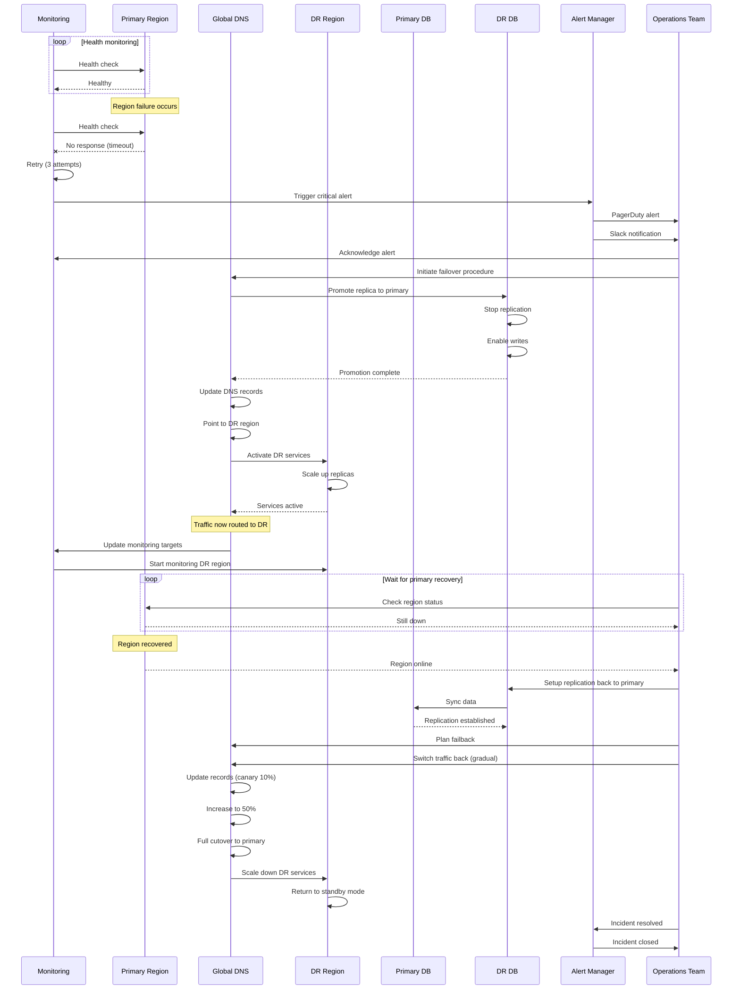
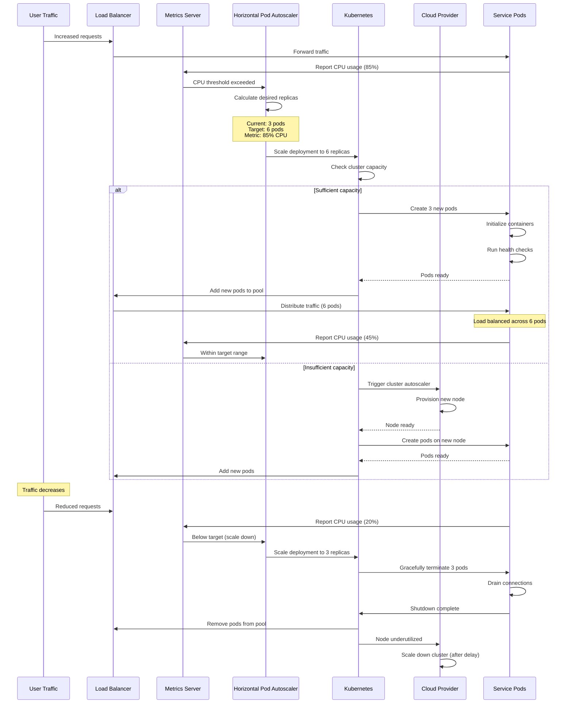
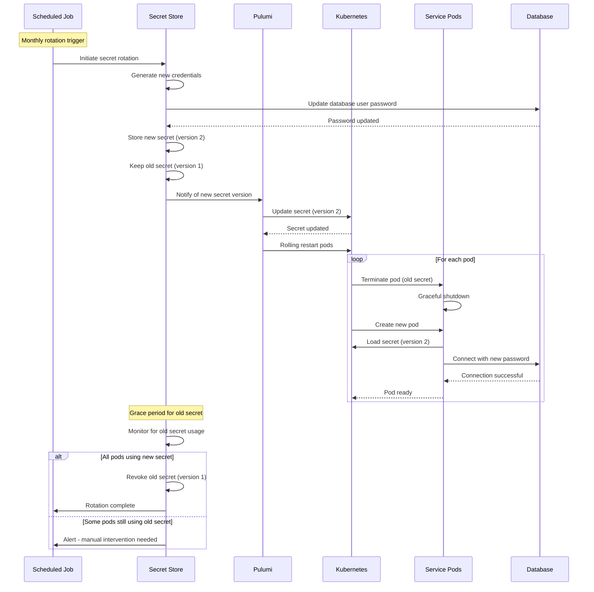
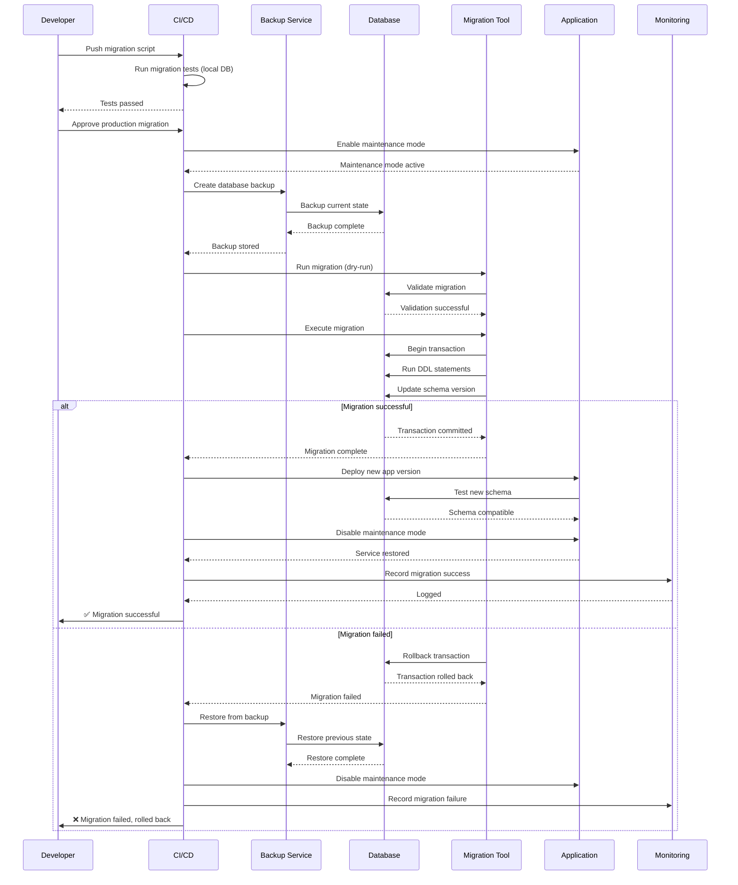
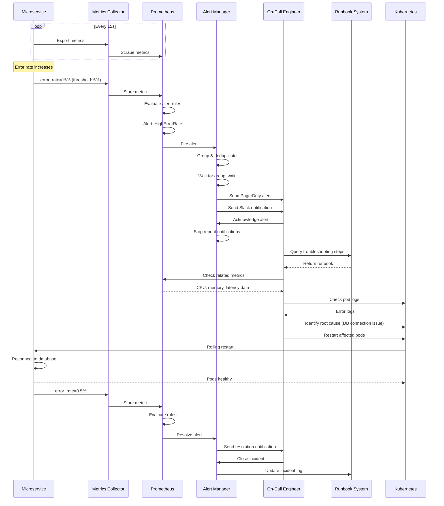
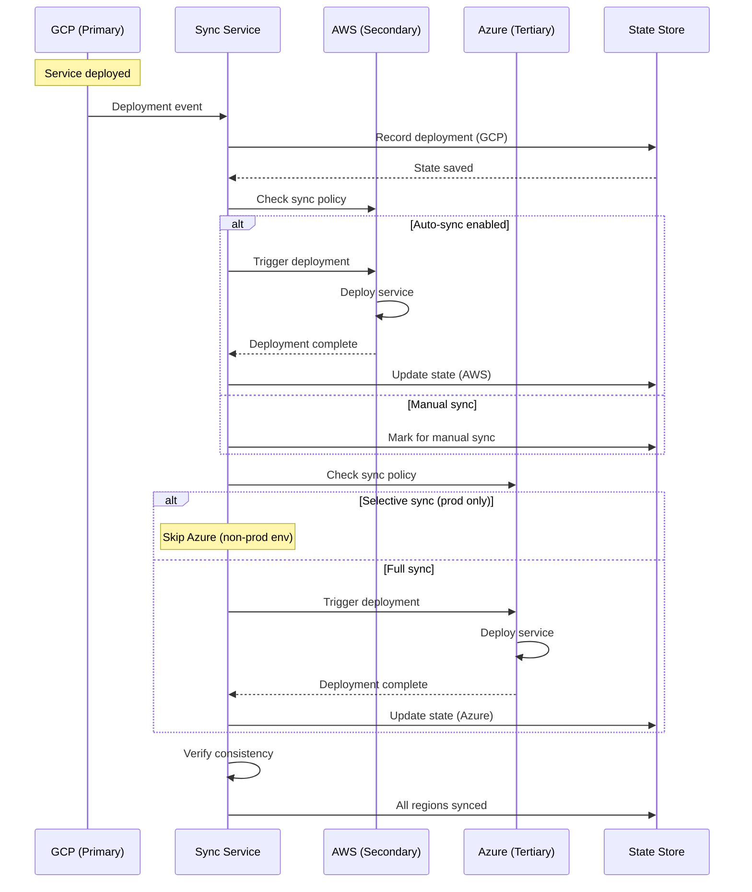

# Pulumi Deployment Sequence Diagrams

## 1. Initial Infrastructure Provisioning

## 2. Service Deployment Flow

## 3. CI/CD Pipeline with Pulumi

## 4. Disaster Recovery Failover

## 5. Auto-Scaling Event

## 6. Secret Rotation Flow

## 7. Database Migration

## 8. Monitoring Alert Flow

## 9. Multi-Cloud Sync

## Flow Descriptions

### Key Processes

1. **Infrastructure Provisioning**: Complete setup from VPC to K8s cluster
2. **Service Deployment**: CI/CD pipeline with health checks and rollback
3. **Disaster Recovery**: Automated failover with data replication
4. **Auto-Scaling**: Dynamic scaling based on metrics
5. **Secret Rotation**: Zero-downtime credential updates
6. **Database Migration**: Safe schema changes with rollback
7. **Monitoring**: Alert-driven incident response
8. **Multi-Cloud Sync**: Cross-region deployment coordination

### Common Patterns

- **Retry Logic**: All API calls include retries with exponential backoff
- **Health Checks**: Continuous validation before and after changes
- **Rollback**: Automatic rollback on failure detection
- **State Management**: Consistent state tracking across operations
- **Notifications**: Multi-channel alerts for critical events
