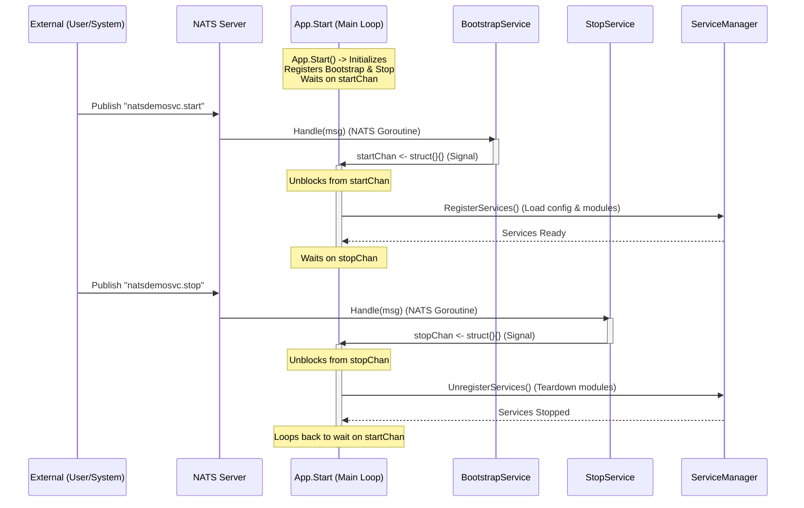

# Application Lifecycle Flow

This document illustrates the event-driven lifecycle of the application, specifically how `BootstrapService` and `StopService` control the main application loop via NATS messages.

## Sequence Diagram

The following diagram shows the separation between the **Main Application Loop** (blocking and waiting) and the **NATS Event Handlers** (receiving messages asynchronously).



## Key Concepts

1.  **Channel Synchronization**: `startChan` and `stopChan` act as synchronization bridges between the concurrent NATS message handlers and the main application state machine.
2.  **State Preservation**: The application process does not exit when "stopped". It merely unloads the heavy business logic services and goes into a dormant state, listening only for the "start" signal again.
3.  **Concurrency Safety**: By forcing service registration/unregistration to happen on the Main Loop (triggered by channels), we avoid race conditions that could occur if we tried to modify the Service Manager directly from the NATS handler goroutines.

## Build & Test Guide

### 1. Build
**Using Bazel (Recommended)**
```bash
bin/bazel build //services/natsdemosvc/cmd/natsdemosvc:natsdemosvc
```
Output: `bazel-bin/services/natsdemosvc/cmd/natsdemosvc/natsdemosvc_/natsdemosvc`

**Using Go**
```bash
cd services/natsdemosvc
go build -o natsdemosvc ./cmd/natsdemosvc
```
Output: `./natsdemosvc` (in current directory)

### 2. Unit Tests
**Using Bazel**
```bash
bin/bazel test //services/natsdemosvc/...
```

**Using Go**
```bash
cd services/natsdemosvc
go test -short ./...
```
*Note: The `-short` flag skips integration tests.*

### 3. Integration Tests
**Using Bazel**
Integration tests are included in the standard test targets but may be separated by tags or configuration in advanced setups. For this service:
```bash
bin/bazel test //services/natsdemosvc/internal/app:app_test
```

**Using Go**
```bash
cd services/natsdemosvc
go test -v ./...
```
*Note: Integration tests (non-short) run by default without `-short`.*

## Run & Verify Guide

### 1. Prerequisites
Ensure a NATS server is running:
```bash
docker run -d --name nats -p 4222:4222 -p 8222:8222 nats:latest -js
```

### 2. Run the Application
**Using Bazel Binary**
```bash
./bazel-bin/services/natsdemosvc/cmd/natsdemosvc/natsdemosvc_/natsdemosvc --config services/natsdemosvc/internal/config/config.yaml
```

**Using Go Run**
```bash
cd services/natsdemosvc
go run cmd/natsdemosvc/main.go --config internal/config/config.yaml
```

### 3. Manual Verification (Client Triggers)
Use the `nats` CLI to interact with the service.

**Install NATS CLI**
```bash
go install github.com/nats-io/natscli/nats@latest
```

**Subscribe to Logs**
```bash
nats sub "natsdemosvc.>"
```

**Triggers**
*   **Start Service**:
    ```bash
    nats pub natsdemosvc.start '{"type": "start", "id": "1", "data": {}, "source": "cli"}'
    ```
*   **Create Resource**:
    ```bash
    nats pub natsdemosvc.natdemo.create '{"type": "natdemo.create", "id": "2", "data": {}, "source": "cli"}'
    ```
*   **Check Health**:
    ```bash
    nats req natsdemosvc.health.live '{"type": "health.live", "id": "3"}'
    nats req natsdemosvc.health.ready '{"type": "health.ready", "id": "3"}'
    ```
*   **Stop Service**:
    ```bash
    nats pub natsdemosvc.stop '{"type": "stop", "id": "4", "data": {}, "source": "cli"}'
    ```
