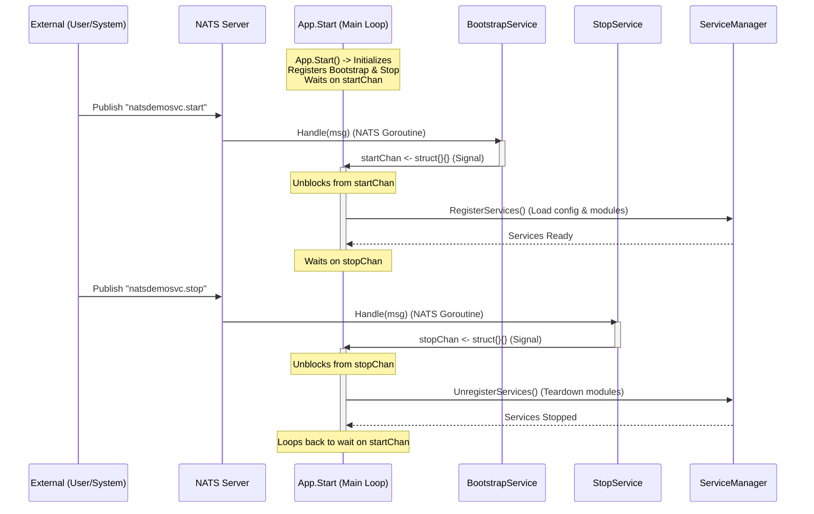

# Application Lifecycle Flow

This document illustrates the event-driven lifecycle of the application, specifically how `BootstrapService` and `StopService` control the main application loop via NATS messages.

## Sequence Diagram

The following diagram shows the separation between the **Main Application Loop** (blocking and waiting) and the **NATS Event Handlers** (receiving messages asynchronously).

## Key Concepts

1.  **Channel Synchronization**: `startChan` and `stopChan` act as synchronization bridges between the concurrent NATS message handlers and the main application state machine.
2.  **State Preservation**: The application process does not exit when "stopped". It merely unloads the heavy business logic services and goes into a dormant state, listening only for the "start" signal again.
3.  **Concurrency Safety**: By forcing service registration/unregistration to happen on the Main Loop (triggered by channels), we avoid race conditions that could occur if we tried to modify the Service Manager directly from the NATS handler goroutines.
