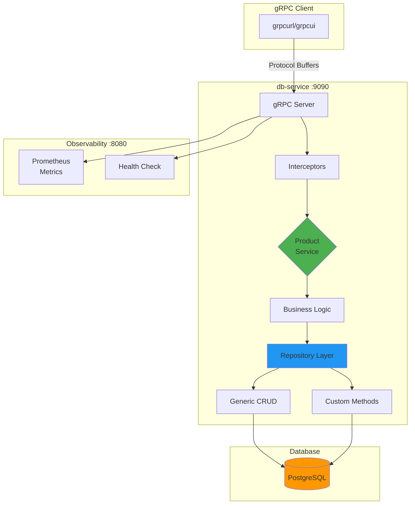
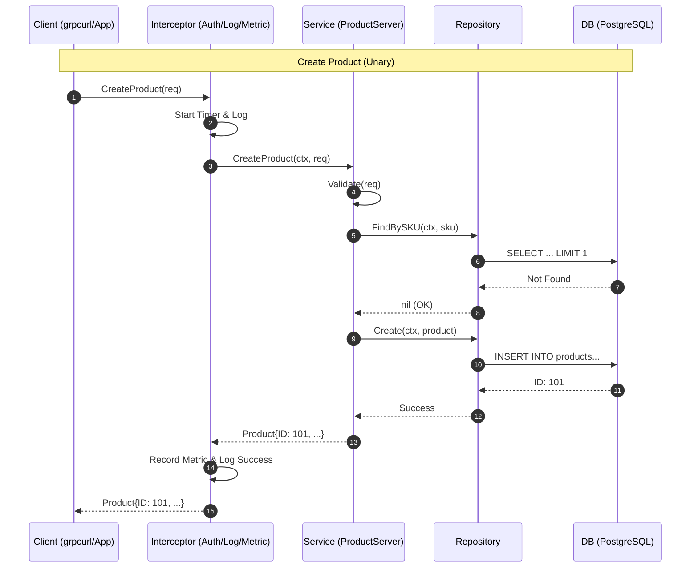
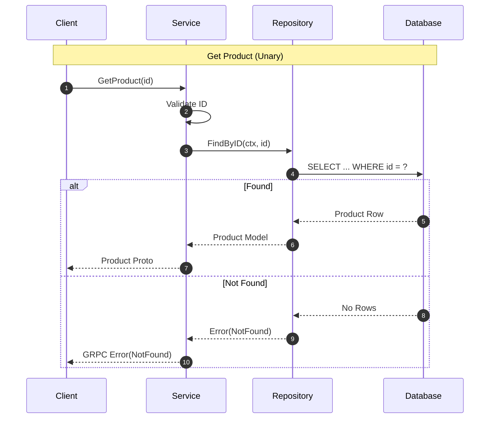
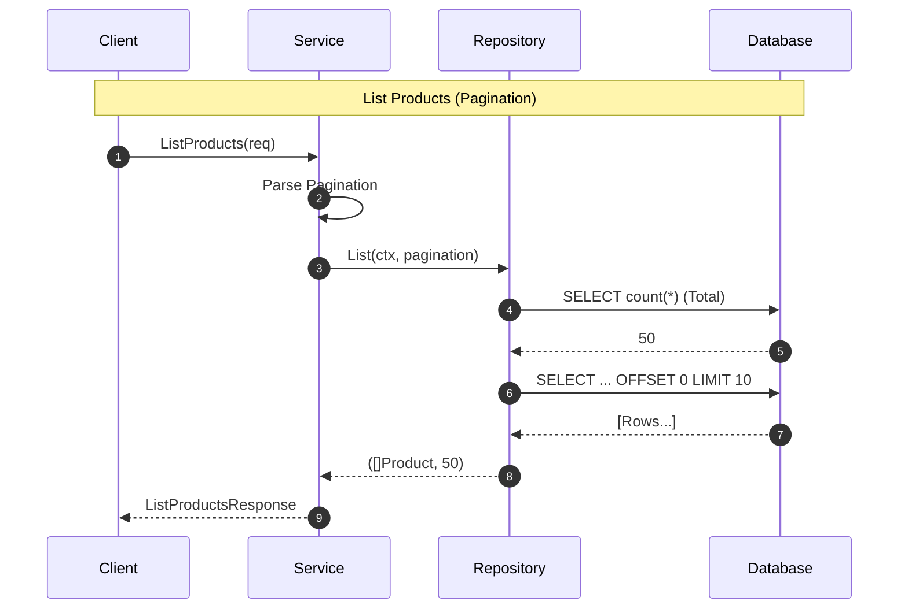
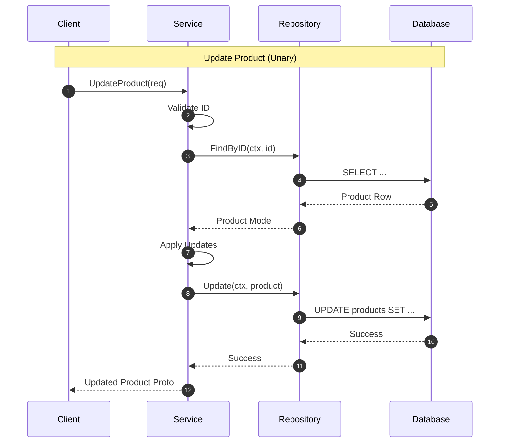
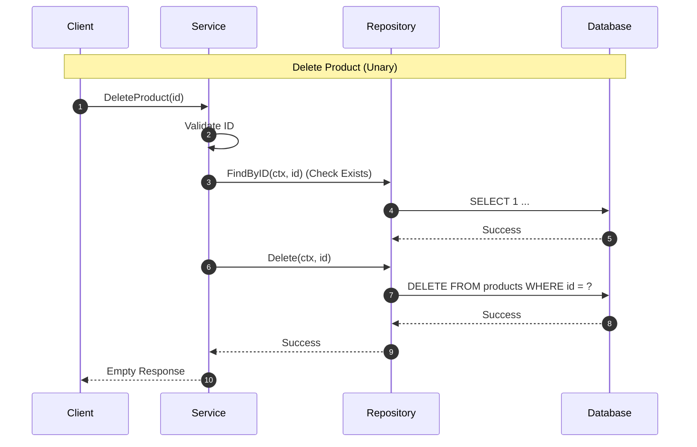
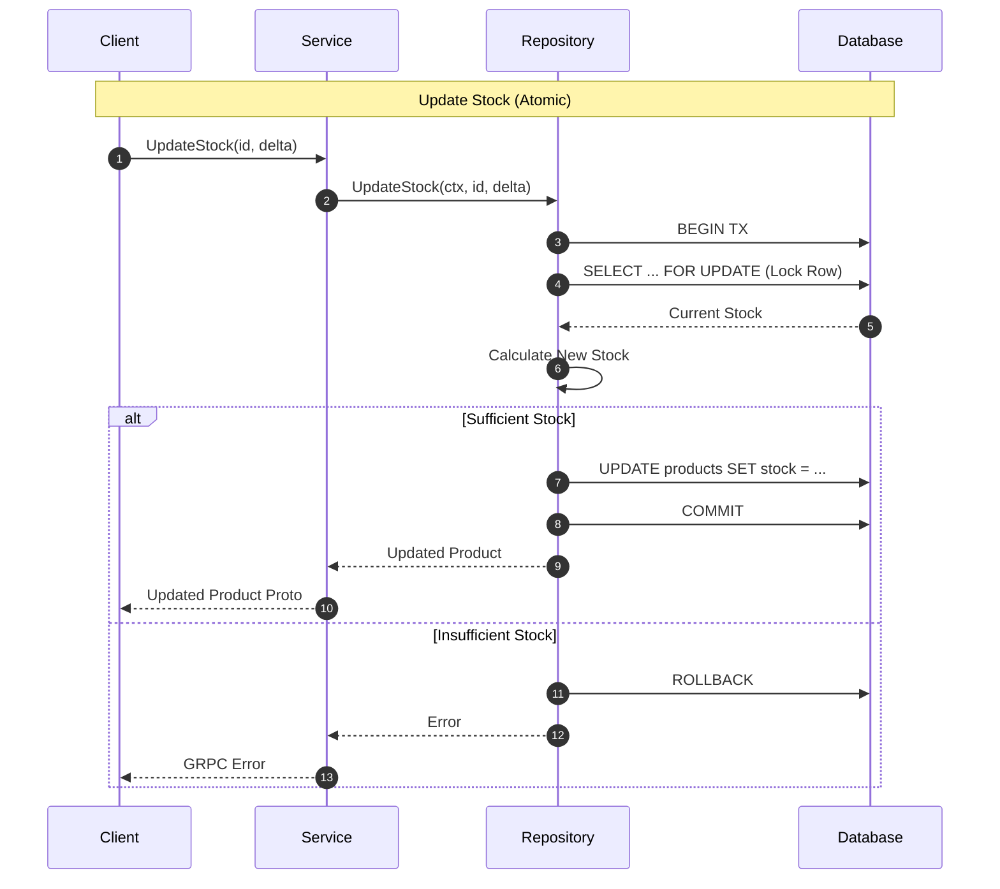
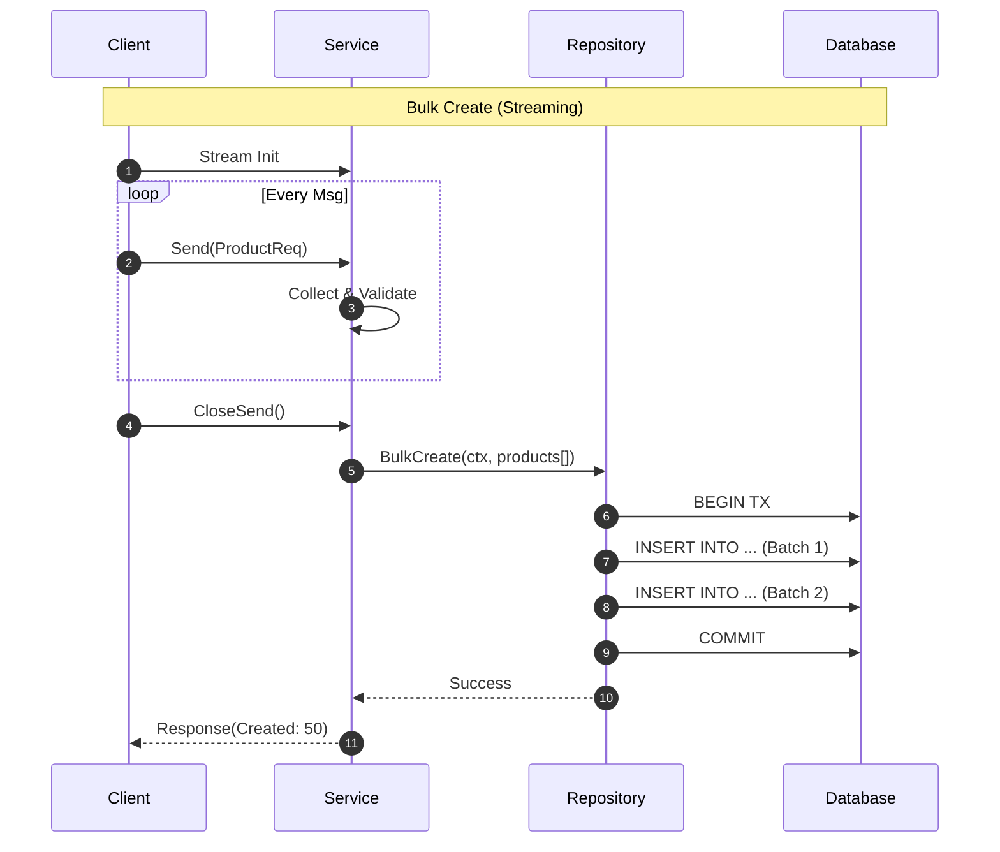

# Database Service Template (gRPC)

A **production-grade gRPC database service** template demonstrating best practices for using the `pkg/database` package with Protocol Buffers, high-performance RPC, and comprehensive observability.

## 🚀 Features

### Performance & Type Safety
- ✅ **gRPC with Protocol Buffers** - 3-10x faster than REST with strong typing
- ✅ **Generic Repository Pattern** - Reusable CRUD operations via `pkg/database`
- ✅ **Server-side Streaming** - Efficient bulk operations
- ✅ **Connection Pooling** - Optimized database connection management

### Production-Ready
- ✅ **OpenTelemetry Tracing** - Distributed tracing for all database operations
- ✅ **Prometheus Metrics** - Database stats + gRPC metrics
- ✅ **Health Checks** - gRPC standard health check protocol
- ✅ **Graceful Shutdown** - Connection draining and cleanup
- ✅ **Structured Logging** - Zap logger with request context

### Database Features
- ✅ **Multi-Database Support** - PostgreSQL, MySQL, SQLite
- ✅ **Auto-Migration** - GORM schema management
- ✅ **Transactions** - ACID guarantees for complex operations
- ✅ **Pagination & Filtering** - Built-in query optimization
- ✅ **Custom Queries** - Extension points for complex operations

## 📁 Directory Structure

```
templates/db-service/
├── api/v1/                      # Protocol Buffer definitions
│   ├── product.proto            # ProductService definition
│   └── common.proto             # Shared types (Pagination, etc.)
├── cmd/api/                     # Application entry point
│   └── main.go
├── internal/
│   ├── app/                     # Application orchestrator
│   │   └── app.go
│   ├── config/                  # Service configuration
│   │   └── config.go
│   ├── grpc/                    # gRPC server implementations
│   │   └── product_server.go
│   └── pkg/products/            # Product domain
│       ├── model.go             # GORM models + proto conversion
│       └── repository.go        # Repository with custom methods
├── Dockerfile                   # Multi-stage Docker build
├── docker-compose.yml           # Local development stack
├── init.sql                     # Database initialization
└── README.md                    # This file
```

## 🏗️ Architecture



## 🔄 Sequence Diagrams

### Create Product Flow


### Get Product Flow (Read)


### List Products Flow


### Update Product Flow


### Delete Product Flow


### Update Stock Flow (Atomic Transaction)


### Bulk Create Flow


## 🎯 API Reference

### ProductService Methods

| Method | Type | Description |
|--------|------|-------------|
| `CreateProduct` | Unary | Create a new product |
| `GetProduct` | Unary | Retrieve product by ID |
| `ListProducts` | Unary | List products with pagination |
| `UpdateProduct` | Unary | Update existing product |
| `DeleteProduct` | Unary | Delete product by ID |
| `UpdateStock` | Unary | Atomic stock delta operation |
| `BulkCreateProducts` | Client Stream | Bulk insert with transaction |

### Protocol Buffer Definitions

```protobuf
message Product {
  uint64 id = 1;
  string name = 2;
  string description = 3;
  double price = 4;
  string sku = 5;
  int32 stock = 6;
  google.protobuf.Timestamp created_at = 7;
  google.protobuf.Timestamp updated_at = 8;
}
```

## 🚦 Quick Start

### Prerequisites
- Docker & Docker Compose
- Go 1.22+ (for local development)
- `grpcurl` or `grpcui` (for testing)

### 1. Start with Docker Compose

```bash
cd templates/db-service
docker-compose up -d
```

This starts:
- **PostgreSQL** on port 5432
- **db-service** gRPC on port 9090
- **Metrics** HTTP on port 8080
- **grpcui** web UI on port 8081

### 2. Verify Health

```bash
# gRPC health check
grpcurl -plaintext localhost:9090 grpc.health.v1.Health/Check

# HTTP health check
curl http://localhost:8080/health
```

### 3. Test with grpcui (Browser)

Open http://localhost:8081 in your browser for an interactive UI.

### 4. Test with grpcurl (CLI)

```bash
# Install grpcurl
go install github.com/fullstorydev/grpcurl/cmd/grpcurl@latest

# List services
grpcurl -plaintext localhost:9090 list

# Create a product
grpcurl -plaintext -d '{
  "name": "Gaming Laptop",
  "description": "High-performance laptop for gaming",
  "price": 1299.99,
  "sku": "LAP-001",
  "stock": 10
}' localhost:9090 product.v1.ProductService/CreateProduct

# List all products
grpcurl -plaintext -d '{
  "pagination": {"page": 1, "page_size": 10, "sort": "created_at desc"}
}' localhost:9090 product.v1.ProductService/ListProducts

# Get specific product
grpcurl -plaintext -d '{"id": 1}' \
  localhost:9090 product.v1.ProductService/GetProduct

# Update stock (subtract 3)
grpcurl -plaintext -d '{"id": 1, "stock_delta": -3}' \
  localhost:9090 product.v1.ProductService/UpdateStock

# Delete product
grpcurl -plaintext -d '{"id": 1}' \
  localhost:9090 product.v1.ProductService/DeleteProduct
```

## 🛠️ Local Development

### Generate Proto Files

```bash
# From templates/db-service directory
protoc --go_out=. --go_opt=paths=source_relative \
       --go-grpc_out=. --go-grpc_opt=paths=source_relative \
       api/v1/*.proto
```

### Run Locally (without Docker)

```bash
# Ensure PostgreSQL is running
export DB_DRIVER=postgres
export DB_HOST=localhost
export DB_PORT=5432
export DB_USER=grouter
export DB_PASSWORD=grouter123
export DB_NAME=products_db
export DB_SSLMODE=disable

# Run from project root
go run templates/db-service/cmd/api/main.go
```

### Build Binary

```bash
# From project root
go build -o bin/db-service ./templates/db-service/cmd/api

# Run
./bin/db-service
```

## 📊 Observability

### Prometheus Metrics

```bash
curl http://localhost:8080/metrics
```

**Database Metrics:**
- `db_open_connections` - Current open connections
- `db_idle_connections` - Idle connections in pool
- `db_in_use_connections` - Active connections
- `db_wait_count` - Total connection wait count
- `db_wait_duration_seconds` - Total wait time

**gRPC Metrics:**
- `grpc_server_started_total` - Total RPC calls started
- `grpc_server_handled_total` - Total RPC calls completed
- `grpc_server_handling_seconds` - Request latency histogram

### Logs

Structured JSON logs to stdout:
```json
{
  "level": "info",
  "ts": "2026-01-14T09:44:00Z",
  "msg": "creating product",
  "sku": "LAP-001",
  "name": "Gaming Laptop"
}
```

### Distributed Tracing

OpenTelemetry traces are automatically generated for all database operations. Configure your tracing backend (Jaeger, Zipkin, etc.) via environment variables.

## 🧪 Testing

### Unit Tests

```bash
# Run all tests
go test -v ./templates/db-service/...

# With coverage
go test -v -cover ./templates/db-service/...
```

### Load Testing with ghz

```bash
# Install ghz
go install github.com/bojand/ghz/cmd/ghz@latest

# Load test GetProduct (10k requests, 50 concurrent)
ghz --insecure \
  --proto api/v1/product.proto \
  --call product.v1.ProductService/GetProduct \
  -d '{"id":1}' \
  -n 10000 -c 50 \
  localhost:9090
```

**Expected Performance:**
- P50 Latency: < 2ms
- P99 Latency: < 10ms
- Throughput: > 10,000 req/s

## 🔧 Configuration

Configuration is loaded from `configs/config.yaml` or environment variables:

```yaml
database:
  driver: postgres
  host: localhost
  port: 5432
  user: grouter
  password: grouter123
  dbname: products_db
  sslmode: disable
  max_open_conns: 25
  max_idle_conns: 5
  conn_max_lifetime: 5m
  log_level: info
```

**Environment Variables Override:**
- `DB_DRIVER`, `DB_HOST`, `DB_PORT`, etc.

## 📦 Deployment

### Docker Build

```bash
# From project root
docker build -f templates/db-service/Dockerfile -t db-service:latest .
```

### Kubernetes

See `deployments/` directory for Helm charts and Kubernetes manifests.

## 🎓 Extending the Template

### Adding a New Entity

1. **Define proto message** in `api/v1/<entity>.proto`
2. **Create model** with GORM tags in `internal/pkg/<entity>/model.go`
3. **Create repository** extending `database.Repository[T]`
4. **Implement gRPC server** in `internal/grpc/<entity>_server.go`
5. **Register service** in `internal/app/app.go`

### Adding Custom Repository Methods

```go
// In repository.go
func (r *Repository) FindBySKU(ctx context.Context, sku string) (*Product, error) {
    var product Product
    if err := r.db.WithContext(ctx).Where("sku = ?", sku).First(&product).Error; err != nil {
        return nil, err
    }
    return &product, nil
}
```

### Adding gRPC Interceptors

```go
// In app.go initGRPCServer()
grpc.UnaryInterceptor(grpc_middleware.ChainUnaryServer(
    grpc_prometheus.UnaryServerInterceptor,
    grpc_zap.UnaryServerInterceptor(a.deps.Logger),
    grpc_recovery.UnaryServerInterceptor(),
    // Add your custom interceptor here
    myCustomInterceptor(),
))
```

## 🤝 Related Templates

- **grpc-service** - General purpose gRPC service
- **rest-service** - REST API with Gin framework
- **hybrid-service** - Combined gRPC + REST

## 📚 References

- [gRPC Go Quickstart](https://grpc.io/docs/languages/go/quickstart/)
- [Protocol Buffers Guide](https://protobuf.dev/programming-guides/proto3/)
- [GORM Documentation](https://gorm.io/docs/)
- [grpcurl](https://github.com/fullstorydev/grpcurl)
- [grpcui](https://github.com/fullstorydev/grpcui)

## 📝 License

Part of the gRouter project.
